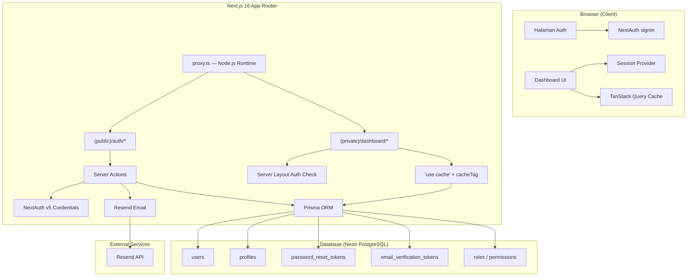
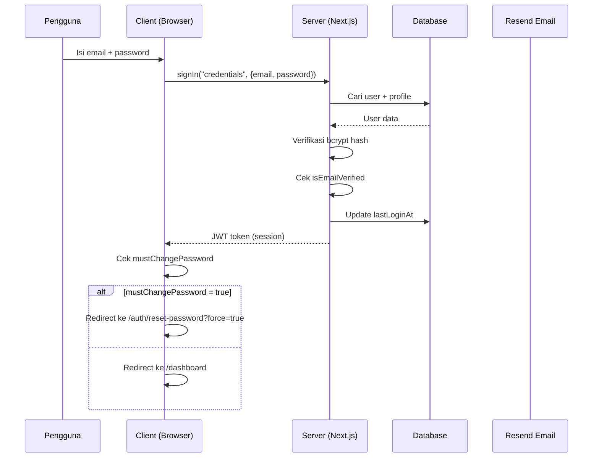
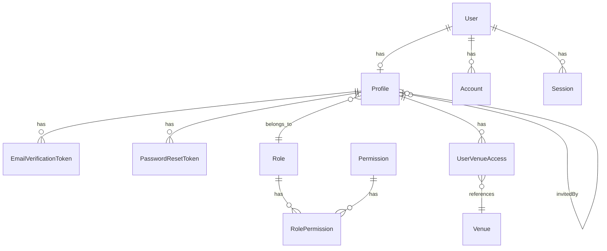

# Dokumen Desain — Migrasi Autentikasi

## Overview

Dokumen ini menjelaskan desain teknis untuk migrasi fitur autentikasi dari proyek sumber (`contoh/Sistem-Wedding-Kediaman/`) ke proyek target (`swasana-project/`). Migrasi mencakup halaman auth (login, forgot password, reset password, verifikasi email), dashboard UI shell (sidebar + header), fitur undangan pengguna, halaman settings, URL dinamis, dan konsistensi penggunaan shadcn/ui.

Proyek target sudah memiliki fondasi yang kuat:
- NextAuth v5 dengan Credentials provider sudah terkonfigurasi di `lib/auth.ts`
- Prisma 7 schema sudah lengkap dengan model `User`, `Profile`, `PasswordResetToken`, `EmailVerificationToken`, `Role`, `RolePermission`, `Permission`, `UserVenueAccess`
- Validasi Zod sudah ada di `lib/validations/auth.ts`
- Route group `(public)` dan `(private)` sudah terstruktur
- Komponen shadcn/ui sudah terinstal lengkap
- Dashboard layout dasar (sidebar + header) sudah ada
- TanStack Query 5 sudah terkonfigurasi dengan `QueryProvider` dan `getQueryClient()`
- Next.js 16.2.3 dengan `proxy.ts` (pengganti `middleware.ts`)

Fokus desain ini adalah melengkapi dan menyempurnakan implementasi yang sudah ada agar sesuai dengan seluruh persyaratan, bukan membangun dari nol.

## Architecture

### Arsitektur Tingkat Tinggi



### Alur Autentikasi



### Struktur Route & Folder

> **PENTING**: Next.js 16 mengganti `middleware.ts` menjadi `proxy.ts`. Lihat bagian Proxy di bawah.

```
swasana-project/
├── app/
│   ├── (public)/
│   │   ├── layout.tsx                          # Layout publik (tanpa auth)
│   │   └── auth/
│   │       ├── login/
│   │       │   ├── page.tsx                    # Server Component — halaman login
│   │       │   └── _components/login-form.tsx  # Client Component — form login
│   │       ├── forgot-password/
│   │       │   ├── page.tsx
│   │       │   └── _components/forgot-password-form.tsx
│   │       ├── reset-password/
│   │       │   ├── page.tsx
│   │       │   └── _components/reset-password-form.tsx
│   │       └── verify/
│   │           ├── page.tsx
│   │           └── _components/verify-form.tsx
│   ├── (private)/
│   │   ├── layout.tsx                          # Auth guard (redirect jika belum login)
│   │   └── dashboard/
│   │       ├── layout.tsx                      # Dashboard shell (sidebar + header)
│   │       ├── page.tsx                        # Overview — Server Component
│   │       ├── loading.tsx                     # Skeleton layout dashboard
│   │       ├── not-found.tsx                   # 404 dashboard
│   │       ├── error.tsx                       # Error boundary dashboard
│   │       ├── _components/
│   │       │   ├── sidebar/
│   │       │   │   ├── sidebar.tsx
│   │       │   │   ├── nav-item.tsx
│   │       │   │   ├── sub-menu-item.tsx
│   │       │   │   └── sidebar-config.ts       # Konfigurasi menu navigasi
│   │       │   └── header/
│   │       │       ├── header.tsx
│   │       │       └── user-menu.tsx
│   │       └── settings/
│   │           ├── layout.tsx                  # Settings layout dengan sub-nav
│   │           ├── page.tsx                    # Redirect ke sub-menu default
│   │           ├── user-management/
│   │           │   ├── page.tsx                # Server Component — fetch users
│   │           │   ├── loading.tsx             # Skeleton tabel pengguna
│   │           │   └── _components/
│   │           │       ├── users-table.tsx     # Client Component — tabel + TanStack Query
│   │           │       └── invite-drawer.tsx   # Client Component — form undangan
│   │           ├── roles/
│   │           │   ├── page.tsx                # Server Component — fetch roles + permissions
│   │           │   └── _components/
│   │           │       └── roles-manager.tsx   # Client Component — CRUD role + matriks permission
│   │           ├── profile/
│   │           │   └── page.tsx
│   │           └── account/
│   │               └── page.tsx
│   ├── api/auth/[...nextauth]/route.ts         # NextAuth handler
│   ├── layout.tsx                              # Root layout (providers)
│   ├── page.tsx                                # Landing / redirect
│   ├── not-found.tsx
│   └── error.tsx
├── actions/
│   ├── auth.ts                                 # Server Actions: login, reset, verify
│   ├── user.ts                                 # Server Actions: invite, update, delete
│   └── role.ts                                 # Server Actions: createRole, updateRole, deleteRole, updateRolePermissions
├── lib/
│   ├── auth.ts                                 # NextAuth config
│   ├── db.ts                                   # Prisma client
│   ├── url.ts                                  # getBaseUrl() — async
│   ├── queries/
│   │   ├── users.ts                            # Cached query: getUsers()
│   │   ├── roles.ts                            # Cached query: getRoles()
│   │   ├── permissions.ts                      # Cached query: getPermissions()
│   │   └── venues.ts                           # Cached query: getVenues()
│   └── validations/
│       ├── auth.ts                             # Zod schema auth
│       └── user.ts                             # Zod schema user management
├── hooks/
│   ├── use-users.ts                            # TanStack Query hook: useUsers(initialData)
│   ├── use-roles.ts                            # TanStack Query hook: useRoles(initialData)
│   ├── use-current-user.ts                     # TanStack Query hook: useCurrentUser()
│   └── use-sidebar.ts                          # Hook state sidebar
├── components/
│   ├── ui/                                     # ← shadcn/ui global (Button, Input, Card, dll.)
│   ├── providers/
│   │   ├── session-provider.tsx
│   │   └── query-provider.tsx
│   └── shared/
│       ├── page-header.tsx                     # Reusable page header
│       ├── data-table.tsx                      # Reusable data table wrapper
│       └── confirm-dialog.tsx                  # Reusable confirm dialog
├── services/
│   ├── user-service.ts                         # Pure fetch functions untuk TanStack Query queryFn
│   └── auth-service.ts                         # Pure fetch functions untuk auth
├── types/
│   ├── auth.ts                                 # Type definitions auth
│   └── user.ts                                 # Type definitions user
├── proxy.ts                                    # ← BUKAN middleware.ts! (Next.js 16)
└── prisma/
    ├── schema.prisma
    └── seed.ts
```

### Proxy (Pengganti Middleware) — Next.js 16

> **BREAKING CHANGE**: Next.js 16 mengganti nama `middleware.ts` menjadi `proxy.ts`. Export function bernama `proxy` (bukan `middleware`). Runtime adalah **Node.js** (bukan Edge).

Pola proxy:
- Cek keberadaan JWT cookie saja — **TIDAK ada DB call** di proxy
- Redirect logic untuk public/private paths
- Cek `mustChangePassword` via JWT claims (bukan DB query)

```typescript
// proxy.ts
import { NextResponse } from "next/server";
import type { NextRequest } from "next/server";

const PUBLIC_PATHS = [
  "/auth/login",
  "/auth/forgot-password",
  "/auth/reset-password",
  "/auth/verify",
  "/api/auth",
  "/api/send-email",
];

function isPublicPath(pathname: string): boolean {
  return PUBLIC_PATHS.some((path) => pathname.startsWith(path));
}

export function proxy(request: NextRequest) {
  const { pathname } = request.nextUrl;

  // Cek JWT cookie (tanpa DB call)
  const sessionToken =
    request.cookies.get("authjs.session-token")?.value ||
    request.cookies.get("__Secure-authjs.session-token")?.value;

  // Public paths
  if (isPublicPath(pathname)) {
    if (sessionToken && pathname.startsWith("/auth")) {
      return NextResponse.redirect(new URL("/dashboard", request.url));
    }
    return NextResponse.next();
  }

  // Redirect ke login jika tidak ada session
  if (!sessionToken) {
    const loginUrl = new URL("/auth/login", request.url);
    loginUrl.searchParams.set("callbackUrl", pathname);
    return NextResponse.redirect(loginUrl);
  }

  // mustChangePassword dicek via JWT claims di layout, bukan di proxy
  return NextResponse.next();
}

export const config = {
  matcher: ["/((?!_next/static|_next/image|favicon.ico|public/).*)"],
  skipProxyUrlNormalize: true, // ← BUKAN skipMiddlewareUrlNormalize
};
```

> **Catatan**: `mustChangePassword` dicek di `(private)/layout.tsx` via `auth()` session, bukan di proxy. Proxy hanya mengecek keberadaan cookie.

## Components and Interfaces

### 1. Halaman Login (`/auth/login`)

Komponen `LoginForm` (client component):
- Layout dua kolom pada desktop: form kiri, gambar `thumbnail.png` kanan
- Layout satu kolom pada mobile: gambar tersembunyi
- Field: email (Input), password (Input dengan toggle Eye/EyeOff)
- Tombol: Login (Button dengan loading state Loader2)
- Link: "Forgot your password?" → `/auth/forgot-password`
- Toast dari URL parameter `message` (Sonner)
- Tanpa tombol Google/OAuth
- Menggunakan `signIn("credentials")` dari next-auth/react

```typescript
// Komponen shadcn/ui yang digunakan:
// Card, CardContent, Input, Button, Label, Form (react-hook-form + zod)
// Ikon: Eye, EyeOff, Loader2 dari lucide-react
// Toast: Sonner
```

### 2. Halaman Forgot Password (`/auth/forgot-password`)

Komponen `ForgotPasswordForm` (client component):
- Layout centered card
- Field: email (Input)
- Tombol: "Kirim link reset" (Button dengan loading)
- Link: kembali ke login
- Server action: buat token di `password_reset_tokens`, kirim email via Resend
- Selalu tampilkan pesan sukses (anti-enumerasi)

### 3. Halaman Reset Password (`/auth/reset-password`)

Komponen `ResetPasswordForm` (client component):
- Validasi token dari URL parameter sebelum tampilkan form
- Field: password baru, konfirmasi password (keduanya dengan toggle visibility)
- Mode `force=true`: tampilkan pesan wajib ganti password sementara
- Setelah berhasil: update password (bcrypt), set `mustChangePassword = false`, redirect ke login

### 4. Halaman Verifikasi Email (`/auth/verify`)

Komponen `VerifyForm` (client component):
- State machine: loading → verified → password input → login
- Validasi token dari `email_verification_tokens` via API
- Set `isEmailVerified = true` pada profile
- Form password sementara untuk login pertama kali
- Redirect otomatis setelah 3 detik jika ada `message` tanpa `token`

### 5. Dashboard Shell

#### Sidebar (`components/sidebar.tsx`)
- Logo `logo-swasana.svg` di bagian atas
- Menu navigasi sesuai proyek sumber:
  - Overview, Customers, Event (submenu: Booking, Calendar Event, Addons)
  - Purchase Order, Finance (submenu: AR, AP), Package, Venue, Vendor
  - Users Management, Settings (submenu: Role & Permission, PDF Config, Profile, Account)
- Collapsible pada desktop (toggle PanelLeftClose/PanelLeftOpen)
- Sheet overlay pada mobile
- Submenu sebagai popover saat sidebar collapsed + hover

#### Header (`components/header.tsx`)
- Info pengguna: nama, role (Avatar + DropdownMenu)
- Menu dropdown: Profile, Settings, Logout
- Hamburger menu untuk mobile
- Logout: `signOut({ callbackUrl: "/auth/login" })`

### 6. User Management Page

Komponen utama di `/dashboard/settings/user-management`:
- Tabel pengguna (Table, Badge, Avatar, Button)
- Tombol "Invite New User" → Sheet/Dialog
- Form undangan: email, nama lengkap, role (Select), assigned venues
- Validasi: react-hook-form + zod
- Tombol "Resend Invitation" untuk pengguna belum verifikasi

### 7. Settings Page (`/dashboard/settings`)

Layout dengan navigasi sub-menu (Tabs atau sidebar internal):
- `/dashboard/settings/roles` — Role & Permission (Table, Checkbox, Card, Dialog, AlertDialog, Input, Label, Button) — admin only
- `/dashboard/settings/pdf-config` — PDF Configuration (Tabs, Card, Input) — admin only
- `/dashboard/settings/profile` — Profile (Card, Input, Avatar, Select) — semua user
- `/dashboard/settings/account` — Account/Change Password (Card, Input, Form) — semua user

#### Role & Permission (`/dashboard/settings/roles`)

Halaman ini menyediakan CRUD lengkap untuk role dan matriks permission per role.

**Daftar Role:**
- Tabel atau daftar Card yang menampilkan semua role (nama, deskripsi, jumlah user)
- Tombol "Tambah Role Baru" di bagian atas → membuka Dialog
- Setiap role memiliki tombol Edit (ikon pensil) dan Hapus (ikon trash)
- Role "admin" tidak dapat dihapus — tombol hapus disembunyikan atau dinonaktifkan

**Form Tambah/Edit Role (Dialog):**
- Komponen: Dialog, Input, Label, Button
- Field: Nama role (wajib), Deskripsi (opsional)
- Validasi: react-hook-form + zod
- Server Action: `createRole` / `updateRole` → Prisma `Role` model
- Setelah berhasil: tutup dialog, invalidasi cache `roles`, tampilkan toast sukses

**Hapus Role (AlertDialog):**
- Komponen: AlertDialog dengan konfirmasi "Apakah Anda yakin ingin menghapus role ini?"
- Server Action: `deleteRole` → Prisma `Role` model (cascade ke `RolePermission`)
- Validasi: tidak boleh menghapus role "admin"
- Setelah berhasil: invalidasi cache `roles`, tampilkan toast sukses

**Matriks Permission:**
- Komponen: Table, Checkbox
- Baris = modul (dari tabel `Permission`, dikelompokkan berdasarkan field `module`)
- Kolom = aksi (view, create, edit, delete — dari field `action` pada tabel `Permission`)
- Setiap sel = Checkbox yang menandakan apakah role memiliki permission tersebut
- Data diambil dari relasi `Role` → `RolePermission` → `Permission`
- WHEN Checkbox diubah, Server Action `updateRolePermissions` dipanggil untuk memperbarui tabel `role_permissions` via Prisma
- Perubahan disimpan per-checkbox (immediate save) atau via tombol "Simpan Perubahan" di bawah tabel

**Prisma Models yang Terlibat:**
- `Role` — CRUD role (id, name, description, sortOrder)
- `Permission` — daftar permission (id, module, action, description)
- `RolePermission` — relasi many-to-many antara Role dan Permission (roleId, permissionId)

**Pola Server/Client Component:**
```typescript
// app/(private)/dashboard/settings/roles/page.tsx (Server Component)
import { getRoles } from "@/lib/queries/roles";
import { getPermissions } from "@/lib/queries/permissions";
import { RolesManager } from "./_components/roles-manager";

export default async function RolesPage() {
  const [roles, permissions] = await Promise.all([
    getRoles(),
    getPermissions(),
  ]);
  return <RolesManager initialRoles={roles} initialPermissions={permissions} />;
}
```

```typescript
// _components/roles-manager.tsx (Client Component)
"use client";
// Mengelola state: role terpilih, dialog tambah/edit, matriks permission
// Menggunakan TanStack Query untuk cache + invalidation
// Komponen: Card, Table, Checkbox, Dialog, AlertDialog, Button, Input, Label
```

### 8. Utilitas URL Dinamis (Async — Next.js 16)

> **PENTING**: Di Next.js 16, `cookies()`, `headers()`, `params`, dan `searchParams` harus di-`await`. Fungsi `getBaseUrl()` menjadi **async**.

```typescript
// lib/url.ts
import { headers } from "next/headers";

export async function getBaseUrl(): Promise<string> {
  // Server-side: gunakan headers (harus await di Next.js 16)
  if (typeof window === "undefined") {
    const h = await headers();
    const host = h.get("x-forwarded-host") || h.get("host") || "localhost:3000";
    const protocol = h.get("x-forwarded-proto") || "http";
    return `${protocol}://${host}`;
  }
  // Client-side: gunakan env variable
  if (process.env.NEXT_PUBLIC_APP_URL) {
    return process.env.NEXT_PUBLIC_APP_URL;
  }
  return "http://localhost:3000";
}
```

### 9. Pola Server/Client Component Split

Pola utama yang digunakan di seluruh aplikasi:

- `page.tsx` = **Server Component** (fetch data, pass ke client)
- `_components/*.tsx` = **Client Component** (UI + interaksi + TanStack Query)
- Server Actions di direktori `actions/` (bukan di dalam komponen)
- Form menggunakan react-hook-form dengan pola `register()` (uncontrolled)

```typescript
// Contoh: app/(private)/dashboard/settings/user-management/page.tsx
// Server Component — fetch data, pass sebagai initialData
import { getUsers } from "@/lib/queries/users";
import { UsersTable } from "./_components/users-table";

export default async function UserManagementPage() {
  const users = await getUsers();
  return <UsersTable initialData={users} />;
}
```

```typescript
// Contoh: _components/users-table.tsx
// Client Component — TanStack Query mengambil alih setelah render pertama
"use client";

import { useUsers } from "@/hooks/use-users";

export function UsersTable({ initialData }: { initialData: User[] }) {
  const { data: users } = useUsers(initialData);
  // ... render tabel
}
```

### 10. Async APIs — Next.js 16

Semua API berikut harus di-`await` di Next.js 16:

```typescript
// ❌ SALAH (Next.js 15 dan sebelumnya)
const cookieStore = cookies();
const headersList = headers();
const { slug } = params;
const { page } = searchParams;

// ✅ BENAR (Next.js 16)
const cookieStore = await cookies();
const headersList = await headers();
const { slug } = await params;
const { page } = await searchParams;
```

### 11. Halaman Error (404, 500, Error Boundary)

Bagian ini mendefinisikan desain untuk halaman error kustom yang menangani 404 (halaman tidak ditemukan) dan error runtime (500/error boundary) baik di level global maupun di dalam dashboard.

#### Lokasi File

| File | Tipe | Deskripsi |
|------|------|-----------|
| `app/not-found.tsx` | Server Component | Halaman 404 global — ditampilkan saat route tidak ditemukan di mana pun dalam aplikasi |
| `app/error.tsx` | Client Component (`"use client"`) | Halaman error global — ditampilkan saat terjadi error runtime yang tidak tertangani (berfungsi sebagai halaman 500) |
| `app/(private)/dashboard/not-found.tsx` | Server Component | Halaman 404 khusus dashboard — ditampilkan di dalam layout dashboard (sidebar + header tetap terlihat) |
| `app/(private)/dashboard/error.tsx` | Client Component (`"use client"`) | Halaman error khusus dashboard — ditampilkan di dalam layout dashboard (sidebar + header tetap terlihat) |

#### Desain Komponen

##### Global 404 (`app/not-found.tsx`)

- Layout terpusat penuh layar (centered full-screen)
- Ikon ilustrasi: `FileQuestion` dari `lucide-react`
- Heading: "Halaman Tidak Ditemukan"
- Deskripsi: teks penjelasan bahwa halaman yang dicari tidak ada
- Tombol primary: "Kembali ke Dashboard" → navigasi ke `/dashboard`
- Dapat berupa Server Component (tidak memerlukan `"use client"`)

```typescript
// app/not-found.tsx
import Link from "next/link";
import { FileQuestion } from "lucide-react";
import { Button } from "@/components/ui/button";

export default function NotFound() {
  return (
    <div className="flex min-h-svh flex-col items-center justify-center text-center px-4">
      <FileQuestion className="h-16 w-16 text-muted-foreground mb-4" />
      <h1 className="text-2xl font-bold">Halaman Tidak Ditemukan</h1>
      <p className="text-muted-foreground text-sm max-w-md mt-2">
        Maaf, halaman yang Anda cari tidak ditemukan atau telah dipindahkan.
      </p>
      <div className="mt-6 flex gap-3">
        <Button asChild>
          <Link href="/dashboard">Kembali ke Dashboard</Link>
        </Button>
      </div>
    </div>
  );
}
```

##### Global Error (`app/error.tsx`)

- **WAJIB** `"use client"` — Next.js mengharuskan `error.tsx` sebagai Client Component
- Menerima props `error` dan `reset` dari Next.js
- Ikon ilustrasi: `AlertTriangle` dari `lucide-react`
- Heading: "Terjadi Kesalahan"
- Deskripsi: teks penjelasan bahwa terjadi kesalahan tak terduga
- Tombol outline: "Coba Lagi" → memanggil `reset()` untuk mencoba render ulang
- Tombol primary: "Kembali ke Dashboard" → navigasi ke `/dashboard`

```typescript
// app/error.tsx
"use client";

import Link from "next/link";
import { AlertTriangle } from "lucide-react";
import { Button } from "@/components/ui/button";

export default function GlobalError({
  error,
  reset,
}: {
  error: Error & { digest?: string };
  reset: () => void;
}) {
  return (
    <div className="flex min-h-svh flex-col items-center justify-center text-center px-4">
      <AlertTriangle className="h-16 w-16 text-muted-foreground mb-4" />
      <h1 className="text-2xl font-bold">Terjadi Kesalahan</h1>
      <p className="text-muted-foreground text-sm max-w-md mt-2">
        Maaf, terjadi kesalahan yang tidak terduga. Silakan coba lagi atau kembali ke dashboard.
      </p>
      <div className="mt-6 flex gap-3">
        <Button variant="outline" onClick={() => reset()}>
          Coba Lagi
        </Button>
        <Button asChild>
          <Link href="/dashboard">Kembali ke Dashboard</Link>
        </Button>
      </div>
    </div>
  );
}
```

##### Dashboard 404 (`app/(private)/dashboard/not-found.tsx`)

- Desain visual sama dengan global 404, tetapi di-render **di dalam** layout dashboard
- Karena file ini berada di `app/(private)/dashboard/`, Next.js akan membungkusnya dengan `dashboard/layout.tsx` — sehingga sidebar dan header tetap terlihat
- Error hanya muncul di area konten dashboard
- Dapat berupa Server Component

```typescript
// app/(private)/dashboard/not-found.tsx
import Link from "next/link";
import { FileQuestion } from "lucide-react";
import { Button } from "@/components/ui/button";

export default function DashboardNotFound() {
  return (
    <div className="flex min-h-[50vh] flex-col items-center justify-center text-center">
      <FileQuestion className="h-16 w-16 text-muted-foreground mb-4" />
      <h1 className="text-2xl font-bold">Halaman Tidak Ditemukan</h1>
      <p className="text-muted-foreground text-sm max-w-md mt-2">
        Halaman yang Anda cari tidak tersedia di dashboard ini.
      </p>
      <div className="mt-6 flex gap-3">
        <Button asChild>
          <Link href="/dashboard">Kembali ke Dashboard</Link>
        </Button>
      </div>
    </div>
  );
}
```

##### Dashboard Error (`app/(private)/dashboard/error.tsx`)

- **WAJIB** `"use client"` — Next.js mengharuskan `error.tsx` sebagai Client Component
- Menerima props `error` dan `reset` dari Next.js
- Desain visual sama dengan global error, tetapi di-render **di dalam** layout dashboard
- Sidebar dan header tetap terlihat — error hanya di area konten

```typescript
// app/(private)/dashboard/error.tsx
"use client";

import Link from "next/link";
import { AlertTriangle } from "lucide-react";
import { Button } from "@/components/ui/button";

export default function DashboardError({
  error,
  reset,
}: {
  error: Error & { digest?: string };
  reset: () => void;
}) {
  return (
    <div className="flex min-h-[50vh] flex-col items-center justify-center text-center">
      <AlertTriangle className="h-16 w-16 text-muted-foreground mb-4" />
      <h1 className="text-2xl font-bold">Terjadi Kesalahan</h1>
      <p className="text-muted-foreground text-sm max-w-md mt-2">
        Terjadi kesalahan saat memuat konten dashboard. Silakan coba lagi.
      </p>
      <div className="mt-6 flex gap-3">
        <Button variant="outline" onClick={() => reset()}>
          Coba Lagi
        </Button>
        <Button asChild>
          <Link href="/dashboard">Kembali ke Dashboard</Link>
        </Button>
      </div>
    </div>
  );
}
```

#### Spesifikasi Styling

| Elemen | Kelas Tailwind | Keterangan |
|--------|---------------|------------|
| Container (global) | `flex min-h-svh flex-col items-center justify-center text-center px-4` | Full-screen centered |
| Container (dashboard) | `flex min-h-[50vh] flex-col items-center justify-center text-center` | Centered di area konten (tanpa `min-h-svh` karena sudah di dalam layout) |
| Ikon | `h-16 w-16 text-muted-foreground mb-4` | Ikon besar dengan warna muted |
| Heading | `text-2xl font-bold` | Konsisten dengan heading halaman auth |
| Deskripsi | `text-muted-foreground text-sm max-w-md mt-2` | Teks penjelasan dengan lebar maksimum |
| Container tombol | `mt-6 flex gap-3` | Tombol berdampingan dengan jarak 12px |
| Tombol primary | `Button` (default variant) | "Kembali ke Dashboard" |
| Tombol secondary | `Button variant="outline"` | "Coba Lagi" (hanya di halaman error) |

#### Catatan Next.js 16

- `error.tsx` **WAJIB** berupa Client Component (`"use client"`) — ini adalah persyaratan Next.js, bukan pilihan desain
- `error.tsx` menerima props `error: Error & { digest?: string }` dan `reset: () => void` dari Next.js
- `not-found.tsx` **boleh** berupa Server Component — tidak memerlukan `"use client"`
- Halaman error/not-found di `app/(private)/dashboard/` secara otomatis di-render di dalam `dashboard/layout.tsx` oleh Next.js, sehingga sidebar dan header tetap terlihat tanpa konfigurasi tambahan
- Next.js 16.2 memiliki desain ulang halaman error default, namun kita menggunakan halaman kustom untuk konsistensi visual dengan Design System proyek

### 12. Audit Logging Architecture

**Prinsip Desain:**
- Append-only: log tidak pernah di-update atau di-delete oleh aplikasi
- Non-blocking: kegagalan logging tidak menggagalkan operasi bisnis
- 5 dimensi: Who, What, When, Where, On What
- Naming convention: `resource.action`

**Prisma Schema — Model ActivityLog (UPDATE, tambah field baru untuk audit scope):**

> **Catatan**: Model `ActivityLog` yang sudah ada digunakan untuk booking-related activity. Untuk auth/user management audit, kita REUSE model yang sama dengan menambahkan field `result`, `ipAddress`, dan `userAgent` serta index baru. Ini menghindari duplikasi tabel.

```prisma
model ActivityLog {
  id          String   @id @default(cuid())
  userId      String?                          // WHO: actorId
  action      String                           // WHAT: "auth.login", "user.invited"
  result      String   @default("success")     // NEW: "success" or "failure"
  entityType  String                           // ON WHAT: "auth", "profile", "role"
  entityId    String                           // ON WHAT: resource ID
  changes     Json     @default("{}")          // Before/after state
  description String?                          // Human-readable
  ipAddress   String?                          // NEW: WHERE
  userAgent   String?                          // NEW: WHERE
  bookingId   String?                          // Keep for booking logs
  createdAt   DateTime @default(now())         // WHEN

  booking     Booking? @relation(fields: [bookingId], references: [id])
  profile     Profile? @relation(fields: [userId], references: [id])

  @@index([entityType, entityId])
  @@index([userId])
  @@index([userId, createdAt])                 // NEW: query per user + time
  @@index([action, createdAt])                 // NEW: query per action + time
  @@index([entityType, entityId, createdAt])   // NEW: query per resource + time
  @@map("activity_logs")
}
```

**Fungsi Utilitas `lib/audit.ts`:**

```typescript
import { db } from "@/lib/db";

interface AuditLogInput {
  userId?: string;
  action: string;           // "auth.login", "user.invited", etc.
  result?: "success" | "failure";
  entityType: string;       // "auth", "profile", "role", "permission"
  entityId: string;
  changes?: Record<string, any>;  // { before: {...}, after: {...} }
  description?: string;
  ipAddress?: string;
  userAgent?: string;
}

export async function logAudit(params: AuditLogInput) {
  try {
    await db.activityLog.create({
      data: {
        userId: params.userId,
        action: params.action,
        result: params.result ?? "success",
        entityType: params.entityType,
        entityId: params.entityId,
        changes: params.changes ?? {},
        description: params.description,
        ipAddress: params.ipAddress,
        userAgent: params.userAgent,
      },
    });
  } catch (error) {
    // NEVER throw — audit failure must not block business logic
    console.error("[AUDIT] Failed to write audit log:", error);
  }
}
```

**Naming Convention Table:**

| Action | Kapan Dicatat |
|--------|--------------|
| `auth.login` | Login berhasil |
| `auth.login_failed` | Login gagal |
| `auth.logout` | Logout |
| `auth.password_reset_requested` | Request forgot password |
| `auth.password_changed` | Password berhasil diubah |
| `auth.email_verified` | Email berhasil diverifikasi |
| `user.invited` | User baru diundang |
| `user.updated` | Data user diubah |
| `user.deleted` | User dihapus |
| `role.created` | Role baru dibuat |
| `role.updated` | Role diubah |
| `role.deleted` | Role dihapus |
| `permission.changed` | Permission role diubah |

**Contoh Penggunaan di Server Actions:**

```typescript
// actions/auth.ts — setelah login berhasil
await logAudit({
  userId: user.id,
  action: "auth.login",
  entityType: "auth",
  entityId: user.id,
  description: `User ${user.email} logged in`,
  ipAddress: (await headers()).get("x-forwarded-for") ?? undefined,
  userAgent: (await headers()).get("user-agent") ?? undefined,
});
```

**Retention Policy:**
- Auto-cleanup: hapus logs > 90 hari
- Implementasi via scheduled task atau API endpoint yang dipanggil cron
- Query: `DELETE FROM activity_logs WHERE created_at < NOW() - INTERVAL '90 days'`

**Caching:**
- Audit logs TIDAK di-cache — selalu fresh query
- Query menggunakan pagination (LIMIT + OFFSET atau cursor-based)

## Data Models

Model Prisma yang relevan sudah ada di schema. Berikut ringkasan relasi kunci dan **perubahan schema baru**:



### Perubahan Schema Prisma (BARU)

```prisma
// Enum baru
enum ProfileStatus {
  active
  inactive
  suspended
}

// Model Profile — field baru
model Profile {
  // ... field yang sudah ada ...
  status     ProfileStatus @default(active)   // ← BARU
  invitedBy  String?                           // ← BARU: ID profil yang mengundang
  invitedAt  DateTime?                         // ← BARU: waktu undangan dikirim

  @@index([roleId])                            // ← BARU: optimasi query per role
  @@map("profiles")
}

// Model EmailVerificationToken — perubahan field
model EmailVerificationToken {
  id        String    @id @default(cuid())
  profileId String
  token     String    @unique
  expiresAt DateTime
  usedAt    DateTime?                          // ← BERUBAH: dari `used Boolean` ke `usedAt DateTime?`
  createdAt DateTime  @default(now())
  profile   Profile   @relation(fields: [profileId], references: [id], onDelete: Cascade)

  @@map("email_verification_tokens")
}

// Model PasswordResetToken — perubahan field
model PasswordResetToken {
  id        String    @id @default(cuid())
  userId    String
  token     String    @unique
  expiresAt DateTime
  usedAt    DateTime?                          // ← BERUBAH: dari `used Boolean` ke `usedAt DateTime?`
  createdAt DateTime  @default(now())
  profile   Profile   @relation(fields: [userId], references: [id], onDelete: Cascade)

  @@map("password_reset_tokens")
}

// Model UserVenueAccess — index baru
model UserVenueAccess {
  // ... field yang sudah ada ...
  @@index([userId])                            // ← BARU: optimasi query akses venue per user
  @@map("user_venue_access")
}
```

### Strategi Migrasi

1. Buat migrasi: `npx prisma migrate dev --name add_profile_status_and_indexes`
2. Migrasi akan:
   - Menambahkan enum `ProfileStatus`
   - Menambahkan kolom `status`, `invitedBy`, `invitedAt` ke tabel `profiles`
   - Mengubah kolom `used` → `usedAt` pada `email_verification_tokens` dan `password_reset_tokens`
   - Menambahkan index pada `profiles(roleId)` dan `user_venue_access(userId)`
3. Update `prisma/seed.ts` untuk menggunakan field baru

### Tabel Kunci

| Model | Tujuan |
|-------|--------|
| `User` | Akun dasar (email, password hash, NextAuth adapter) |
| `Profile` | Data profil (fullName, roleId, isEmailVerified, mustChangePassword, **status**, **invitedBy**, **invitedAt**, timezone, language) |
| `PasswordResetToken` | Token reset password (token, expiresAt, **usedAt**) |
| `EmailVerificationToken` | Token verifikasi email undangan (token, expiresAt, **usedAt**) |
| `Role` | Definisi role (admin, manager, sales, finance) |
| `RolePermission` | Matriks permission per role |
| `Permission` | Definisi permission (module + action) |
| `UserVenueAccess` | Akses venue per user (**dengan index pada userId**) |

### Alur Data Undangan Pengguna

1. Admin mengisi form undangan (email, nama, role, venues)
2. API `POST /api/user/invite`:
   - Buat `User` dengan password sementara (bcrypt hash)
   - Buat `Profile` dengan `isEmailVerified: false`, `mustChangePassword: true`
   - Buat `EmailVerificationToken` (token random, expiry 24 jam)
   - Buat `UserVenueAccess` untuk setiap venue yang dipilih
3. API `POST /api/send-email/invitation`:
   - Kirim email via Resend dengan tautan `{getBaseUrl()}/auth/verify?token={token}`
   - Sertakan password sementara dalam email
4. Pengguna baru klik tautan → verifikasi → login → forced password change

## Caching Architecture

### 3-Layer Cache

| Layer | Teknologi | Lokasi | Invalidasi |
|-------|-----------|--------|------------|
| Server Cache | `"use cache"` + `cacheTag` + `cacheLife` | Next.js server | `updateTag` di Server Actions |
| Client Cache | TanStack Query `staleTime` + `initialData` | Browser memory | `invalidateQueries` di mutation hooks |
| Browser Cache | Next.js prefetch (`<Link>`) | Browser | Otomatis saat navigasi |

### Strategi Cache per Tipe Data

| Data | Server Cache (`cacheLife`) | Client Cache (`staleTime`) | Invalidasi Saat |
|------|---------------------------|---------------------------|-----------------|
| Daftar users | `"minutes"` | 5 menit | Invite, update, delete user |
| Daftar roles | `"hours"` | 10 menit | Update role/permission |
| Daftar venues | `"hours"` | 10 menit | Update venue |
| Current user profile | `"seconds"` | 1 menit | Update profile |

### Pola Server-Side Cached Query

```typescript
// lib/queries/users.ts
"use cache";

import { cacheTag, cacheLife } from "next/cache";
import { db } from "@/lib/db";

export async function getUsers() {
  cacheTag("users");
  cacheLife("minutes");

  return db.profile.findMany({
    select: {
      id: true,
      email: true,
      fullName: true,
      status: true,
      isEmailVerified: true,
      invitedAt: true,
      role: { select: { id: true, name: true } },
      userVenueAccess: {
        select: { venue: { select: { id: true, name: true } } },
      },
    },
    orderBy: { createdAt: "desc" },
  });
}
```

### Pola Invalidasi di Server Actions

```typescript
// actions/user.ts
"use server";

import { updateTag } from "next/cache";

export async function inviteUser(formData: FormData) {
  // ... logic buat user + kirim email ...

  // Invalidasi server cache
  updateTag("users");

  return { success: true };
}
```

> **Catatan Next.js 16**: `revalidateTag` sekarang membutuhkan 2 argumen `(tag, cacheLifeProfile)`. Gunakan `updateTag` sebagai pengganti yang lebih sederhana untuk invalidasi di Server Actions.

## TanStack Query Integration

### Pola Utama: Server → Client Handoff

1. **Server Component** (`page.tsx`) fetch data via cached query
2. Pass data sebagai `initialData` ke **Client Component**
3. TanStack Query mengambil alih untuk mutations dan refetch

### Hook Patterns

```typescript
// hooks/use-users.ts
"use client";

import { useQuery, useMutation, useQueryClient } from "@tanstack/react-query";
import { User } from "@/types/user";

export function useUsers(initialData?: User[]) {
  return useQuery({
    queryKey: ["users"],
    queryFn: () => fetch("/api/users").then((r) => r.json()),
    initialData,
    staleTime: 5 * 60 * 1000, // 5 menit
  });
}

export function useInviteUser() {
  const queryClient = useQueryClient();

  return useMutation({
    mutationFn: (data: InviteUserInput) =>
      fetch("/api/user/invite", {
        method: "POST",
        body: JSON.stringify(data),
      }).then((r) => r.json()),
    onSuccess: () => {
      queryClient.invalidateQueries({ queryKey: ["users"] });
    },
  });
}
```

```typescript
// hooks/use-current-user.ts
"use client";

import { useQuery } from "@tanstack/react-query";
import { useSession } from "next-auth/react";

export function useCurrentUser() {
  const { data: session } = useSession();

  return useQuery({
    queryKey: ["current-user", session?.user?.id],
    queryFn: () => fetch("/api/user/me").then((r) => r.json()),
    enabled: !!session?.user?.id,
    staleTime: 60 * 1000, // 1 menit
  });
}
```

### Service Layer

```typescript
// services/user-service.ts
// Pure fetch functions — digunakan sebagai queryFn di TanStack Query

export async function fetchUsers(): Promise<User[]> {
  const res = await fetch("/api/users");
  if (!res.ok) throw new Error("Failed to fetch users");
  return res.json();
}

export async function fetchUserById(id: string): Promise<User> {
  const res = await fetch(`/api/user/${id}`);
  if (!res.ok) throw new Error("Failed to fetch user");
  return res.json();
}
```

## Loading/Skeleton Pattern

### Prinsip: User Masuk Halaman Dulu, Data Menyusul

Setiap navigasi halaman harus menampilkan skeleton/shimmer **segera** — tidak ada layar kosong.

### `loading.tsx` per Route

```typescript
// app/(private)/dashboard/loading.tsx
import { Skeleton } from "@/components/ui/skeleton";

export default function DashboardLoading() {
  return (
    <div className="space-y-6">
      <Skeleton className="h-8 w-48" />
      <div className="grid grid-cols-1 md:grid-cols-3 gap-6">
        <Skeleton className="h-32" />
        <Skeleton className="h-32" />
        <Skeleton className="h-32" />
      </div>
      <Skeleton className="h-64" />
    </div>
  );
}
```

```typescript
// app/(private)/dashboard/settings/user-management/loading.tsx
import { Skeleton } from "@/components/ui/skeleton";

export default function UserManagementLoading() {
  return (
    <div className="space-y-4">
      <div className="flex justify-between items-center">
        <Skeleton className="h-8 w-48" />
        <Skeleton className="h-10 w-36" />
      </div>
      <div className="border rounded-lg">
        <div className="p-4 space-y-3">
          {Array.from({ length: 5 }).map((_, i) => (
            <div key={i} className="flex items-center gap-4">
              <Skeleton className="h-10 w-10 rounded-full" />
              <Skeleton className="h-4 w-48" />
              <Skeleton className="h-4 w-32" />
              <Skeleton className="h-6 w-16 rounded-full" />
            </div>
          ))}
        </div>
      </div>
    </div>
  );
}
```

### Suspense Boundaries untuk Komponen

```typescript
// Contoh penggunaan Suspense di page.tsx
import { Suspense } from "react";
import { UserManagementLoading } from "./loading";

export default async function UserManagementPage() {
  return (
    <Suspense fallback={<UserManagementLoading />}>
      <UsersTableWrapper />
    </Suspense>
  );
}
```

### TanStack Query `initialData` — Menghindari Loading State

Dengan pola `initialData`, komponen client **tidak menampilkan loading state** pada render pertama karena data sudah tersedia dari server:

```typescript
// page.tsx (Server Component)
const users = await getUsers(); // cached query
return <UsersTable initialData={users} />;

// _components/users-table.tsx (Client Component)
const { data: users, isLoading } = useUsers(initialData);
// isLoading = false pada render pertama karena initialData tersedia
```

## N+1 Query Prevention

### Prinsip: Selalu Gunakan `select`, Bukan `include`

```typescript
// ❌ BURUK — N+1 query, mengambil semua field
const users = await db.profile.findMany({
  include: { role: true, userVenueAccess: { include: { venue: true } } },
});

// ✅ BAIK — hanya field yang dibutuhkan
const users = await db.profile.findMany({
  select: {
    id: true,
    email: true,
    fullName: true,
    status: true,
    role: { select: { id: true, name: true } },
    userVenueAccess: {
      select: { venue: { select: { id: true, name: true } } },
    },
  },
});
```

### Parallel Queries dengan `Promise.all`

```typescript
// ❌ BURUK — sequential
const users = await getUsers();
const roles = await getRoles();
const venues = await getVenues();

// ✅ BAIK — parallel
const [users, roles, venues] = await Promise.all([
  getUsers(),
  getRoles(),
  getVenues(),
]);
```

## Error Handling

### Strategi Error per Modul

| Modul | Error | Penanganan |
|-------|-------|------------|
| Login | Kredensial salah | Toast error via Sonner, tidak spesifik (anti-enumerasi) |
| Login | Email belum diverifikasi | Toast error "Akun belum diverifikasi" |
| Forgot Password | Email tidak terdaftar | Tetap tampilkan pesan sukses (anti-enumerasi) |
| Reset Password | Token expired | Tampilkan pesan + link ke forgot password |
| Reset Password | Token sudah digunakan | Tampilkan pesan error |
| Reset Password | Token tidak valid | Tampilkan pesan error |
| Verifikasi Email | Token expired | Pesan error + instruksi hubungi admin |
| Verifikasi Email | Token tidak valid | Pesan error |
| Undangan | Email sudah terdaftar | Toast error "Email sudah terdaftar" |
| Undangan | Validasi form gagal | Inline error dari react-hook-form + zod |
| Dashboard | Session expired | Redirect ke login via proxy.ts/layout |
| Gambar | Aset tidak ditemukan | Fallback visual (placeholder/hidden) |
| 404 Global | Route tidak ditemukan | Halaman 404 kustom (`app/not-found.tsx`) dengan ikon, pesan, tombol ke dashboard |
| 404 Dashboard | Sub-route dashboard tidak ditemukan | Halaman 404 di dalam layout dashboard (`dashboard/not-found.tsx`) |
| Error Global | Error runtime tidak tertangani | Halaman error kustom (`app/error.tsx`) dengan tombol reset + dashboard |
| Error Dashboard | Error di dalam dashboard | Halaman error di dalam layout dashboard (`dashboard/error.tsx`) dengan tombol reset |
| API | Server error | Toast error generik + log ke console |

### Pola Error Handling

```typescript
// Server Action pattern
async function serverAction(formData: FormData) {
  try {
    const parsed = schema.safeParse(Object.fromEntries(formData));
    if (!parsed.success) {
      return { success: false, error: parsed.error.flatten().fieldErrors };
    }
    // ... logic
    return { success: true, data: result };
  } catch (error) {
    console.error("[serverAction]", error);
    return { success: false, error: "Terjadi kesalahan. Silakan coba lagi." };
  }
}

// API Route pattern
export async function POST(req: Request) {
  try {
    const body = await req.json();
    // ... logic
    return NextResponse.json({ success: true, data: result });
  } catch (error) {
    console.error("[API]", error);
    return NextResponse.json(
      { success: false, error: "Internal server error" },
      { status: 500 }
    );
  }
}
```

## Testing Strategy

### Penilaian PBT

Fitur ini TIDAK cocok untuk property-based testing karena:
- Sebagian besar adalah halaman UI (rendering, layout, interaksi form)
- Alur auth melibatkan side-effect (session, redirect, email)
- Operasi CRUD sederhana (buat user, update password)
- Integrasi dengan layanan eksternal (Resend, NextAuth, Prisma)
- Caching dan loading states adalah konfigurasi, bukan logika transformasi data

### Strategi Testing yang Digunakan

1. Unit Tests (example-based):
   - Validasi Zod schema (`loginSchema`, `resetPasswordSchema`, `forgotPasswordSchema`, `changePasswordSchema`)
   - Fungsi `getBaseUrl()` dengan berbagai kondisi environment
   - Fungsi utilitas (`getInitials`, `formatDate`, dll.)
   - Logic filter menu sidebar berdasarkan role
   - Validasi `usedAt` token logic (null = belum digunakan, DateTime = sudah digunakan)

2. Integration Tests:
   - API route `/api/auth/validate-reset-token`: token valid, expired, used, invalid
   - API route `/api/auth/reset-password`: happy path, token errors
   - API route `/api/user/invite`: buat user + token + email
   - API route `/api/send-email/invitation`: kirim email via Resend (mock)
   - API route `/api/user/change-password`: ganti password
   - Server Actions: `inviteUser`, `updateUser`, `deleteUser` — termasuk cache invalidation
   - Server Actions: `createRole`, `updateRole`, `deleteRole`, `updateRolePermissions` — termasuk cache invalidation dan validasi (admin role tidak bisa dihapus)
   - Cached queries: `getUsers()`, `getRoles()`, `getPermissions()`, `getVenues()` — verifikasi cacheTag

3. Component Tests (jika menggunakan testing-library):
   - LoginForm: render, submit, loading state, error toast, password toggle
   - ForgotPasswordForm: render, submit, loading state
   - ResetPasswordForm: token validation states, form submit
   - VerifyForm: state machine transitions
   - Sidebar: menu rendering, collapse/expand, active state
   - Header: user info display, dropdown menu, logout
   - Skeleton/Loading: verifikasi loading.tsx render skeleton yang benar
   - UsersTable: verifikasi initialData pattern, mutation + invalidation
   - RolesManager: render daftar role, dialog tambah/edit, AlertDialog hapus, matriks permission checkbox, validasi admin role tidak bisa dihapus

4. E2E Tests (opsional, Playwright/Cypress):
   - Alur login → dashboard
   - Alur forgot password → email → reset → login
   - Alur invite → verify → login → forced password change
   - Proteksi route (akses dashboard tanpa login → redirect via proxy.ts)
   - Loading states: navigasi ke halaman → skeleton muncul → data dimuat


---

## Design System & Styling

Bagian ini mendokumentasikan spesifikasi visual dan panduan styling yang harus diikuti secara konsisten di seluruh halaman auth, dashboard, dan komponen UI pada `swasana-project`.

### Tipografi

#### Font Family

Proyek target menggunakan **Open Sans** sebagai font utama, dimuat via `next/font/google` dan didaftarkan sebagai CSS variable `--font-open-sans`.

```css
/* app/globals.css */
--font-sans: var(--font-open-sans);
--font-heading: var(--font-sans);
```

```tsx
// app/layout.tsx
const openSans = Open_Sans({
  variable: "--font-open-sans",
  subsets: ["latin"],
  weight: ["300", "400", "500", "600", "700", "800"],
});
```

> Proyek sumber menggunakan Geist Sans (`--font-geist-sans`). Saat migrasi, semua referensi font diganti ke Open Sans.

#### Skala Ukuran Font

| Peran | Kelas Tailwind | Ukuran | Digunakan pada |
|-------|---------------|--------|----------------|
| Heading halaman | `text-2xl font-bold` | 24px / 700 | Judul form auth (h1) |
| Heading section | `text-xl font-semibold` | 20px / 600 | Judul halaman di header |
| Body default | `text-sm` | 14px / 400 | Teks umum, label, input |
| Body kecil | `text-xs` | 12px / 400 | Subtitle, caption, role badge |
| Label form | `text-sm font-medium` | 14px / 500 | Label input field |
| Menu navigasi | `text-sm font-medium` | 14px / 500 | Item menu sidebar |
| Sub-menu | `text-[13px]` | 13px / 400 | Item sub-menu sidebar |
| Muted / hint | `text-sm text-muted-foreground` | 14px / 400 | Deskripsi di bawah heading |

> Base font size HTML dan body diset ke `14px` di `globals.css`:
> ```css
> html { font-size: 14px; }
> body { font-size: 14px; line-height: 1.5; }
> ```

#### Font Weight

| Nilai | Kelas Tailwind | Penggunaan |
|-------|---------------|------------|
| 300 | `font-light` | Teks sangat ringan (jarang) |
| 400 | `font-normal` | Teks body default |
| 500 | `font-medium` | Label, item menu aktif |
| 600 | `font-semibold` | Heading section, nama user di header |
| 700 | `font-bold` | Heading utama halaman auth |
| 800 | `font-extrabold` | Tidak digunakan secara aktif |

---

### Palet Warna

> **PENTING**: Proyek ini menerapkan palet warna KETAT — seluruh elemen UI hanya menggunakan hitam, putih, dan abu-abu. Warna semantik (merah, hijau, kuning) HANYA untuk toast/status feedback. Lihat bagian "Panduan Warna Ketat" di bawah untuk aturan lengkap.

Proyek menggunakan **shadcn/ui** dengan `baseColor: "neutral"` dan CSS variables berbasis **OKLCH**. Semua token warna didefinisikan di `app/globals.css` dan dipetakan ke Tailwind via `@theme inline`.

#### Token Warna — Light Mode

| Token CSS | Nilai OKLCH | Perkiraan Hex | Penggunaan |
|-----------|-------------|---------------|------------|
| `--background` | `oklch(1 0 0)` | `#ffffff` | Background halaman |
| `--foreground` | `oklch(0.145 0 0)` | `#1a1a1a` | Teks utama |
| `--card` | `oklch(1 0 0)` | `#ffffff` | Background card/form |
| `--card-foreground` | `oklch(0.145 0 0)` | `#1a1a1a` | Teks di dalam card |
| `--primary` | `oklch(0.205 0 0)` | `#2e2e2e` | Tombol primary, link aktif |
| `--primary-foreground` | `oklch(0.985 0 0)` | `#fafafa` | Teks di atas tombol primary |
| `--secondary` | `oklch(0.97 0 0)` | `#f7f7f7` | Background secondary |
| `--muted` | `oklch(0.97 0 0)` | `#f7f7f7` | Background muted (halaman login) |
| `--muted-foreground` | `oklch(0.556 0 0)` | `#737373` | Teks placeholder, subtitle |
| `--accent` | `oklch(0.97 0 0)` | `#f7f7f7` | Hover state ringan |
| `--destructive` | `oklch(0.577 0.245 27.325)` | `#e53e3e` | Error, tombol hapus |
| `--border` | `oklch(0.922 0 0)` | `#ebebeb` | Border card, input, divider |
| `--input` | `oklch(0.922 0 0)` | `#ebebeb` | Border input field |
| `--ring` | `oklch(0.708 0 0)` | `#b3b3b3` | Focus ring |

#### Token Warna — Sidebar (Light Mode)

| Token CSS | Nilai OKLCH | Penggunaan |
|-----------|-------------|------------|
| `--sidebar` | `oklch(0.985 0 0)` | Background sidebar |
| `--sidebar-foreground` | `oklch(0.145 0 0)` | Teks menu sidebar |
| `--sidebar-primary` | `oklch(0.205 0 0)` | Item menu aktif |
| `--sidebar-primary-foreground` | `oklch(0.985 0 0)` | Teks item aktif |
| `--sidebar-accent` | `oklch(0.97 0 0)` | Hover state menu |
| `--sidebar-accent-foreground` | `oklch(0.205 0 0)` | Teks hover menu |
| `--sidebar-border` | `oklch(0.922 0 0)` | Border sidebar |

#### Token Warna — Dark Mode

| Token CSS | Nilai OKLCH | Penggunaan |
|-----------|-------------|------------|
| `--background` | `oklch(0.145 0 0)` | Background halaman |
| `--foreground` | `oklch(0.985 0 0)` | Teks utama |
| `--card` | `oklch(0.205 0 0)` | Background card |
| `--primary` | `oklch(0.922 0 0)` | Tombol primary |
| `--muted` | `oklch(0.269 0 0)` | Background muted |
| `--muted-foreground` | `oklch(0.708 0 0)` | Teks placeholder |
| `--sidebar` | `oklch(0.205 0 0)` | Background sidebar |
| `--sidebar-primary` | `oklch(0.488 0.243 264.376)` | Item aktif sidebar (biru) |

#### Warna Semantik Tambahan (dari proyek sumber)

Warna-warna ini digunakan secara inline di komponen sumber dan perlu dipertahankan saat migrasi:

| Penggunaan | Nilai | Kelas / Style |
|------------|-------|---------------|
| Ikon menu sidebar | Abu-abu medium | `style={{ color: '#A4A7AE' }}` |
| Background profil header | Abu-abu terang | `bg-[#F0F2F5]` |
| Border sidebar/header | Abu-abu terang | `border-gray-200` |
| Teks menu tidak aktif | Abu-abu | `text-gray-600` |
| Teks menu aktif | Hitam | `text-gray-900` |
| Background hover menu | Abu-abu sangat terang | `hover:bg-gray-50` / `hover:bg-gray-100` |
| Background menu aktif | Abu-abu terang | `bg-gray-100` |
| Teks error/destructive | Merah | `text-red-600` |

---

### Skala Spacing

Proyek menggunakan sistem spacing Tailwind standar. Berikut nilai yang paling sering digunakan:

| Konteks | Kelas Tailwind | Nilai |
|---------|---------------|-------|
| Padding form auth (mobile) | `p-6` | 24px |
| Padding form auth (desktop) | `p-8` | 32px |
| Gap antar field form | `gap-6` | 24px |
| Gap antar elemen kecil | `gap-3` | 12px |
| Padding sidebar nav | `px-2 py-3` | 8px / 12px |
| Padding item menu | `px-3 py-2` | 12px / 8px |
| Padding item sub-menu | `px-3 py-1.5` | 12px / 6px |
| Padding header | `px-6 h-14` | 24px / 56px |
| Padding logo sidebar | `px-4` | 16px |
| Gap ikon + teks menu | `gap-3` | 12px |
| Gap ikon + teks sub-menu | `gap-2.5` | 10px |
| Space antar item nav | `space-y-0.5` | 2px |

---

### Border Radius

Radius didefinisikan via CSS variable `--radius: 0.625rem` (10px) dan diturunkan:

| Token | Nilai | Kelas Tailwind |
|-------|-------|---------------|
| `--radius-sm` | `calc(0.625rem * 0.6)` ≈ 6px | `rounded-sm` |
| `--radius-md` | `calc(0.625rem * 0.8)` ≈ 8px | `rounded-md` |
| `--radius-lg` | `0.625rem` = 10px | `rounded-lg` |
| `--radius-xl` | `calc(0.625rem * 1.4)` ≈ 14px | `rounded-xl` |
| `--radius-2xl` | `calc(0.625rem * 1.8)` ≈ 18px | `rounded-2xl` |

Penggunaan umum:
- Card auth: `rounded-lg` (default Card shadcn/ui)
- Tombol: `rounded-md`
- Input field: `rounded-md`
- Avatar: `rounded-full`
- Item menu sidebar: `rounded-md`
- Popover submenu: `rounded-lg`

---

### Shadows

| Konteks | Kelas Tailwind | Penggunaan |
|---------|---------------|------------|
| Card form auth | `shadow` (default Card) | Elevasi ringan |
| Popover submenu collapsed | `shadow-xl` | Submenu hover saat sidebar collapsed |
| Dropdown menu | `shadow-lg` | Dropdown profil header |
| Header saat di-scroll | `border-b border-gray-200` | Border muncul saat scroll |

---

### Breakpoint Responsif

| Breakpoint | Nilai | Perilaku |
|------------|-------|----------|
| `sm` | 640px | Teks nama user di header muncul |
| `md` | 768px | Kolom gambar login muncul; padding form bertambah |
| `lg` | 1024px | Sidebar selalu tampil; hamburger menu hilang |

Pola responsif utama:
- **Halaman login**: `md:grid-cols-2` — satu kolom di mobile, dua kolom di desktop
- **Gambar thumbnail**: `hidden md:block` — tersembunyi di mobile
- **Sidebar**: `hidden lg:flex` (desktop) + Sheet overlay (mobile)
- **Tombol aksi header**: `hidden lg:flex` — hanya tampil di desktop
- **Nama user di header**: `hidden sm:flex` — tersembunyi di layar sangat kecil

---

### Styling Komponen Spesifik

#### Halaman Auth (Login, Forgot Password, Reset Password, Verify)

```
Layout wrapper:
  bg-muted flex min-h-svh flex-col items-center justify-center p-6 md:p-10

Container card:
  w-full max-w-sm md:max-w-3xl

Card:
  overflow-hidden p-0

CardContent (login — dua kolom):
  grid p-0 md:grid-cols-2

Form area:
  p-6 md:p-8

Heading utama:
  text-2xl font-bold

Subtitle:
  text-muted-foreground text-balance (text-sm)

Label field:
  text-sm font-medium (default Label shadcn/ui)

Input field:
  border border-input rounded-md px-3 py-2 text-sm
  (default Input shadcn/ui — tidak perlu override)

Tombol submit:
  w-full (Button variant="default")
  Loading state: <Loader2 className="mr-2 h-4 w-4 animate-spin" />

Toggle password:
  Button variant="ghost" size="sm"
  absolute right-0 top-0 h-full px-3 py-2 hover:bg-transparent

Link "Forgot password":
  ml-auto text-sm underline-offset-2 hover:underline
  text-muted-foreground hover:text-primary

Kolom gambar (desktop only):
  bg-muted relative hidden md:block
  Image: absolute inset-0 h-full w-full object-cover
         dark:brightness-[0.2] dark:grayscale
```

#### Sidebar

```
Container:
  bg-white border-r border-gray-200 flex flex-col h-screen
  transition-all duration-200
  Expanded: w-60
  Collapsed: w-16

Logo area:
  flex items-center border-b border-gray-200 h-14 shrink-0
  Expanded: px-4 gap-2
  Collapsed: justify-center px-2
  Logo image: width=32 height=32 object-contain
  Teks logo: font-bold text-sm text-gray-900

Nav container:
  flex-1 px-2 py-3 space-y-0.5 overflow-y-auto overflow-x-hidden

Item menu (tidak aktif):
  flex items-center gap-3 px-3 py-2 rounded-md text-sm font-medium
  text-gray-600 hover:bg-gray-100 hover:text-gray-900 transition-colors

Item menu (aktif):
  bg-primary/10 text-primary

Ikon menu:
  h-4 w-4 shrink-0
  (Warna ikon di proyek sumber: #A4A7AE — dapat dipertahankan atau
   menggunakan warna inherit dari text-gray-600/text-primary)

Item sub-menu (tidak aktif):
  flex items-center gap-2.5 px-3 py-1.5 rounded-md text-[13px]
  pl-9 (depth 1) / pl-14 (depth 2)
  text-gray-500 hover:text-gray-800 hover:bg-gray-50

Item sub-menu (aktif):
  bg-primary/10 text-primary font-medium

Chevron expand/collapse:
  h-4 w-4 transition-transform (rotate-180 saat terbuka)

Tombol collapse sidebar:
  border-t border-gray-200 shrink-0 px-2 py-2 flex justify-end
  Button: p-1.5 rounded-md text-gray-400
          hover:bg-gray-100 hover:text-gray-700 transition-colors
  Ikon: PanelLeftOpen / PanelLeftClose h-4 w-4

Popover submenu (collapsed + hover):
  fixed bg-white border border-gray-200 rounded-lg shadow-xl
  py-2 min-w-[200px] z-[9999]
  animate-in fade-in slide-in-from-left-2 duration-200
  Header popover: px-3 py-2 text-sm font-semibold text-gray-900
                  border-b border-gray-100
```

#### Header

```
Container:
  bg-white border-b border-gray-200 px-6 h-14
  flex items-center justify-between shrink-0
  sticky top-0 z-20

Kiri (kosong / page title):
  flex-1

Kanan (user dropdown trigger):
  flex items-center gap-2.5 rounded-full cursor-pointer outline-none

Info user (desktop):
  hidden sm:flex flex-col items-end leading-none
  Nama: text-sm font-semibold text-gray-800
  Email: text-xs text-gray-400 mt-0.5

Avatar:
  h-9 w-9
  AvatarFallback: text-sm font-medium

Dropdown menu:
  w-56 (align="end")
  Label: font-semibold text-gray-900 + text-xs font-normal text-muted-foreground
  Item logout: text-red-600 focus:text-red-600

Background profil (proyek sumber):
  bg-[#F0F2F5] rounded-md h-12 px-4
  (Dapat diadopsi jika ingin tampilan lebih konsisten dengan sumber)
```

#### Card (Umum)

```
shadcn/ui Card default:
  bg-card text-card-foreground rounded-lg border shadow

Card form auth:
  overflow-hidden p-0 (override padding default)

Card settings/dashboard:
  p-6 (padding standar)
```

#### Tombol (Button)

> **ATURAN KETAT**: Tombol hanya menggunakan warna hitam, putih, dan abu-abu. TIDAK ADA tombol berwarna (biru, hijau, ungu, dll.).

```
Primary (default):
  bg-primary text-primary-foreground hover:bg-primary/90
  → Hitam/gelap dengan teks putih
  rounded-md px-4 py-2 text-sm font-medium

Secondary:
  bg-secondary text-secondary-foreground hover:bg-secondary/80
  → Abu-abu terang dengan teks gelap

Outline:
  border border-input bg-background hover:bg-accent hover:text-accent-foreground
  → Background putih, border abu-abu, teks gelap

Ghost:
  hover:bg-accent hover:text-accent-foreground
  → Tanpa background, hover abu-abu terang
  (digunakan untuk toggle password, ikon header)

Destructive (HANYA untuk aksi hapus/berbahaya):
  bg-destructive text-white hover:bg-destructive/90
  → Merah HANYA untuk konfirmasi hapus dan aksi berbahaya
  JANGAN gunakan untuk tombol umum

Disabled state:
  opacity-50 cursor-not-allowed pointer-events-none

Loading state:
  <Loader2 className="mr-2 h-4 w-4 animate-spin" />
```

**Contoh penggunaan yang BENAR:**
- Tombol "Login" → `variant="default"` (hitam)
- Tombol "Batal" → `variant="outline"` (putih/border)
- Tombol "Invite New User" → `variant="default"` (hitam)
- Tombol "Hapus" di AlertDialog → `variant="destructive"` (merah, karena aksi berbahaya)
- Tombol "Coba Lagi" → `variant="outline"` (putih/border)

**Contoh penggunaan yang SALAH:**
- ❌ Tombol biru untuk "Submit"
- ❌ Tombol hijau untuk "Simpan"
- ❌ Tombol ungu untuk navigasi

#### Input Field

```
shadcn/ui Input default:
  border border-input bg-background rounded-md px-3 py-2
  text-sm placeholder:text-muted-foreground
  focus-visible:ring-2 focus-visible:ring-ring

Disabled state:
  opacity-50 cursor-not-allowed

Password dengan toggle:
  Wrapper: relative
  Input: pr-10 (beri ruang untuk tombol toggle)
  Toggle button: absolute right-0 top-0 h-full px-3 py-2
                 hover:bg-transparent (Button variant="ghost" size="sm")
```

#### Badge (Status)

> **ATURAN KETAT**: Badge hanya menggunakan varian netral. TIDAK ADA badge berwarna (biru, hijau, ungu) untuk status.

```
shadcn/ui Badge:
  inline-flex items-center rounded-full px-2.5 py-0.5
  text-xs font-semibold

Variant default: bg-primary text-primary-foreground
  → Hitam dengan teks putih (untuk status aktif/utama)

Variant secondary: bg-secondary text-secondary-foreground
  → Abu-abu terang dengan teks gelap (untuk status netral)

Variant outline: border text-foreground
  → Border saja dengan teks gelap (untuk status informasi)

Variant destructive: bg-destructive text-white
  → Merah HANYA untuk status error/inactive/gagal
```

**Contoh penggunaan yang BENAR:**
- Status "Active" → `variant="default"` (hitam)
- Status "Pending" → `variant="secondary"` (abu-abu)
- Status "Verified" → `variant="outline"` (border)
- Status "Inactive" / "Suspended" → `variant="destructive"` (merah)

**Contoh penggunaan yang SALAH:**
- ❌ Badge hijau untuk "Active"
- ❌ Badge biru untuk "Verified"
- ❌ Badge ungu untuk role

#### Table (User Management, Settings)

```
shadcn/ui Table:
  w-full caption-bottom text-sm

TableHeader: bg-muted/50
TableRow hover: hover:bg-muted/50
TableHead: text-muted-foreground font-medium h-12 px-4
TableCell: px-4 py-3
```

---

### Panduan Warna Ketat

> **ATURAN UTAMA**: Seluruh elemen UI (tombol, card, sidebar, header, input, border, teks) HANYA menggunakan warna **hitam, putih, dan abu-abu**. Warna semantik (merah, hijau, kuning) HANYA digunakan untuk status/feedback.

#### Elemen UI — Hitam, Putih, Abu-abu SAJA

| Elemen | Warna yang Diizinkan | Contoh Token |
|--------|---------------------|--------------|
| Tombol primary | Hitam bg + putih teks | `bg-primary text-primary-foreground` |
| Tombol secondary/outline/ghost | Putih/abu-abu bg + teks gelap | `bg-secondary`, `variant="outline"`, `variant="ghost"` |
| Sidebar | Putih/abu-abu terang bg, teks gelap | `bg-sidebar text-sidebar-foreground` |
| Header | Putih bg, teks gelap | `bg-white border-gray-200` |
| Card | Putih bg, border abu-abu | `bg-card border` |
| Input | Putih bg, border abu-abu | `bg-background border-input` |
| Badge | Hitam, abu-abu, atau border saja | `variant="default"`, `"secondary"`, `"outline"` |
| Teks | Hitam/gelap atau abu-abu (muted) | `text-foreground`, `text-muted-foreground` |

#### Warna Semantik — HANYA untuk Status/Feedback

| Warna | Penggunaan yang DIIZINKAN | Penggunaan yang DILARANG |
|-------|--------------------------|--------------------------|
| **Merah** (`destructive`) | Error toast, konfirmasi hapus (AlertDialog), status error/inactive, teks aksi berbahaya | ❌ Tombol umum, ❌ background, ❌ badge untuk status non-error |
| **Hijau** | Success toast (Sonner) saja | ❌ Tombol, ❌ badge, ❌ background, ❌ ikon status |
| **Kuning/Amber** | Warning toast (Sonner) saja | ❌ Tombol, ❌ badge, ❌ background, ❌ ikon status |
| **Biru/Ungu** | TIDAK DIGUNAKAN sama sekali | ❌ Semua elemen UI |

#### Aturan Implementasi

1. **Tombol**: Gunakan HANYA `variant="default"` (hitam), `"secondary"` (abu-abu), `"outline"` (border), `"ghost"` (transparan), atau `"destructive"` (merah, hanya untuk aksi hapus)
2. **Badge**: Gunakan HANYA `variant="default"` (hitam), `"secondary"` (abu-abu), `"outline"` (border), atau `"destructive"` (merah, hanya untuk error/inactive)
3. **Toast (Sonner)**: Merah untuk error, hijau untuk success, kuning untuk warning — ini adalah SATU-SATUNYA tempat warna semantik digunakan
4. **Ikon**: Gunakan `text-muted-foreground` (abu-abu) atau `text-foreground` (hitam) — JANGAN gunakan warna pada ikon
5. **Background**: Selalu putih (`bg-background`, `bg-card`) atau abu-abu terang (`bg-muted`, `bg-secondary`)
6. **Border**: Selalu abu-abu (`border-border`, `border-input`, `border-gray-200`)

---

### Pertimbangan Dark Mode

Proyek target mendukung dark mode via class `.dark` pada elemen root. Semua token warna sudah memiliki nilai dark mode di `globals.css`.

Poin penting saat implementasi:
- Gunakan token CSS (`bg-background`, `text-foreground`, dll.) — **jangan hardcode warna hex**
- Gambar thumbnail di halaman login: tambahkan `dark:brightness-[0.2] dark:grayscale` untuk adaptasi dark mode
- Sidebar dan header menggunakan `bg-white border-gray-200` — jika dark mode diaktifkan, ganti ke `bg-card border-border`
- Ikon dengan warna hardcode (`#A4A7AE`) perlu diganti ke `text-muted-foreground` agar responsif terhadap dark mode

> Catatan: Proyek sumber tidak mengimplementasikan dark mode secara aktif. Implementasi dark mode di proyek target bersifat opsional untuk MVP, namun token sudah tersedia.

---

### Panduan Konsistensi Styling

1. **Selalu gunakan komponen shadcn/ui** — jangan buat komponen UI dari nol jika sudah tersedia
2. **Gunakan token CSS, bukan nilai hardcode** — `text-muted-foreground` bukan `text-gray-500`
3. **Ikuti skala spacing Tailwind** — hindari nilai arbitrary seperti `mt-[13px]`
4. **Font Open Sans sudah terdaftar** — gunakan `font-sans` (sudah di-set sebagai default di `html`)
5. **Base font size 14px** — semua ukuran font relatif terhadap base ini
6. **Radius konsisten** — gunakan `rounded-md` untuk input/tombol, `rounded-lg` untuk card
7. **Transisi** — gunakan `transition-colors` untuk hover state, `transition-all duration-200` untuk animasi layout
8. **Palet warna KETAT** — elemen UI hanya hitam/putih/abu-abu; warna semantik (merah/hijau/kuning) HANYA untuk toast dan status feedback (lihat bagian "Panduan Warna Ketat")
