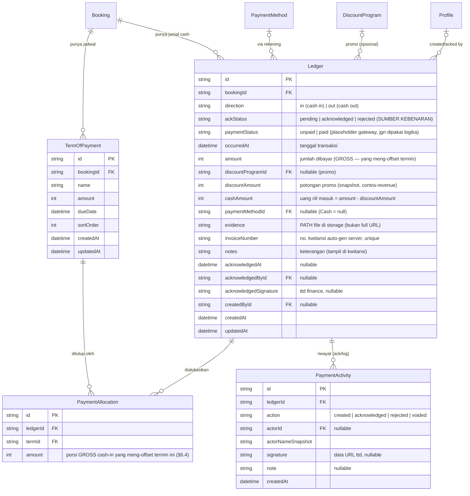

# Plan: TOP Slim-down + Ledger (Cashbook) + Create-Booking Payment Step

> 📌 **DOKUMEN AUTHORITATIVE buat Ledger/Cashbook.** Ada plan ledger lama di repo
> (`docs/ar-ledger-system-plan.md`, model `CashflowLedger` + `entryType` + `partialPaymentId`) —
> itu **SUPERSEDED**, jangan dipakai eksekusi. Model final = dokumen ini (`Ledger` + `direction`
> in/out + `PaymentAllocation`, discount-as-field, recognition di Booking).

> Status: **DESIGN / belum dieksekusi (kecuali prototype UI step 6).** Branch: `feat/crm`.
> Konteks: memisah **jadwal (Term of Payment)** dari **cash movement (Ledger)**, dengan
> Ledger sebagai **cashbook tunggal** — nyatet **cash IN** & **cash OUT** pakai arah `in`/`out`,
> dipakai bareng untuk AR (sekarang) dan AP (nanti).

> ⚠️ **Revisi finance-review (2026-07-12).** Plan ini udah di-audit dari kacamata akuntansi.
> 4 keputusan penting yang mengubah desain awal:
> 1. **`direction` = `in` / `out`** (BUKAN `credit`/`debit`). Istilah debit/kredit dibuang —
>    lihat §1.1. Alasan: "cash in = kredit" itu konvensi *bank statement*, KEBALIK dari
>    buku-besar akuntansi (di mana kas naik = debit). Nama tabel `Ledger` + istilah debit/kredit
>    = jebakan buat auditor. `in`/`out` netral & gak bisa salah.
> 2. **Recognition (`earned`/`unearned`) BUKAN di row Ledger** — pindah ke level Booking
>    (`Booking.recognizedAt`). Lihat §2.1. Alasan: revenue recognition (PSAK 72/IFRS 15) itu
>    properti event, bukan per-pembayaran; kalau per-row bisa muncul kondisi mustahil (1 booking
>    sebagian earned sebagian unearned).
> 3. **Ledger = single-entry cashbook**, BUKAN general ledger double-entry. Scope-nya
>    **operasional** (tracking cashflow + AR buat sales/finance), bukan akuntansi resmi
>    (neraca/L-R/pajak). Lihat §1.2.
> 4. **Alokasi promo pakai GROSS** — `PaymentAllocation.amount` meng-offset termin sebesar nilai
>    kotor (`amount`), diskon dicatat terpisah sebagai contra-revenue. Lihat §6.4. Alasan: kalau
>    offset pakai cash, piutang gak pernah nol padahal udah dikasih diskon.

---

## 0. Naming (FINAL — locked)

Tabel utama cashflow = **`Ledger`** (cashbook operasional — lihat §1.2, ini BUKAN GL akuntansi).
Nyambung ke AP juga (cash out) via arah `in`/`out`, bukan cuma sisi masuk. Anak tabelnya pakai
istilah **payment**.

| Peran | Nama tabel | `@@map` |
|---|---|---|
| Baris jurnal cash movement (main) | **`Ledger`** | `ledgers` |
| Alokasi ledger → termin (multi) | **`PaymentAllocation`** | `payment_allocations` |
| Log/ack per ledger (created/ack/void) | **`PaymentActivity`** | `payment_activities` |
| Jadwal cicilan (existing, dislim) | **`TermOfPayment`** | `term_of_payments` |

> "Payment" nggak dipakai buat tabel utama (sudah dipakai AP: `BookingPaymentSettlement`,
> `PaymentMethod`, `PartialPayment`) — makanya main-nya `Ledger`.
> FE read-model (`types/finance.ts::LedgerEntry`, `LedgerActivity`) = proyeksi/bentuk hasil
> query — boleh beda nama dari tabel DB.

---

## 1. Model arah dana (inti)

Satu row `Ledger` = satu pergerakan dana, punya **arah**:

| `direction` | Arti | Contoh |
|---|---|---|
| **`in`** | **cash IN** (uang masuk) | booking fee, DP, cicilan, pelunasan dari client |
| **`out`** | **cash OUT** (uang keluar) | bayar vendor, refund (AP — nanti) |

> **NO `entryType`.** Arah dana cukup diwakili `direction` (`in`/`out`) — `cash_in`/`cash_out`
> itu cuma sinonim, jadi redundant. **Discount** juga bukan baris tersendiri lagi: dia field
> dalam row pembayaran yang sama (`amount` gross, `discountAmount`, `cashAmount`,
> `discountProgramId`) — lihat §6. Kalau nanti AP butuh bedain jenis `out` (bayar vendor vs
> refund), tambah field sub-tipe **ortogonal** `outType: vendor | refund` (JANGAN hidupkan lagi
> `cash_in`/`cash_out`). **Refund (RESOLVED):** `direction=out` + `outType=refund` — bukan
> direction baru. `BookingPaymentSettlement.type=refund` yang existing feed ke sini pas cash keluar.
>
> Catatan: FE dummy sekarang (`types/finance.ts::LedgerEntry.entryType`,
> `receivable|cash_in|discount|recognition|…`) itu **model LAMA** (append-only journal). Model baru
> ini pakai `direction` + discount-as-field; FE nyusul di **Fase 4 (wire FE)**.

Alur:
1. Uang client pertama masuk → **`in`** (cash in).
2. Dana bisa **cash out** (`out`) karena dialokasikan ke vendor dll — AP, nanti.
3. **Revenue recognition:** query semua `in` ter-ack untuk 1 booking = total masuk. Jadi
   **pendapatan SAH** ketika **event selesai + approve 4-step (sales→manager→finance→client)**.
   Status recognition-nya **di Booking**, bukan di row Ledger — lihat §2.1.

### 1.1 Kenapa `in`/`out`, BUKAN debit/kredit

Di double-entry accounting, buat buku **Kas (aset)**: cash IN = **debit** kas (aset naik),
cash OUT = **kredit** kas (aset turun). Konvensi "cash in = kredit" yang sempat dipakai itu
konvensi **bank statement** (dari sisi nasabah: "credited" = masuk) — **KEBALIK** dari buku
besar akuntansi. Karena tabelnya dinamai `Ledger` dan sempat pakai istilah debit/kredit, itu
jebakan: akuntan/auditor bakal baca terbalik. **Solusi: buang istilah debit/kredit total**,
pakai `in`/`out` yang netral. Debit/kredit baru relevan kalau suatu saat dibangun layer
double-entry beneran (lihat §1.2) — dan itu di luar scope.

### 1.2 Ledger ini = single-entry **cashbook**, bukan general ledger

Desain 1 row = 1 movement + arah = **single-entry cashbook** (buku kas). Itu **BUKAN** general
ledger akuntansi (yang double-entry: tiap transaksi ≥2 baris debit=kredit, ada Chart of
Accounts, selalu balance). Buat kebutuhan sekarang (cashflow tracking + AR), single-entry
**cukup** — jangan over-engineer.

**Scope Ledger = OPERASIONAL** (tracking buat sales & finance), **BUKAN akuntansi resmi**
(neraca, laba-rugi, lapor pajak). Kalau nanti butuh laporan keuangan formal, itu **layer
terpisah** yang consume data Ledger — bukan bikin Ledger jadi double-entry. Nama `Ledger`
dipertahankan sebagai branding internal (FE, URL, folder udah kepakai), TAPI sadar ini cashbook.

---

## 2. Status di satu row `Ledger` (jangan ketuker)

| Field | Nilai | Arti |
|---|---|---|
| `direction` | `in` / `out` | arah dana (masuk/keluar) |
| **`ackStatus`** | `pending` / `acknowledged` / `rejected` | **sumber kebenaran** — verifikasi Finance (dana benar diterima). Gate buat AR & recognition. |
| `paymentStatus` | `unpaid` / `paid` | **placeholder gateway** — DISEDIAKAN tapi **JANGAN dipakai buat logika apa pun dulu**. Cuma buat integrasi payment gateway nanti. Manual transfer set `paid` langsung. |

> **`status` (earned/unearned) DIHAPUS dari row Ledger** — pindah ke Booking (§2.1).
>
> **Kenapa `ackStatus` yang jadi sumber kebenaran, bukan `paymentStatus`:** dua-duanya jawab
> pertanyaan "uang beneran ada?", jadi overlap. Kombinasi mentah = 2×3×2 = 12 state, kebanyakan
> gak valid. Buat sekarang: **cukup `ackStatus`** yang nge-gate AR & recognition. `paymentStatus`
> di-*add* ke schema tapi konstan `paid` (manual) — logikanya baru hidup pas gateway masuk.
> State-machine `ackStatus` yang valid: `pending → acknowledged` atau `pending → rejected`
> (dua-duanya final; koreksi setelah final = void + reissue, §6.5).

### 2.1 Revenue recognition ada di **Booking**, bukan row Ledger

Recognition (PSAK 72/IFRS 15) itu properti **event/booking**: begitu event selesai + 4-approval
lolos, **SELURUH** cash-in booking itu jadi *earned* sekaligus. Kalau `earned/unearned` disimpan
per-row Ledger, bisa muncul kondisi mustahil (1 booking sebagian row earned, sebagian unearned).

**Solusi:** taruh di `Booking`:

| Field baru di `Booking` | Tipe | Arti |
|---|---|---|
| `recognizedAt` | `DateTime?` | null = unearned. Terisi = pendapatan diakui (event selesai + 4-approval). |
| `recognizedById` | `String?` (FK Profile) | siapa yang men-trigger recognition (finance). |

- **Unearned revenue** (booking) = Σ Ledger `in` ter-ack milik booking dengan `recognizedAt == null`.
- **Earned revenue** (booking) = Σ Ledger `in` ter-ack milik booking dengan `recognizedAt != null`.
- Ledger row **gak punya** field recognition — dia murni nyatet cash movement.
- **Driver `recognizedAt` (RESOLVED):** aksi **manual finance**, di-*gate* 2 syarat —
  `Booking.bookingStatus === Confirmed` **DAN** event udah lewat (`eventDate < now`, atau ada
  `EventEvaluation`). BUKAN auto-trigger: auto pas `Confirmed` salah (approval jalan sebelum
  event, masih unearned); auto pas `eventDate` lewat rapuh kalau event batal. Manual + guard =
  paling aman. Finance klik "Akui Pendapatan" pas event beres.
- **Opsi lain (nanti):** kalau butuh audit trail recognition (siapa/kapan/snapshot approval),
  pecah ke tabel `RevenueRecognition` (1 booking : 0..1). Buat sekarang 2 field di Booking cukup.

---

## 3. 🎯 Scope SEKARANG

**Cuma sampai "cash in → `direction: in`" — nyiapin data ready.** Sisanya ditunda:

| Sekarang ✅ | Nanti ⏳ |
|---|---|
| TOP dislim (jadwal murni) | Cash out / AP (`direction: out`, link vendor) |
| `Ledger` arah **`in`** (cash in) + `PaymentAllocation` ke TOP | Revenue recognition (`Booking.recognizedAt`) |
| `paymentStatus` (unpaid/paid) field disediakan (placeholder) | Payment gateway integration |
| Capture cash-in di cashflow + step 6 create booking (UI dummy) | Approval 4-step |
| Status termin derived dari `in` ter-ack | Integrasi `BookingPaymentSettlement` (AP) |

---

## 4. Masalah model TOP sekarang

`TermOfPayment` nyampur jadwal + tracking pembayaran → dipindah ke `Ledger`:

| Jadwal (tetap di TOP) | Pindah ke Ledger |
|---|---|
| `name`, `amount`, `dueDate`, `sortOrder`, **`invoiceNumber`** | `paymentStatus`, `paymentEvidence`, `paymentMethodId`, `ackStatus`, `acknowledgedAt/By` |

> ⚠️ **`invoiceNumber` TETAP di TOP (impact-analysis 2026-07-12).** `TermOfPayment.invoiceNumber`
> itu **nomor INVOICE / tagihan** per-termin (pola `<seq>/INV/<venue>/<bln>/<thn>`, di-generate pas
> create booking, dibaca `lib/queries/ar.ts:99` buat `statusInvoice`). Itu **BEDA dokumen** dari
> **nomor KWITANSI** (`Ledger.invoiceNumber`, pola `/KW/`, bukti terima per-pembayaran). Invoice =
> tagihan (sebelum bayar); kwitansi = bukti terima (sesudah bayar). **Jangan digabung** — dua-duanya
> hidup berdampingan. Ini mengoreksi rencana awal yang sempat men-drop `invoiceNumber` dari TOP.

`PartialPayment` (child TOP) di-migrate → `Ledger(in)` + `PaymentAllocation`.

**Strategi migrasi + backfill (RESOLVED — 2-pass).** Masalah: TOP bisa `paid`/`partial`
**tanpa** row `PartialPayment` sama sekali (marking manual legacy).
1. **Real:** tiap `PartialPayment` → 1 `Ledger(in)` (`occurredAt=paidAt`, `amount`, `evidence`,
   `notes`) + 1 `PaymentAllocation(termId, amount)`. Lurus 1:1.
2. **Synthetic (gap):** term `paid`/`partial` yang `Σ PartialPayment < amount` → bikin `Ledger(in)`
   buat **selisihnya** (`amount − Σpartial`), `occurredAt = acknowledgedAt ?? updatedAt`, alokasi =
   gap, `notes = "[migrasi]"` (audit trail).

Field ack term (`ackStatus`, `acknowledgedAt`, `acknowledgedById`, `paymentEvidence`) ikut pindah
ke row Ledger hasil migrasi — jejak ack Finance gak hilang.

---

## 5. Target: 2-layer

```
Booking  (+ recognizedAt, recognizedById  → recognition ada di sini, §2.1)
 ├── TermOfPayment[]     → JADWAL: apa yang harus dibayar & kapan
 └── Ledger[]            → CASHBOOK: cash in (in) / cash out (out)
       └── PaymentAllocation → alokasi cash-in ke 1..n TermOfPayment
```

- 1 cash-in (`in`) bisa nutup banyak TOP; 1 TOP bisa ditutup banyak cash-in.
- Status TOP **derived** dari `PaymentAllocation` (dari Ledger `in` yang ter-ack).

---

## 6. ERD



### 6.1 Tabel BARU
- **`Ledger`** (`ledgers`) — cashbook. Sekarang `direction=in`. Generalisasi `PartialPayment`.
- **`PaymentAllocation`** (`payment_allocations`) — join cash-in ↔ TOP + nominal gross. `@@unique([ledgerId, termId])`.
- **`PaymentActivity`** (`payment_activities`) — log append-only + snapshot ttd.

### 6.2 DIUBAH
- **`TermOfPayment`** — drop `paymentStatus`, `paymentEvidence`, `paymentMethodId`, `ackStatus`, `acknowledgedAt`, `acknowledgedById`. **`invoiceNumber` TETAP** (nomor tagihan/INV — §4).
- **`Booking`** — TAMBAH `recognizedAt: DateTime?`, `recognizedById: String?` (FK Profile) — recognition pindah ke sini (§2.1).
- **`PartialPayment`** — migrate → `Ledger(in)` + `PaymentAllocation`.

### 6.3 EXISTING (tak berubah)
`DiscountProgram`, `PaymentMethod`, `Profile`.

**`BookingPaymentSettlement` ↔ Ledger (RESOLVED):** **NO mirror/double-write.** Settlement tetap
sumber kebenaran AP (jadwal/intent bayar vendor, punya `status: pending|completed|cancelled`).
Ledger `out` lahir **cuma pas cash beneran keluar** — yaitu `settlement.status → completed` bikin
**1** row `Ledger(out, outType=vendor|refund)`. Simetris sama sisi in: TOP (jadwal) → Ledger `in`
(cash). Ini bikin Ledger jadi cashbook tunggal tanpa drift duplikasi. **(Scope Nanti ⏳.)**

### 6.4 Alokasi promo: pakai **GROSS**, bukan cash

`PaymentAllocation.amount` yang meng-offset termin = **gross** (`Ledger.amount`), BUKAN
`cashAmount`. Diskon = **contra-revenue** (potongan penjualan), dicatat di `Ledger.discountAmount`
+ `discountProgramId` buat pelaporan.

> **Kenapa gross:** kalau termin di-offset pakai `cashAmount` (uang riil < nominal karena diskon),
> piutang termin **gak akan pernah nol** padahal client udah dapat diskon → AR salah. Dengan gross,
> termin bisa **lunas** walau kas masuk lebih kecil; selisihnya kebukti sebagai potongan penjualan.
>
> **Contoh:** termin `Rp10jt`, promo 10% → client bayar `Rp9jt`. `Ledger.amount=10jt`,
> `discountAmount=1jt`, `cashAmount=9jt`. `PaymentAllocation.amount=10jt` → termin **LUNAS**.
> Kas nambah `9jt`, potongan penjualan `1jt`.
>
> ⚠️ Bedakan dari **diskon level-booking** (`Booking.specialBonusAmount`): itu udah ngurangi harga
> paket **di depan**, jadi total TOP udah net — gak ada isu gross/cash di allocation. Yang §6.4 ini
> khusus **promo per-pembayaran** (`Ledger.discountProgramId`).

### 6.5 Immutability, constraints, index

- **Immutability:** Ledger row yang udah `ackStatus=acknowledged` **IMMUTABLE** — gak boleh
  di-edit/di-hapus. Koreksi = `PaymentActivity(action=voided)` + row Ledger **baru** (reversing/
  reissue), bukan overwrite. Row `pending` masih boleh di-edit (FE Edit sudah restrict ke pending).
- **Constraints (enforce di server, array-form tx):**
  1. Per `termId`: `Σ PaymentAllocation.amount` (dari Ledger `in` ter-ack) **≤** `TermOfPayment.amount` (gak over-alokasi termin).
  2. Per `ledgerId`: `Σ PaymentAllocation.amount` **≤** `Ledger.amount` (gak alokasi > yang dibayar).
  3. `cashAmount == amount - discountAmount` (invariant, cek server).
  4. **Unallocated dibolehin di DB (RESOLVED):** `Σalloc < amount` VALID (sisa = titipan/DP sebelum
     TOP fix, atau overpayment) — constraint #2 udah otomatis ngizinin. Wajib "≥1 alokasi" itu
     **aturan FE aja** (UX happy-path), BUKAN invariant server. Server gak nolak cash-in unallocated.
- **Index (AR aging & derived status dihitung on-the-fly):** `PaymentAllocation(termId)`,
  `TermOfPayment(bookingId, dueDate)`, `Ledger(bookingId, direction, ackStatus)`.

### 6.6 ⚠️ `ackStatus`/`paymentStatus` TOP itu LOAD-BEARING — rewire dulu sebelum drop

Impact-analysis (2026-07-12) nemu: `TermOfPayment.ackStatus` & `paymentStatus` **BUKAN cuma display** —
dipakai buat **lock-protection & deteksi material-change** di logika inti. Drop mentah = app break.
Consumer yang WAJIB di-rewire ke sinyal Ledger (**"ada `Ledger(in)` ter-ack yang beralokasi ke termin ini?"**)
sebelum kolomnya boleh di-drop di Fase 5:

| File | Peran | Sinyal pengganti |
|---|---|---|
| `actions/payment-ack.ts` | **seluruh ack flow existing** (set `ackStatus=acknowledged` per TOP) | ganti target ack → **row Ledger** (`actions/ledger.ts` ack) |
| `actions/booking-revision.ts:152-166` | deteksi material-change (termin `paid`/`ack` = locked) | ada alokasi ter-ack ke termin? |
| `actions/booking.ts:1650-1698` | edit-booking lock termin + hapus evidence pas reverse | idem + evidence pindah ke Ledger |
| `actions/term-of-payment.ts:89-101` | lock guard TOP saat edit jadwal | idem |
| `actions/package-prices.ts:71,253,298` | guard ubah harga saat termin terkunci | idem |
| `lib/queries/ar.ts` | `statusInvoice` + status termin | derived dari alokasi gross |

> **Konsekuensi sequencing:** rewire guard ini masuk **Fase 4** (bareng wire FE), BUKAN Fase 5.
> Fase 5 (drop kolom) baru jalan setelah SEMUA baris tabel ini gak baca `TOP.ackStatus`/`paymentStatus` lagi.
> `payment-ack.ts` praktis **ditulis ulang** jadi ack-Ledger, bukan ack-TOP.

---

## 7. Field khusus

### 7.1 `evidence` — path only
Simpan **storage path/key** (mis. `bookings/xxx/bukti-123.jpg`), BUKAN full URL. FE prepend
`NEXT_PUBLIC_S3_PUBLIC_URL` saat render (pola `toFullUrl()` di `edit-finance-shared.tsx`).

### 7.2 `invoiceNumber` — nomor kwitansi (auto-gen server)
Di-generate **server-side, kayak no PO** di create booking (auto-increment sequence + kode).
Template:
```
<auto_increment>/KW/<brand_kode>/<venue_kode>/<bulan_dibuat>/<tahun_dibuat>
```
Contoh: `0006/KW/GWN/SMSR/07/2026` (**bulan ANGKA 2-digit** — RESOLVED). `@@unique`.

**Generator (impact-analysis 2026-07-12):** pakai `getNextSequence` / `getNextSequenceBatch` dari
**`@/lib/counter`** (bukan bikin baru) — counter atomik yang udah dipakai `poNumber` & `invoiceNumber`
TOP. Key baru mis. `kwitansi-<year>`. Reuse di `actions/ledger.ts`.

> ⚠️ **Dua nomor beda jangan ketuker:**
> - **KWITANSI** (Ledger, bukti terima) → `/KW/`, **bulan ANGKA** `07`.
> - **INVOICE** (TOP, tagihan) → `/INV/`, existing masih **Romawi** (`booking.ts:278`,
>   `booking-mice-draft.ts:377` pakai `ROMAN[month]`). Itu dokumen lain, **biarin** — bukan bagian
>   scope ini.
>
> **FE dummy kwitansi masih Romawi** (`ledger-dummy.ts::ROMAN_MONTHS`, `ledger-entry-drawer.tsx:641`).
> Ganti ke angka 2-digit pas **Fase 4 (wire FE)** biar match server.

### 7.3 Rounding promo (PERCENTAGE)
FE hitung `discountAmount = Math.round(amount * value / 100)`. **Server WAJIB pakai rule
pembulatan yang sama** biar `cashAmount` gak selisih 1 rupiah antara preview & data tersimpan.
`Int` (IDR tanpa sen) sudah tepat — jangan pakai float.

---

## 8. Create wizard: resolusi `uid → id`

Step 6 (Payment) nge-link TOP yang baru dibuat di step 5 (belum ada DB id). **Solusi:** link
pakai **`uid`** (client-id di `TermRow`); server resolve ke `termId` saat submit (1 transaksi):
create Booking → TOP[] (map uid→id) → Ledger[] → PaymentAllocation[] (uid→termId). Booking
pakai DB-draft, jadi kalau TOP sudah persist, `termId` sudah ada. Validasi: Σ alokasi ke termin ≤ `TermOfPayment.amount`.

---

## 9. Rencana eksekusi (bertahap, UI-first)

| Fase | Isi | Layer |
|---|---|---|
| **0. Prototype UI** ✅ *(step 6 wizard + slim TOP, dummy — DONE, belum commit)* | Payment step + slim TOP pakai local state (cash in only). | FE only |
| **1. Schema** ⚙️ *(ADDITIVE — zero risk)* | Migration **nambah doang**: `Ledger` (`direction=in` dulu, + `paymentStatus` placeholder), `PaymentAllocation`, `PaymentActivity`; TAMBAH `Booking.recognizedAt/recognizedById`; migrate `PartialPayment` → Ledger (2-pass §4). **TOP kolom lama TIDAK di-drop** (ditunda Fase 5). | Prisma |
| **2. Server actions** | `actions/ledger.ts` (create/ack/void cash-in + gen kwitansi via `@/lib/counter` §7.2 + constraints §6.5 + rounding §7.3), update `actions/booking.ts` (uid→id step 6). Array-form tx. | actions |
| **3. Queries** | `lib/queries/ledger.ts` (view + derived status TOP dari alokasi gross), update `lib/queries/ar.ts`. | queries |
| **4. Wire FE + rewire guard** | Cashflow + step 6 → data real (`Ledger` `in`). Buang `entryType` model lama dari `types/finance.ts`, ganti FE kwitansi Romawi→angka. **REWIRE lock-guard (§6.6):** `payment-ack.ts`→ack Ledger, material-change & edit-lock baca alokasi ter-ack (bukan `TOP.ackStatus`). | FE + actions |
| **5. Cleanup** ⚠️ *(baru aman stlh Fase 4)* | Drop kolom TOP (`paymentStatus`/`paymentEvidence`/`paymentMethodId`/`ackStatus`/`acknowledgedAt`/`acknowledgedById` — **`invoiceNumber` TETAP**, §6.2) + drop `PartialPayment` table (stlh data ke-migrate) + hapus dari edit-top-drawer/takeout. | FE + schema |
| **6+. AP + Recognition + Gateway** ⏳ | `direction=out` (vendor), set `Booking.recognizedAt` (event selesai + 4-approval), payment gateway (`paymentStatus` hidup). | later |

---

## 10. Dampak / file
> Diperbarui dari impact-analysis 2026-07-12 — consumer jauh lebih banyak dari perkiraan awal.

- **Schema:** `prisma/schema.prisma` (+ migration) — 3 tabel baru, `Booking.recognizedAt/recognizedById`, migrate PartialPayment. Slim TOP = Fase 5 (belakangan).
- **Actions (baru):** `actions/ledger.ts`.
- **Actions (rewire lock-guard §6.6):** `actions/payment-ack.ts` (**ditulis ulang** → ack Ledger), `actions/booking-revision.ts:152-166` (material-change), `actions/booking.ts:1650-1698` (edit-lock + uid→id step 6 :571), `actions/term-of-payment.ts:89-101`, `actions/package-prices.ts:71,253,298`.
- **Actions (PartialPayment consumer → migrate/hapus):** `actions/partial-payment.ts`, `app/api/bookings/partial-payment-evidence/route.ts`, `lib/access-control.ts:61` (`getBookingIdFromPartialPayment`).
- **Queries:** `lib/queries/ledger.ts` (baru), `lib/queries/ar.ts` (status derived + `statusInvoice` tetap dari `TOP.invoiceNumber`), `lib/queries/booking-finance-detail.ts`, `lib/queries/finance.ts` (`paidSoFar` dari alokasi).
- **Validations:** `lib/validations/booking.ts` (TOP tanpa payment fields), `lib/validations/ledger.ts`.
- **Wizard create:** `booking-drawer.tsx` (step TOP slim + step 6 Payment — prototype done).
- **Edit:** `edit-top-drawer.tsx`, `edit-finance-shared.tsx` (`PartialPayment`/`FinanceTerm` slim), `takeout-top-step.tsx`, `ar-detail-drawer.tsx` (partialPayments history).
- **Ledger FE:** `finance/ledger/*`, `types/finance.ts`, `components/pdf/KwitansiPdfDocument.tsx`.
- **AR pages:** `finance/accounts-receivable/*` (status derived).
- **Draft:** `actions/booking-draft.ts`, `actions/booking-mice-draft.ts` (evidence handling + invoice gen — cek regres).

---

## 11. Keputusan & open questions

### 11.1 RESOLVED (finance-review 2026-07-12)

**Batch 1 — konsep akuntansi:**
- ✅ **Konvensi arah dana** — pakai `in`/`out`, buang debit/kredit (§1.1).
- ✅ **Promo offset gross vs cash** — **gross** meng-offset termin, diskon = contra-revenue (§6.4).
- ✅ **Recognition level** — di `Booking.recognizedAt`, BUKAN row Ledger (§2.1).
- ✅ **Ledger scope** — single-entry cashbook operasional, bukan GL akuntansi (§1.2).
- ✅ **paymentStatus vs ackStatus** — `ackStatus` sumber kebenaran; `paymentStatus` placeholder gateway (§2).
- ✅ **Immutability** — acked = immutable, koreksi via void+reissue (§6.5).

**Batch 2 — driver teknis (2026-07-12, resolved sebelum Fase 1):**
- ✅ **#1 Driver `recognizedAt`** — manual finance, gate `Confirmed` + event lewat (§2.1). Scope Nanti ⏳.
- ✅ **#2 Refund** — `direction=out` + `outType=refund` (ortogonal, bukan direction baru) (§1). Scope Nanti ⏳.
- ✅ **#3 AP ↔ Ledger** — no mirror; `settlement→completed` bikin 1 `Ledger(out)` (§6.3). Scope Nanti ⏳.
- ✅ **#4 Migrasi `PartialPayment`** — 2-pass: real 1:1 + synthetic gap `[migrasi]` (§4).
- ✅ **#5 Unallocated cash-in** — DB izinin (`Σalloc < amount` valid); wajib ≥1 = FE-only (§6.5 #4).
- ✅ **#6 Bulan `invoiceNumber`** — **angka 2-digit** (`07`), FE dummy diganti dari Romawi pas Fase 4 (§7.2).

### 11.2 MASIH OPEN
_Kosong — semua open question sebelum Fase 1 sudah resolved. Isu baru muncul saat eksekusi taruh sini._
