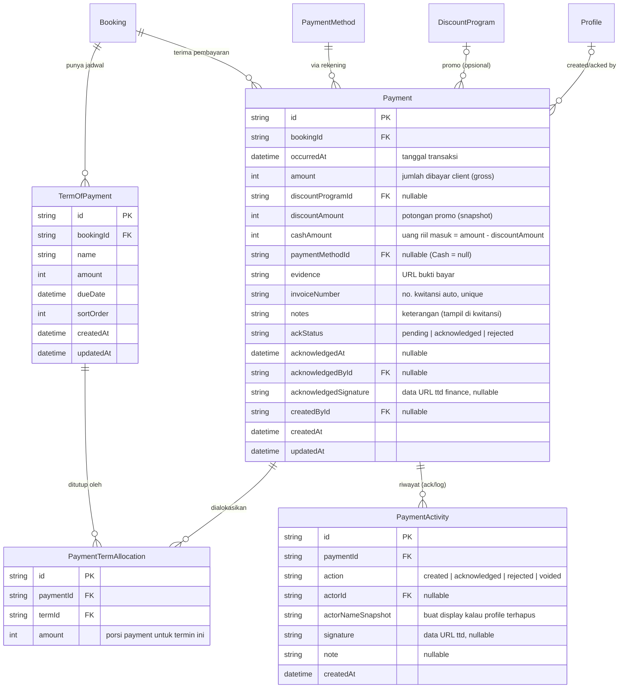

# Plan: TOP Slim-down + Payment Layer + Ledger DB

> Status: **DESIGN / belum dieksekusi.** Branch: `feat/crm`.
> Konteks: memisah **jadwal (Term of Payment)** dari **pembayaran (Payment)**, dan
> menjadikan **cashflow/ledger** sebagai layer pembayaran tunggal. Termasuk step
> baru "Payment" di wizard create booking + ERD DB untuk ledger.

---

## 1. Tujuan

1. **TOP = jadwal murni** — cuma `sortOrder`, `name`, `amount`, `dueDate`. Hilangkan
   tracking pembayaran (status/bukti/metode/ack) dari termin.
2. **Payment = layer terpisah** — mencatat uang masuk beneran (persis input drawer
   "Catat Transaksi" cashflow): tanggal, nominal, via rekening, bukti, keterangan,
   link ke TOP (multi), promo, + ack/verifikasi Finance.
3. **Status termin = derived** — dihitung dari total pembayaran yang **sudah di-ack**,
   bukan di-set manual.
4. **Ledger (cashflow) = projection** dari Payment + TOP + Booking, bukan tabel journal
   terpisah (lihat §6).
5. **Create booking** dapat step 6 "Payment" yang bisa nge-link TOP yang baru dibuat di
   step 5 (via `uid`, resolve ke DB id saat submit).

---

## 2. Masalah model sekarang

`TermOfPayment` (schema saat ini) nyampur 2 tanggung jawab:

| Jadwal (rencana) | Tracking pembayaran (harus pindah) |
|---|---|
| `name`, `amount`, `dueDate`, `sortOrder` | `paymentStatus`, `paymentEvidence`, `paymentMethodId`, `invoiceNumber`, `ackStatus`, `acknowledgedAt`, `acknowledgedById` |

Create wizard (step TOP) set `paymentStatus` + upload `paymentEvidence` langsung di termin →
schedule & payment tercampur, dan status bisa "boong" (paid tanpa duit ter-ack).
`PartialPayment` (child TOP) sebetulnya sudah ada tapi ke-bypass.

---

## 3. Target: model 2-layer

```
Booking
 ├── TermOfPayment[]      → JADWAL: apa yang harus dibayar & kapan
 └── Payment[]            → UANG MASUK: berapa yang benar-benar dibayar
       └── alokasi ke 1..n TermOfPayment (many-to-many + nominal)
```

- **1 Payment bisa nutup banyak TOP** (mis. transfer sekaligus buat Booking Fee + DP).
- **1 TOP bisa ditutup banyak Payment** (mis. cicilan partial).
- Status TOP **derived** dari alokasi payment yang ter-ack.

---

## 4. ERD



### 4.1 Tabel BARU

**`Payment`** (`payments`) — inti dari ledger. Generalisasi dari `PartialPayment`
(yang cuma 1 termin) → bisa link banyak termin lewat `PaymentTermAllocation`.

**`PaymentTermAllocation`** (`payment_term_allocations`) — join Payment ↔ TOP dengan
nominal alokasi. `@@unique([paymentId, termId])`.

**`PaymentActivity`** (`payment_activities`) — append-only log per payment (created,
acknowledged, rejected, voided) + snapshot ttd. Ini yang jadi "Riwayat" di cashflow.

### 4.2 Tabel yang DIUBAH

**`TermOfPayment`** — drop kolom: `paymentStatus`, `paymentEvidence`, `paymentMethodId`,
`invoiceNumber`, `ackStatus`, `acknowledgedAt`, `acknowledgedById`. Sisakan jadwal murni.

**`PartialPayment`** — **deprecate / migrate** ke `Payment` + `PaymentTermAllocation`
(lihat §7). Data lama: tiap `PartialPayment(termId, amount, paidAt, evidence)` →
1 `Payment` + 1 alokasi ke `termId`-nya.

### 4.3 Tabel EXISTING yang dipakai (tidak berubah)

- `Booking` — parent. `sellingPrice` dipakai buat validasi total TOP.
- `DiscountProgram` (`discount_programs`) — promo: `discountType`, `discountValue`, `quota`, dst.
- `PaymentMethod` — rekening tujuan.
- `Profile` — created/acknowledged by.

> Catatan: `BookingPaymentSettlement` itu buat **AP/vendor settlement**
> (snapVendorItem/targetBooking), **bukan** payment customer — tidak disentuh.

---

## 5. Stored vs Derived

| Nilai | Stored / Derived | Rumus |
|---|---|---|
| Nominal termin | stored | `TermOfPayment.amount` |
| Uang masuk | stored | `Payment.cashAmount` |
| **Paid amount / termin** | **derived** | Σ `allocation.amount` WHERE `payment.ackStatus = acknowledged` |
| **Status termin** | **derived** | `0 → unpaid`, `< amount → partial`, `≥ amount → paid` |
| **Sisa piutang / termin** | **derived** | `amount − paidAmount` |
| **Ledger: cash_in** | dari `Payment` | `cashAmount` |
| **Ledger: discount** | dari `Payment` | `discountAmount` (kalau promo) |
| **Ledger: receivable** | **derived** | per TOP yang `sisa > 0` |
| **Ledger: unearned vs earned** | **derived** | payment ter-ack + booking event **belum** selesai → `unearned`; event **sudah** selesai (+ approval) → `earned` (pendapatan diakui) |

---

## 6. Ledger = projection, bukan tabel journal

**Rekomendasi: TIDAK bikin tabel `LedgerEntry`.** Cashflow list = query projection:

| Ledger row (FE `LedgerEntry`) | Sumber |
|---|---|
| `cash_in` | tiap `Payment` (cashAmount, ackStatus, invoiceNumber, dst) |
| `discount` | `Payment` yang punya `discountProgramId` (amount = discountAmount) |
| `receivable` | derived per `TermOfPayment` dengan sisa > 0 |
| `recognition` / `earned` | derived dari status event booking |

**Alasan:** satu sumber kebenaran, nggak ada double-write / risiko desync.
`types/finance.ts::LedgerEntry` tetap dipakai sebagai **read-model** (bentuk hasil query),
di-assembly di `lib/queries/ledger.ts`.

**Alternatif (kalau nanti butuh audit journal ketat):** materialize jadi tabel append-only.
Ditunda dulu — belum perlu.

---

## 7. Create wizard: resolusi `uid → id`

PR utama: step 6 (Payment) harus nge-link TOP yang baru dibuat di step 5 (belum ada DB id).

**Solusi:** link pakai **`uid`** (client-id stabil yang sudah ada di `TermRow`), lalu server
resolve ke `termId` DB asli saat submit.

```
STEP 5 TOP                 STEP 6 PAYMENT              SUBMIT (1 transaksi)
──────────                 ─────────────              ───────────────────
A uid=a1  ┐                Payment #1                 1. create Booking
B uid=b2  ┼──────────────► link: [a1, b2]      ─────► 2. create TOP[] → map uid→id
C uid=c3  ┘                promo: EarlyBird           3. create Payment[]
                                                      4. create Allocation[]
                                                         (uid → termId asli)
```

- Multi-link: pakai **card-picker termin** yang sudah dibuat di cashflow, sumbernya TOP
  in-memory step 5.
- Promo: reuse logika split cashflow (amount → cash + discount).
- Multiple payment: step 6 boleh > 1 entri (mis. Booking Fee + DP), tiap entri link TOP sendiri.
- Bonus: booking pakai **DB-backed draft**, jadi kalau TOP sudah tersimpan sebagai draft,
  `termId` sudah ada → linking makin gampang. `uid` tetap kunci aman di dua kondisi.

**Validasi (server + client):** Σ alokasi ke termin X (dari semua payment) ≤ `TermOfPayment.amount`
(anti overpay). Nominal TOP ada di memori step 6, jadi bisa divalidasi live.

---

## 8. Rencana eksekusi (bertahap, UI-first)

| Fase | Isi | Layer |
|---|---|---|
| **0. Prototype UI** | Step 6 "Payment" di wizard pakai **dummy** (tanpa DB). TOP slim-down secara UI. Card-picker TOP + promo + multi-payment. Acc dulu tampilannya. | FE only |
| **1. Schema** | Migration: bikin `Payment`, `PaymentTermAllocation`, `PaymentActivity`; slim `TermOfPayment`; migrate `PartialPayment`. Idempotent + seeder kalau perlu. | Prisma |
| **2. Server actions** | `actions/payment.ts` (create/ack/void), update `actions/booking.ts` (create/edit + resolusi uid→id), update `actions/term-of-payment.ts`. Transaksi array-form (Neon HTTP). | actions |
| **3. Queries** | `lib/queries/ledger.ts` (projection), derived status TOP, update `lib/queries/ar.ts`. | queries |
| **4. Wire FE** | Ganti dummy ledger + step 6 ke data real. Cashflow "Catat Transaksi" → `Payment`. | FE |
| **5. Cleanup** | Hapus dropdown status + upload bukti dari step TOP; hapus field lama di edit-top-drawer. | FE + schema |

---

## 9. Dampak / file yang kesentuh

- **Schema:** `prisma/schema.prisma` (+ migration) — 3 tabel baru, slim TOP, migrate PartialPayment.
- **Actions:** `actions/booking.ts`, `actions/term-of-payment.ts`, `actions/payment.ts` (baru).
- **Queries:** `lib/queries/ledger.ts` (baru), `lib/queries/ar.ts`, `lib/queries/booking-finance-detail.ts`.
- **Validations:** `lib/validations/booking.ts` (TOP tanpa payment fields), `lib/validations/payment.ts` (baru, reuse dari `ledger.ts`).
- **Wizard create:** `booking-drawer.tsx` (step TOP slim + step 6 Payment baru).
- **Edit:** `edit-top-drawer.tsx`, `edit-finance-shared.tsx` (`FinanceTerm` slim), `EditTakeoutDrawer.tsx`, `takeout-top-step.tsx` (status jadi derived).
- **Ledger FE:** `finance/ledger/*` (dummy → real), `components/pdf/KwitansiPdfDocument.tsx` (sumber dari Payment).
- **AR pages:** `finance/accounts-receivable/*` (status derived).

---

## 10. Open questions (perlu keputusan sebelum Fase 1)

1. **Semantik `amount` vs `cashAmount` saat promo.** Di cashflow sekarang:
   `cashAmount = amount − discount`. Perlu dikonfirmasi: yang dikreditkan ke termin itu
   `amount` (gross) atau `cashAmount` (net)? → nentuin alokasi.
2. **Driver "recognition/earned".** Sinyalnya dari mana? `booking.eventDate` lewat +
   approval selesai? Perlu 1 sinyal jelas.
3. **Refund / koreksi.** Dibikin sebagai `Payment` bertipe refund (nominal negatif) atau
   entri sendiri? (Rekomendasi: payment refund, bukan toggle manual.)
4. **Void payment.** Boleh hapus payment yang belum ack? Yang sudah ack → void + activity log?
5. **Migrasi data existing** `PartialPayment` + termin yang statusnya udah `paid` manual tapi
   nggak ada payment row — perlu strategi backfill.
