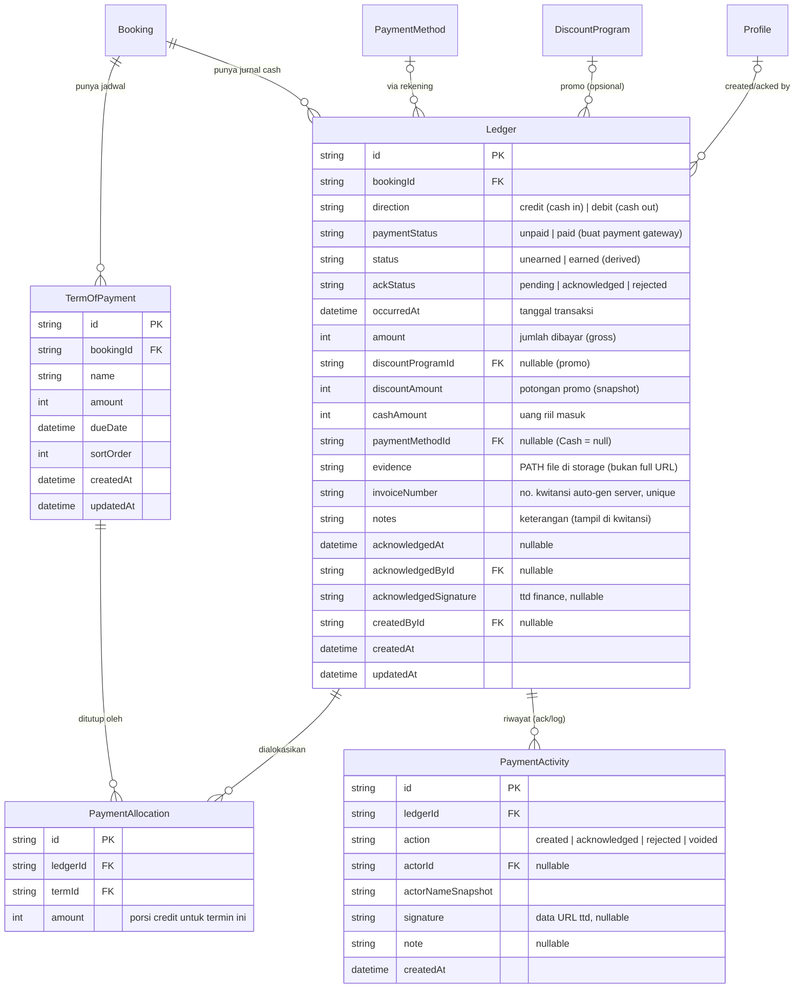

# Plan: TOP Slim-down + Ledger (Buku Besar) + Create-Booking Payment Step

> Status: **DESIGN / belum dieksekusi (kecuali prototype UI step 6).** Branch: `feat/crm`.
> Konteks: memisah **jadwal (Term of Payment)** dari **cash movement (Ledger)**, dengan
> Ledger sebagai **buku besar tunggal** — nyatet **cash in (kredit)** & **cash out (debit)**,
> dipakai bareng untuk AR (sekarang) dan AP (nanti).

---

## 0. Naming (FINAL — locked)

Tabel utama cashflow = **`Ledger`** (buku besar). Nyambung ke AP juga (cash out), jadi jurnal
umum debit/kredit, bukan cuma sisi masuk. Anak tabelnya pakai istilah **payment**.

| Peran | Nama tabel | `@@map` |
|---|---|---|
| Baris jurnal cash movement (main) | **`Ledger`** | `ledgers` |
| Alokasi ledger → termin (multi) | **`PaymentAllocation`** | `payment_allocations` |
| Log/ack per ledger (created/ack/void) | **`PaymentActivity`** | `payment_activities` |
| Jadwal cicilan (existing, dislim) | **`TermOfPayment`** | `term_of_payments` |

> "Payment" nggak dipakai buat tabel utama (sudah dipakai AP: `BookingPaymentSettlement`,
> `PaymentMethod`, `PartialPayment`) — makanya main-nya `Ledger`.
> FE read-model (`types/finance.ts::LedgerEntry`, `LedgerActivity`) = proyeksi/bentuk hasil
> query — boleh beda nama dari tabel DB.

---

## 1. Model debit/kredit (inti)

Satu row `Ledger` = satu pergerakan dana, punya **arah**:

| `direction` | Arti | Contoh |
|---|---|---|
| **`credit`** | **cash IN** (uang masuk) | booking fee, DP, cicilan, pelunasan dari client |
| **`debit`** | **cash OUT** (uang keluar) | bayar vendor, refund (AP — nanti) |

> **NO `entryType`.** Arah dana cukup diwakili `direction` (credit/debit) — `cash_in`/`cash_out`
> itu cuma sinonim `credit`/`debit`, jadi redundant. **Discount** juga bukan baris tersendiri
> lagi: dia field dalam row pembayaran yang sama (`amount` gross, `discountAmount`, `cashAmount`,
> `discountProgramId`) — lihat §6. Kalau nanti AP butuh bedain jenis debit (bayar vendor vs
> refund), tambah field sub-tipe yang **ortogonal** ke `direction`, JANGAN hidupkan lagi
> `cash_in`/`cash_out`.
>
> Catatan: FE dummy sekarang (`types/finance.ts::LedgerEntry.entryType`,
> `receivable|cash_in|discount|recognition|…`) itu **model LAMA** (append-only journal). Model baru
> ini pakai `direction` + discount-as-field; FE nyusul di **Fase 4 (wire FE)**.

Alur:
1. Uang client pertama masuk → **credit** (cash in).
2. Dana bisa **cash out** (debit) karena dialokasikan ke vendor dll — AP, nanti.
3. **Revenue recognition:** query semua `credit` ter-ack untuk 1 booking = total masuk.
   Jadi **pendapatan SAH** ketika **event selesai + approve 4-step (sales→manager→finance→client)**.
   Sebelum itu **`unearned`**.

---

## 2. Status di satu row `Ledger` (jangan ketuker)

| Field | Nilai | Arti |
|---|---|---|
| `direction` | `credit` / `debit` | arah dana (in/out) |
| **`paymentStatus`** | **`unpaid` / `paid`** | **status settlement** — buat integrasi **payment gateway** nanti (link dibuat = `unpaid`, dana benar masuk = `paid`). Manual transfer bisa langsung `paid`. |
| `ackStatus` | `pending` / `acknowledged` / `rejected` | verifikasi Finance (dana benar diterima) |
| `status` | `unearned` / `earned` | **derived** — pengakuan pendapatan (event selesai + 4 approval) |

> Relasi `paymentStatus` vs `ackStatus` → open question #7 (gateway auto-paid mungkin skip ack;
> manual transfer butuh ack). Untuk sekarang dua-duanya disediakan.

---

## 3. 🎯 Scope SEKARANG

**Cuma sampai "cash in → credit" — nyiapin data ready.** Sisanya ditunda:

| Sekarang ✅ | Nanti ⏳ |
|---|---|
| TOP dislim (jadwal murni) | Cash out / AP (`direction: debit`, link vendor) |
| `Ledger` arah **credit** (cash in) + `PaymentAllocation` ke TOP | Revenue recognition (`unearned → earned`) |
| `paymentStatus` (unpaid/paid) field disediakan | Payment gateway integration |
| Capture cash-in di cashflow + step 6 create booking (UI dummy) | Approval 4-step |
| Status termin derived dari credit ter-ack | Integrasi `BookingPaymentSettlement` (AP) |

---

## 4. Masalah model TOP sekarang

`TermOfPayment` nyampur jadwal + tracking pembayaran → dipindah ke `Ledger`:

| Jadwal (tetap di TOP) | Pindah ke Ledger |
|---|---|
| `name`, `amount`, `dueDate`, `sortOrder` | `paymentStatus`, `paymentEvidence`, `paymentMethodId`, `invoiceNumber`, `ackStatus`, `acknowledgedAt/By` |

`PartialPayment` (child TOP) di-migrate → `Ledger(credit)` + `PaymentAllocation`.

---

## 5. Target: 2-layer

```
Booking
 ├── TermOfPayment[]     → JADWAL: apa yang harus dibayar & kapan
 └── Ledger[]            → BUKU BESAR: cash in (credit) / cash out (debit)
       └── PaymentAllocation → alokasi credit ke 1..n TermOfPayment
```

- 1 credit bisa nutup banyak TOP; 1 TOP bisa ditutup banyak credit.
- Status TOP **derived** dari `PaymentAllocation` credit yang ter-ack.

---

## 6. ERD



### 6.1 Tabel BARU
- **`Ledger`** (`ledgers`) — jurnal cash. Sekarang `direction=credit`. Generalisasi `PartialPayment`.
- **`PaymentAllocation`** (`payment_allocations`) — join credit ↔ TOP + nominal. `@@unique([ledgerId, termId])`.
- **`PaymentActivity`** (`payment_activities`) — log append-only + snapshot ttd.

### 6.2 DIUBAH
- **`TermOfPayment`** — drop `paymentStatus`, `paymentEvidence`, `paymentMethodId`, `invoiceNumber`, `ackStatus`, `acknowledgedAt`, `acknowledgedById`.
- **`PartialPayment`** — migrate → `Ledger(credit)` + `PaymentAllocation`.

### 6.3 EXISTING (tak berubah)
`Booking`, `DiscountProgram`, `PaymentMethod`, `Profile`. `BookingPaymentSettlement` (AP) — TBD feed ke Ledger sebagai `debit`.

---

## 7. Field khusus

### 7.1 `evidence` — path only
Simpan **storage path/key** (mis. `bookings/xxx/bukti-123.jpg`), BUKAN full URL. FE prepend
`NEXT_PUBLIC_S3_PUBLIC_URL` saat render (pola `toFullUrl()` di `edit-finance-shared.tsx`).

### 7.2 `invoiceNumber` — nomor kwitansi (auto-gen server)
Di-generate **server-side, kayak no PO** di create booking (auto-increment sequence + kode).
Template:
```
<auto_increment>/KW/<brand_kode>/<venue_kode>/<bulan_dibuat>/<tahun_dibuat>
```
Contoh: `0006/KW/GWN/SMSR/VII/2026` (bulan Romawi — konsisten sama generator cashflow FE
yang sudah dibuat; konfirmasi kalau mau angka `07`). `@@unique`. Generator ikut pola nomor PO
(`actions/booking.ts` / query counter) — dipindah/di-reuse di `actions/ledger.ts`.

---

## 8. Create wizard: resolusi `uid → id`

Step 6 (Payment) nge-link TOP yang baru dibuat di step 5 (belum ada DB id). **Solusi:** link
pakai **`uid`** (client-id di `TermRow`); server resolve ke `termId` saat submit (1 transaksi):
create Booking → TOP[] (map uid→id) → Ledger[] → PaymentAllocation[] (uid→termId). Booking
pakai DB-draft, jadi kalau TOP sudah persist, `termId` sudah ada. Validasi: Σ alokasi ke termin ≤ `TermOfPayment.amount`.

---

## 9. Rencana eksekusi (bertahap, UI-first)

| Fase | Isi | Layer |
|---|---|---|
| **0. Prototype UI** ✅ *(step 6 wizard + slim TOP, dummy — DONE, belum commit)* | Payment step + slim TOP pakai local state (cash in only). | FE only |
| **1. Schema** | Migration: `Ledger` (credit dulu, + `paymentStatus`), `PaymentAllocation`, `PaymentActivity`; slim `TermOfPayment`; migrate `PartialPayment`. | Prisma |
| **2. Server actions** | `actions/ledger.ts` (create/ack/void credit + gen `invoiceNumber` ala PO), update `actions/booking.ts` (uid→id), `actions/term-of-payment.ts`. Array-form tx. | actions |
| **3. Queries** | `lib/queries/ledger.ts` (view + derived status TOP), update `lib/queries/ar.ts`. | queries |
| **4. Wire FE** | Cashflow + step 6 → data real (`Ledger` credit). | FE |
| **5. Cleanup** | Hapus status/bukti dari step TOP + edit-top-drawer. | FE + schema |
| **6+. AP + Recognition + Gateway** ⏳ | `direction=debit` (vendor), revenue recognition + approval, payment gateway. | later |

---

## 10. Dampak / file
- **Schema:** `prisma/schema.prisma` (+ migration) — 3 tabel baru, slim TOP, migrate PartialPayment.
- **Actions:** `actions/booking.ts`, `actions/term-of-payment.ts`, `actions/ledger.ts` (baru).
- **Queries:** `lib/queries/ledger.ts` (baru), `lib/queries/ar.ts`, `lib/queries/booking-finance-detail.ts`.
- **Validations:** `lib/validations/booking.ts` (TOP tanpa payment fields), `lib/validations/ledger.ts`.
- **Wizard create:** `booking-drawer.tsx` (step TOP slim + step 6 Payment — prototype done).
- **Edit:** `edit-top-drawer.tsx`, `edit-finance-shared.tsx` (`FinanceTerm` slim), `takeout-top-step.tsx`.
- **Ledger FE:** `finance/ledger/*`, `types/finance.ts`, `components/pdf/KwitansiPdfDocument.tsx`.
- **AR pages:** `finance/accounts-receivable/*` (status derived).

---

## 11. Open questions (sebelum Fase 1)
1. **`amount` vs `cashAmount` saat promo** — yang dikreditkan ke termin: gross atau net?
2. **Konvensi debit/kredit** — cash in = credit, cash out = debit (kebalik akuntansi standar; ikut model tim). OK?
3. **Driver "earned"** — event selesai + 4 approval. Sinyal teknis dari status approval booking existing?
4. **Refund** — `Ledger` debit, atau tipe khusus?
5. **AP ↔ Ledger** — cash out vendor: entri `debit` di Ledger, atau `BookingPaymentSettlement` di-mirror?
6. **Migrasi `PartialPayment`** + termin lama `paid` manual tanpa row → backfill.
7. **`paymentStatus` vs `ackStatus`** — gateway auto-`paid` (skip ack?) vs manual transfer (butuh ack). Bulan di `invoiceNumber`: Romawi (`VII`) atau angka (`07`)?
