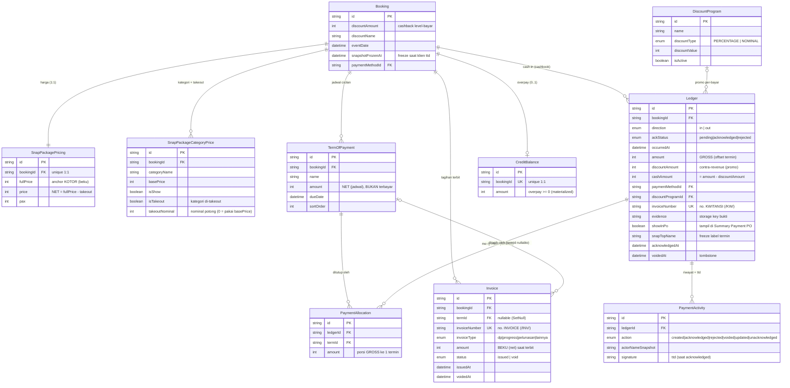
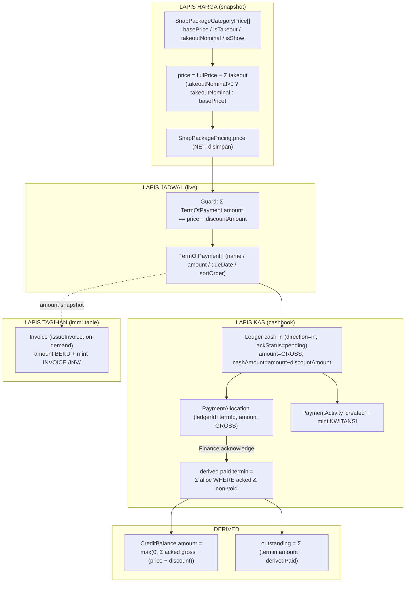
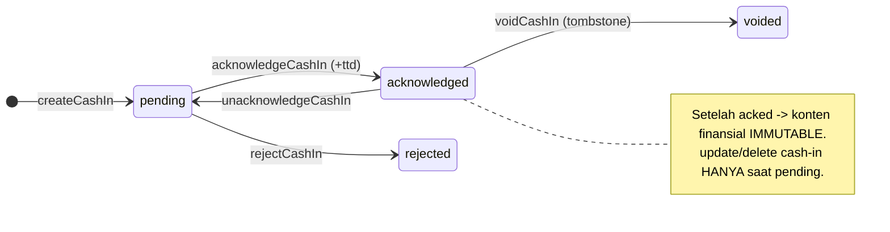
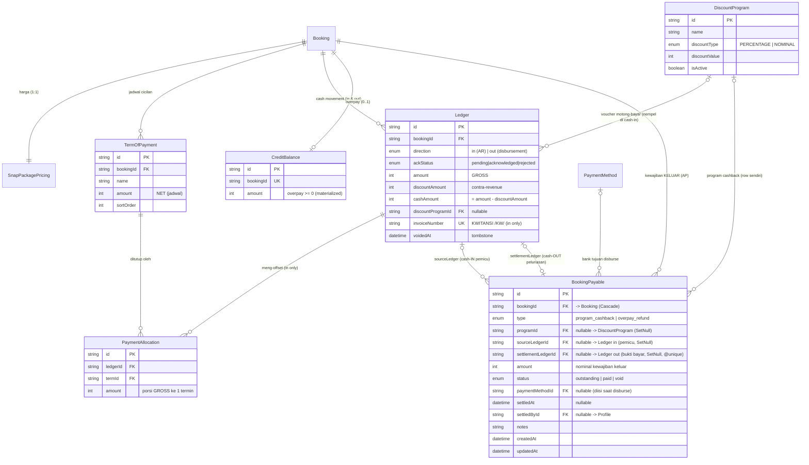
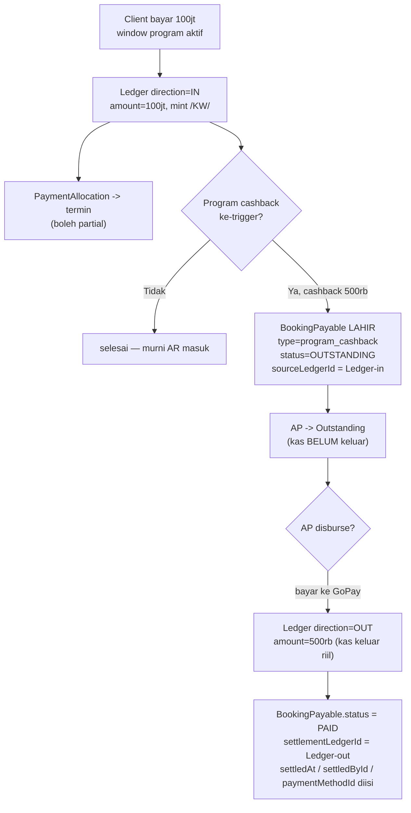

# ERD — Booking → TOP → Allocation → Takeout → Ledger

> Sumber kebenaran: `prisma/schema.prisma` (model verbatim). ERD ini nge-cover rantai
> uang booking wedding: **harga (takeout) → jadwal (TOP) → kas (Ledger) → alokasi
> (PaymentAllocation) → tagihan (Invoice) → kelebihan bayar (CreditBalance)**.
> Semua field & enum di §0–§6 diambil apa adanya dari schema — bukan karangan.
>
> ⚠️ **§7 (AP / BookingPayable) = PROPOSED — belum ada di schema.** Bagian itu rancangan
> arah uang KELUAR (cashback program, refund overpay) yang belum di-migrate. Ditandai
> jelas biar gak ketuker sama model yang udah live.

---

## 0. Mental model — 4 lapis yang harus dipisah

| Lapis | Model | Sifat | Nyimpen apa |
|---|---|---|---|
| **Harga** | `SnapPackagePricing` + `SnapPackageCategoryPrice` | snapshot (beku saat ttd) | `fullPrice` (anchor kotor), `price` (net = fullPrice − Σ takeout) |
| **Jadwal tagihan** | `TermOfPayment` (TOP) | live / mutable | `name`, `amount` (net), `dueDate`. **TIDAK nyimpen "terbayar"** |
| **Kas riil (cashbook)** | `Ledger` + `PaymentAllocation` | append-only + void tombstone | uang masuk, di-ack Finance, dialokasi ke termin |
| **Tagihan terbit** | `Invoice` | immutable on-demand | snapshot beku 1 termin = 1 invoice |

**Turunan (derived, TIDAK disimpan):** "berapa termin terbayar" = Σ `PaymentAllocation.amount`
dari `Ledger` yang `direction=in` + `ackStatus=acknowledged` + `voidedAt=null`.
`CreditBalance.amount` = materialized overpay (kelebihan bayar).

---

## 1. ERD utama



---

## 2. Kardinalitas & aturan hapus (onDelete)

| Relasi | Kardinalitas | FK / constraint | onDelete |
|---|---|---|---|
| Booking → SnapPackagePricing | 1 : 1 | `bookingId @unique` | Cascade |
| Booking → SnapPackageCategoryPrice | 1 : N | `bookingId` (index) | Cascade |
| Booking → TermOfPayment | 1 : N | `bookingId` (index) | Cascade |
| Booking → Ledger | 1 : N | `bookingId` (index) | Cascade |
| Booking → Invoice | 1 : N | `bookingId` (index) | Cascade |
| Booking → CreditBalance | 1 : 0..1 | `bookingId @unique` | Cascade |
| TermOfPayment → PaymentAllocation | 1 : N | `termId` | Cascade |
| Ledger → PaymentAllocation | 1 : N | `ledgerId` | Cascade |
| PaymentAllocation (bridge) | Ledger M : N TermOfPayment | `@@unique([ledgerId, termId])` | — |
| TermOfPayment → Invoice | 1 : N | `termId` **nullable** | **SetNull** (invoice jadi yatim, utuh) |
| Ledger → PaymentActivity | 1 : N | `ledgerId` | Cascade |
| DiscountProgram → Ledger | 1 : N (opsional) | `discountProgramId` nullable | SetNull |
| PaymentMethod → Ledger | 1 : N (opsional) | `paymentMethodId` nullable | SetNull |

**Nomor unik:** `Ledger.invoiceNumber` (KWITANSI `/KW/`) & `Invoice.invoiceNumber` (INVOICE `/INV/`)
dua deret **beda total**, dua-duanya `@@unique`.

---

## 3. Alur takeout → harga → TOP → kas



---

## 4. Invariant penting (ke-encode di schema/guard)

- **Takeout = potongan level-HARGA** → nurunin `SnapPackagePricing.price`; revenue ikut turun.
  (Beda dari `Ledger.discountAmount` yang level-BAYAR / contra-revenue.)
- **`Σ TermOfPayment.amount == price − Booking.discountAmount`** — guard di `updateTermOfPayments`
  (relaxed ke `max(net, locked)` biar termin ber-cash-in tetap valid).
- **`PaymentAllocation @@unique([ledgerId, termId])`** — 1 cash-in maks 1 baris alokasi per termin.
- **Alokasi pakai GROSS** (`Ledger.amount`), bukan `cashAmount`. Termin bisa LUNAS walau kas < nominal
  kalau ada promo per-bayar (selisih = `Ledger.discountAmount`, contra-revenue).
- **Void = tombstone** (`Ledger.voidedAt`), bukan delete. Semua query derived WAJIB exclude `voidedAt != null`.
- **Cuma `ackStatus=acknowledged` + non-void** yang nutup termin & ngitung derived-paid.
- **`CreditBalance.amount >= 0`**, materialized & di-recompute tiap ack / perubahan harga/jadwal/takeout.
- **`Invoice.termId` nullable + SetNull** — termin boleh di-rebuild (switch venue) tanpa ngerusak invoice terbit.

---

## 5. Penomoran — KWITANSI vs INVOICE

| | KWITANSI (bukti terima) | INVOICE (tagihan terbit) |
|---|---|---|
| Field | `Ledger.invoiceNumber` ⚠️ (isinya KW, bukan INV) | `Invoice.invoiceNumber` |
| Format | `<seq>/KW/<brand>/<venue>/<bln-ANGKA>/<thn>` | `<seq>/INV/<venue>/<bln-ROMAWI>/<thn>` |
| Counter | `kwitansi-<year>` | `invoice-<year>` |
| Trigger | tiap **cash-in** dicatat (`createCashIn` / `finalize.payments`) | **manual** — Finance AR "Terbitkan Invoice" (`issueInvoice`) |
| Kapan | otomatis pas uang masuk | on-demand, terpisah dari TOP |

---

## 6. State machines singkat



Status termin (DERIVED, `deriveTermStatus`): `paid | partial | overdue | not_due_yet` — tidak disimpan.
Invoice: `issued -> void` (tombstone); re-issue = nomor baru.

---

## 7. ⚠️ PROPOSED — Arah uang KELUAR (AP / `BookingPayable`)

> **BELUM ADA DI SCHEMA.** Section ini rancangan buat kewajiban keluar: **cashback program**
> (voucher e-wallet, mis. GoPay 500rb) & **refund overpay**. Semua di §0–§6 = uang MASUK (AR);
> di sini uang KELUAR (AP). Ditulis di sini biar arah desainnya kekunci, bukan buat diimplement diam-diam.

### 7.1. Prinsip finance — kewajiban ≠ pergerakan kas

> **Uang yang di-UTANG belum tentu uang yang udah KELUAR.** "Gue ngutang cashback 500rb" dan
> "gue bayar cashback 500rb" = **2 kejadian beda, 2 waktu beda, 2 baris beda.**

Double-entry cashback GoPay 500rb:

```
Kejadian 1 — cashback lahir (client bayar pas window program aktif):
    Dr. Beban Promo / Contra-revenue   500.000
        Cr. Utang Cashback (liability)     500.000      ← KAS DIAM. cuma lahir kewajiban.

Kejadian 2 — AP disburse ke GoPay (besok/kapanpun):
    Dr. Utang Cashback   500.000
        Cr. Kas / Bank       500.000                    ← BARU kas keluar.
```

Jeda antara kejadian 1 & 2 = **seluruh alasan** kenapa ada halaman **AP → Outstanding**.

### 7.2. Yang lo bangun sekarang BUKAN "General Ledger"

Namanya `Ledger`, tapi de-facto = **Jurnal Penerimaan Kas** (cash receipts, `direction=in` doang —
`direction=out` di enum **belum kepakai** di seluruh codebase). Itu **cukup** — gak usah bikin GL
debit-kredit beneran (over-engineering). Cetak biru yang bener:

| Momen | Yang dicatat | Di mana |
|---|---|---|
| Client bayar | kas masuk | **Ledger `in`** (live ✅) |
| Cashback program lahir | kewajiban keluar (akrual, kas diam) | **BookingPayable** `outstanding` (proposed) |
| AP disburse cashback | kas keluar riil | **Ledger `out`** (enum ada, blm kepakai) + flip payable → `paid` |
| Refund overpay | kas keluar riil | **Ledger `out`** + BookingPayable |

Visi "semua transaksi di Ledger" **tetep kejaga** — tiap **pergerakan kas** (in & out) jadi baris Ledger.
Yang gak masuk Ledger cuma **kewajiban yang kasnya belum gerak** (itu akrual → `BookingPayable`).

### 7.3. ERD konsolidasi — AR (masuk) + AP (keluar) dalam 1 view

> `BookingPayable` = node **biru** di kanan. Relasi tebel (`==`-arti) = korelasi baru yang diperkenalkan
> section ini. Kiri = rantai AR yang udah live (§1); kanan = jalur AP proposed.



**Cara baca korelasinya (dari `BookingPayable` ke luar):**

| Dari | Ke | Relasi | Makna |
|---|---|---|---|
| `BookingPayable.bookingId` | `Booking` | N:1 (Cascade) | payable ini milik booking mana |
| `BookingPayable.programId` | `DiscountProgram` | N:0..1 (SetNull) | lahir dari program cashback yang mana |
| `BookingPayable.sourceLedgerId` | `Ledger (in)` | N:0..1 (SetNull) | **cash-in pemicu** — bayar yang men-trigger cashback |
| `BookingPayable.settlementLedgerId` | `Ledger (out)` | 1:0..1 (SetNull, @unique) | **cash-out pelunasan** — bukti AP udah bayar |
| `BookingPayable.paymentMethodId` | `PaymentMethod` | N:0..1 (SetNull) | bank tujuan disburse |

Jadi `BookingPayable` **nyambung ke rantai AR lewat `sourceLedgerId`** (Ledger `in` yang sama yang
juga punya `PaymentAllocation` ke termin), dan **nyambung ke jalur AP lewat `settlementLedgerId`**
(Ledger `out`). Satu payable = jembatan 2 arah kas di sekitar 1 booking.

### 7.4. Korelasi kunci — `BookingPayable` nyentuh `Ledger` DUA kali

| Relasi | FK | Arti | Kapan diisi |
|---|---|---|---|
| **sourceLedger** | `sourceLedgerId` | cash-**in** yang **memicu** program (client bayar pas window aktif) | saat payable **lahir** (`outstanding`) |
| **settlementLedger** | `settlementLedgerId` | cash-**out** **bukti bayar** (AP disburse → nyetak `Ledger direction=out`) | saat payable **dibayar** (`paid`) |

Satu `BookingPayable` = jembatan **cash-in pemicu** (masa lalu) ↔ **cash-out pelunasan** (masa depan).
Di antaranya nangkring di **AP Outstanding**.

### 7.5. Alur uang (proposed)



### 7.6. Kardinalitas & onDelete (proposed)

| Relasi | Kardinalitas | FK | onDelete | Alasan |
|---|---|---|---|---|
| Booking → BookingPayable | 1 : N | `bookingId` | **Cascade** | booking mati, kewajiban ikut |
| DiscountProgram → BookingPayable | 0..1 : N | `programId` nullable | **SetNull** | program dihapus, payable tetep (histori bayar) |
| Ledger → BookingPayable (source) | 0..1 : N | `sourceLedgerId` nullable | **SetNull** | cash-in di-void, payable berdiri sendiri |
| Ledger → BookingPayable (settlement) | 0..1 : 0..1 | `settlementLedgerId` nullable `@unique` | **SetNull** | 1 cash-out = 1 pelunasan payable |
| PaymentMethod → BookingPayable | 0..1 : N | `paymentMethodId` nullable | **SetNull** | bank tujuan disburse |

### 7.7. Voucher: 2 tipe, 2 rumah beda (arah uang beda)

| | Voucher **motong-bayar** | Voucher **cashback e-wallet** |
|---|---|---|
| Arah uang | client bayar **lebih dikit** (masuk berkurang) | uang **keluar** dari Swasana |
| Rumah data | **NGIKUT di Ledger** (`discountProgramId` + `discountAmount`) | **row sendiri** (`BookingPayable`) |
| Trigger | saat cash-in | saat cash-in |
| Jejak | contra-revenue (`cashAmount < amount`) | payable → **AP Outstanding** |
| Field udah ada? | ✅ live | ❌ proposed |

Gak bisa disatuin: motong-bayar = uang **masuk berkurang** (nempel di cash-in). Cashback e-wallet =
uang **keluar** (kebalikan). 1 baris Ledger gak mungkin nyimpen masuk DAN keluar sekaligus.

### 7.8. Catatan cutover

- Ganti `app/(private)/dashboard/finance/accounts-payable/_components/ap-dummy.ts` (`AP_PAYABLES`,
  `buildApEvents`, type `APPayable`) → query real dari `BookingPayable`.
- `Ledger.direction=out` yang selama ini nganggur = jalur disbursement (bukan cash-in).
  Query derived AR (`direction=in` doang) **gak** boleh keitung baris `out`.
- Rename arah `promo` → `voucher`/`program` (master `/dashboard/discount-promo`) = track terpisah.
