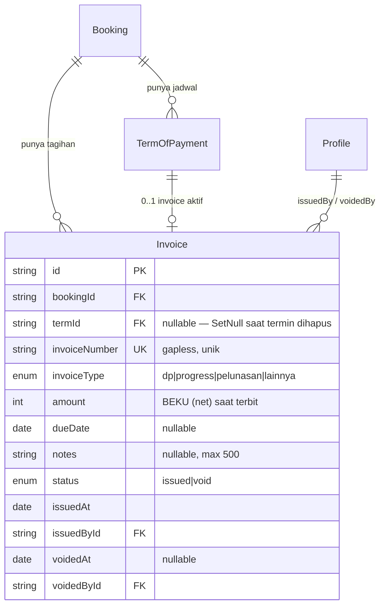
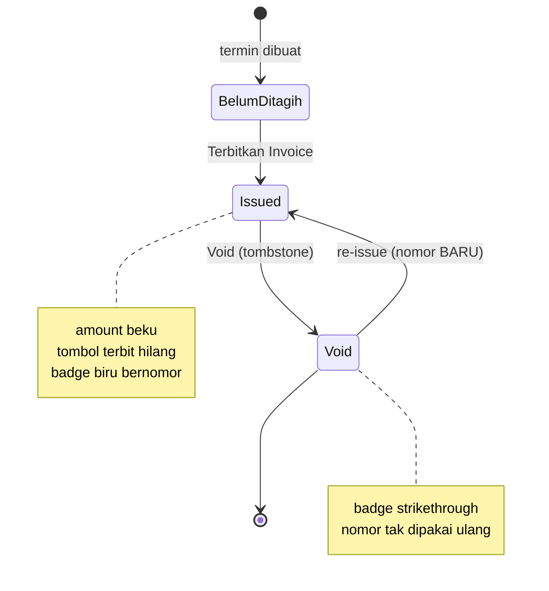
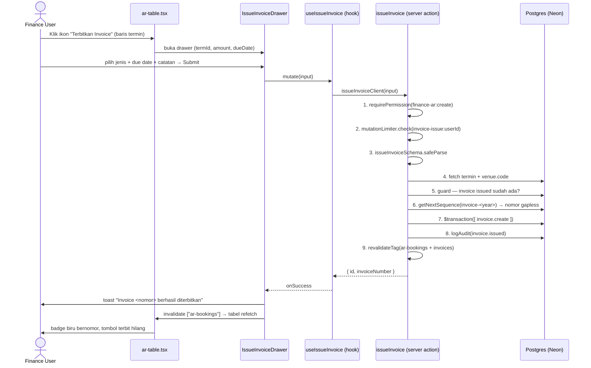
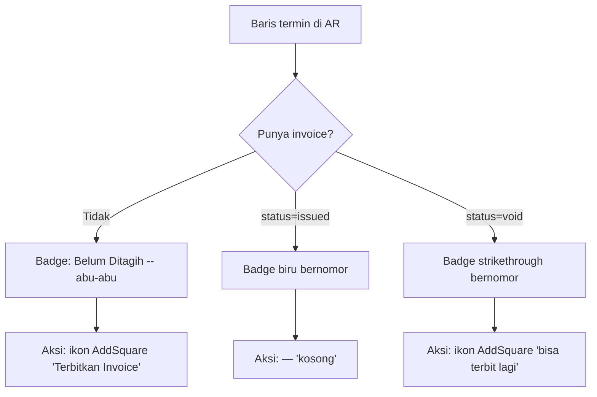
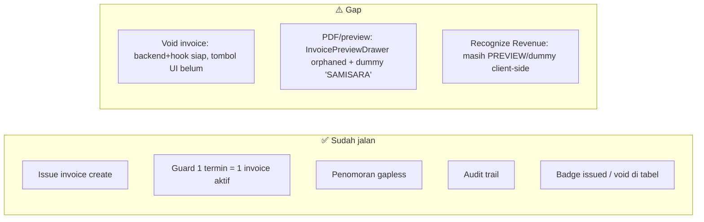

# Spec — Terbitkan Invoice (Finance AR)

> **Status kode:** issue + void invoice **sudah berfungsi** (backend + UI create terpasang). Void masih backend-only (belum ada tombol di UI). PDF/preview invoice masih orphaned.
> **Modul:** `finance-ar` · **Cakupan:** Accounts Receivable → per-termin.
> **Sumber verifikasi:** `actions/invoice.ts`, `lib/validations/invoice.ts`, `prisma/schema.prisma`, `hooks/use-invoices.ts`, `services/invoice-service.ts`, `app/(private)/dashboard/finance/accounts-receivable/_components/IssueInvoiceDrawer.tsx` + `ar-table.tsx`.

---

## 1. Konsep — Invoice ≠ Kwitansi

Dua dokumen keuangan yang beda peran dan **tidak boleh ketuker**:

| Aspek | **Invoice** (tagihan) | **Kwitansi** (bukti bayar) |
|---|---|---|
| Arti | "Tolong bayar sekian" | "Sudah terima sekian" |
| Dipicu oleh | Finance klik **Terbitkan Invoice** | Cash-in masuk (Ledger) |
| Nomor | `/INV/` bulan **Romawi** | `/KW/` bulan **angka** |
| Sumber angka | `TermOfPayment.amount` (net, dibekukan) | `Ledger.amount` (cash aktual) |
| Tabel | `Invoice` (entity terpisah) | `Ledger.invoiceNumber` |

Prinsip kunci: **1 invoice = 1 termin**, on-demand, nomor gapless, `amount` **beku** saat terbit (bukan dibaca live dari termin lagi), pembatalan lewat **tombstone** (row tak pernah dihapus).

---

## 2. Data Model (ERD)



**Kenapa `termId` nullable?** Kalau termin di-rebuild/dihapus (mis. switch venue), invoice yang sudah terbit tetap utuh sebagai dokumen historis — jadi "yatim" tapi tidak rusak (`onDelete: SetNull`).

---

## 3. State Machine Invoice



- 1 termin cuma boleh punya **1 invoice `issued`** dalam satu waktu (di-guard di server).
- Mau ganti invoice? **Void dulu** yang lama → baru bisa terbit lagi (dapat nomor baru, nomor lama hangus).

---

## 4. Alur End-to-End (Sequence)



Urutan server action ini **persis** mengikuti aturan hardened project: permission → rate-limit → Zod → transaksi array-form → audit → revalidate.

---

## 5. Format Penomoran

```
<seq>/INV/<kodeVenue>/<bulanRomawi>/<tahun>
```

Contoh: **`7/INV/SWS/VII/2026`**

- `seq` — dari `getNextSequence("invoice-<year>")` → UPSERT atomik `counters`, **gapless**, tanpa race.
- Bulan **Romawi** (`I`–`XII`) — pembeda utama dari kwitansi (angka).
- Counter dilanjut dari mint lama (sebelum FIX C) → sequence tak pernah reset lintas cara-mint.

---

## 6. UI States (per baris termin di AR)



| Kondisi | Kolom Invoice | Kolom Aksi |
|---|---|---|
| Belum ada invoice | `Belum Ditagih` (abu) | Tombol **Terbitkan Invoice** |
| `issued` | Badge **biru** + nomor | `—` (kosong) |
| `void` | Badge **strikethrough** + nomor | Tombol Terbitkan lagi |

---

## 7. Kontrak Data & Validasi

**Input form (`issueInvoiceSchema`, `lib/validations/invoice.ts`):**

| Field | Tipe | Wajib | Aturan |
|---|---|---|---|
| `termId` | string | ✅ | min 1 |
| `invoiceType` | enum | ✅ | `dp` \| `progress` \| `pelunasan` \| `lainnya` |
| `dueDate` | date | ❌ | opsional |
| `notes` | string | ❌ | max 500 char |

**Yang TIDAK dikirim client:** nomor invoice & amount — keduanya lahir/dibekukan **di server** (nomor via counter, amount = snapshot `termin.amount`). Ini mencegah tamper.

**Guard server (`issueInvoice`):**
1. `requirePermission("finance-ar", "create")`
2. `mutationLimiter` per user
3. Termin harus ada
4. Tolak kalau termin sudah punya invoice `issued`

**Guard server (`voidInvoice`):** `finance-ar:delete` + hanya invoice `issued` yang bisa di-void.

---

## 8. Status Implementasi



| Bagian | Status | Bukti |
|---|---|---|
| Terbitkan invoice (create) | ✅ Fully functional | `actions/invoice.ts:45` + drawer + hook nyambung |
| Guard duplikat | ✅ | `db.invoice.findFirst({ status:"issued" })` |
| Penomoran gapless | ✅ | `lib/counter.ts` UPSERT atomik |
| Audit | ✅ | `logAudit("invoice.issued")` |
| **Void di UI** | ⚠️ Backend+hook ada, tombol belum di-wire | `voidInvoice`, `useVoidInvoice` tanpa consumer di tabel |
| **PDF invoice** | ⚠️ Orphaned + dummy | `invoice-preview-drawer.tsx` zero-import, `ORG_NAME="SAMISARA"` |
| Recognize Revenue | 🚧 Preview/dummy | badge "PREVIEW", state client-only |

---

## 9. Rekomendasi Next Steps

1. **Wire tombol Void** di `ar-table.tsx` → panggil `useVoidInvoice` (backend sudah siap, tinggal UI + konfirmasi).
2. **Connect InvoicePreviewDrawer** ke tombol "Lihat/Cetak Invoice" pada baris `issued`, ganti dummy `ORG_NAME`/data org dengan data venue dari DB.
3. (Opsional) Realisasikan **Recognize Revenue** jadi mutation beneran kalau memang masuk scope.

---

*Dokumen ini deskripsi state kode saat spec dibuat (2026-07-26). Verifikasi ulang ke file sumber sebelum dipakai sebagai acuan implementasi.*
