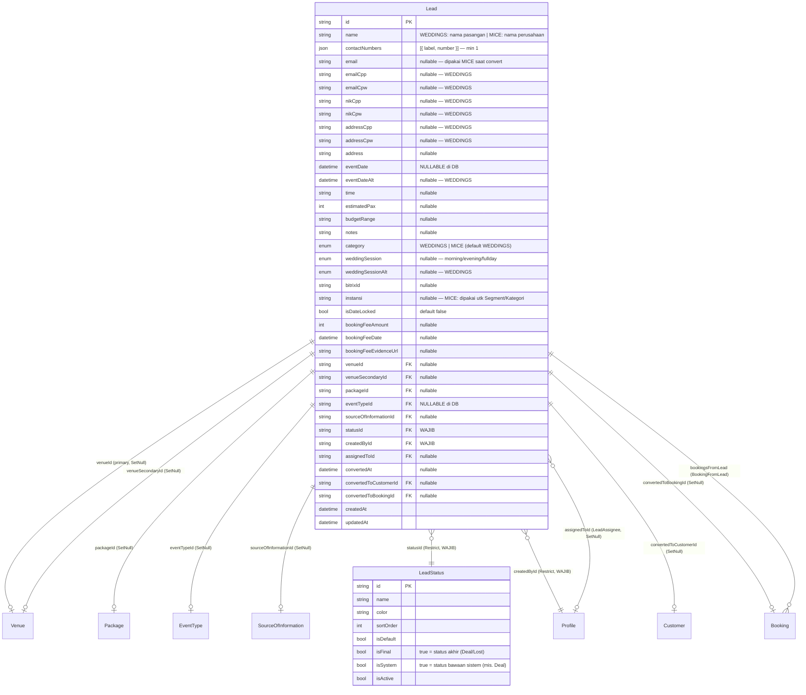
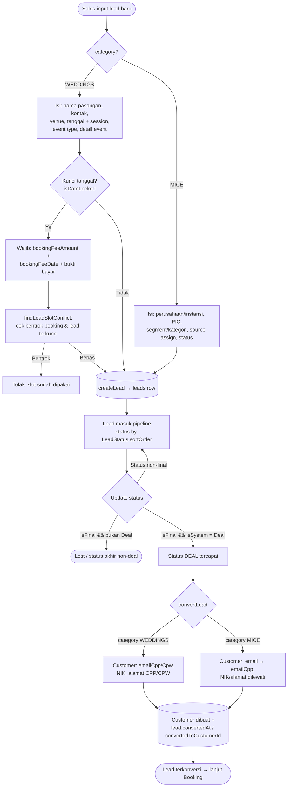

# Leads — DB Relations, Business Flow & Adjustment Spec

> Status: **spec / analisa** (belum ada perubahan kode di file ini).
> Scope: modul **Leads** (`Lead`, `LeadStatus`) + relasi & konversi ke `Customer`/`Booking`.
> Konteks: setelah UI leads MICE disederhanakan (buang Nama Client → Perusahaan/Instansi,
> tambah Segment, sembunyikan venue / tanggal event / detail event), muncul **mismatch**
> antara UI ↔ Zod schema yang perlu diputuskan sebelum lanjut ke DB.

---

## 1. Ringkasan Model

`Lead` adalah satu tabel yang menampung **dua kategori** lewat kolom `category` (`EventCategory`):

- **WEDDINGS** — funnel lengkap: pasangan (CPP/CPW), venue, tanggal event + session, date-lock booking fee.
- **MICE** — funnel ringkas: perusahaan/instansi + PIC, tanpa venue/tanggal/session di UI baru.

Satu tabel, dua bentuk data. Bedanya **kolom mana yang diisi**, bukan tabel terpisah. Ini kunci
kenapa banyak kolom di `Lead` bersifat `nullable` — supaya MICE bisa mengosongkannya.

---

## 2. ERD (relasi DB)



### Catatan relasi penting
- **`statusId` (Restrict)** & **`createdById` (Restrict)** — satu-satunya FK wajib. Status/creator
  tidak boleh dihapus selama masih dipakai lead.
- Semua FK lain **SetNull** — kalau venue/package/eventType dihapus, lead tetap hidup, FK-nya jadi null.
- **`convertedToCustomerId` / `convertedToBookingId`** — jejak konversi (diisi saat lead jadi Deal & di-convert).
- **`bookingsFromLead`** — satu lead bisa menurunkan >1 booking (relasi `BookingFromLead`).

### Index (relevan untuk availability)
- `@@index([venueId, eventDate, weddingSession, isDateLocked])` — cek slot terkunci per venue+tanggal+session.
- `@@index([venueId, eventDateAlt, weddingSessionAlt, isDateLocked])` — versi tanggal alternatif.
- Plus index tunggal: `statusId`, `createdById`, `assignedToId`, `eventDate`, `venueId`, `isDateLocked`.

> Index composite ini **wedding-centric** (mengandung `weddingSession`). MICE tanpa session
> tetap ke-cover karena guard mem-pakai `weddingSession: null` → reserve satu hari penuh (lihat §4).

---

## 3. Business Flow (lifecycle lead)



### Aturan status
- Pipeline diurut `LeadStatus.sortOrder`; status default dipakai saat create (`isDefault`).
- **Konversi hanya boleh** kalau status `isSystem = true` **dan** `isFinal = true` (status "Deal" bawaan sistem).
  Cek ini ada di `convertLead` (`actions/lead.ts:520`).
- Lead yang sudah `convertedAt != null` tidak bisa dikonversi ulang.

### Guard date-lock (ringkas)
`findLeadSlotConflict` (`actions/lead.ts:55`) dipanggil **hanya** saat lead `isDateLocked && venueId && eventDate`.
Mengecek 2 sumber yang me-reserve slot:
1. Booking aktif (`recordStatus saved`, status bukan Canceled/Lost/Rejected).
2. Lead lain yang terkunci (`isDateLocked`, status belum final, belum converted).
MICE tanpa session → `weddingSession: null` → reserve **satu hari penuh** di venue itu.

---

## 4. Mapping field per kategori

| Field | WEDDINGS | MICE (UI baru) | Catatan |
|---|---|---|---|
| `name` | Nama pasangan | Nama perusahaan/instansi | Shared kolom, beda makna label |
| `contactNumbers` | cpw/cpp/ortu | **Nama PIC** | Min 1 (Zod). Placeholder label beda per kategori |
| `instansi` | (opsional) | **Segment/Kategori** | MICE reuse kolom `instansi` utk simpan segment |
| `email` | jarang dipakai | dipakai → di-map ke `customer.emailCpp` saat convert | |
| `emailCpp/emailCpw` | ✅ | ❌ | Wedding-only |
| `nikCpp/nikCpw` | ✅ | ❌ | Wedding-only |
| `addressCpp/addressCpw` | ✅ | ❌ | Wedding-only |
| `eventDate` | ✅ wajib (UI) | ❌ disembunyikan | **DB nullable**, tapi Zod wajib (lihat §5) |
| `eventDateAlt` + `weddingSessionAlt` | opsional | ❌ | Wedding-only |
| `weddingSession` | ✅ wajib | ❌ | Zod sudah conditional (WEDDINGS only) |
| `venueId / venueSecondaryId` | ✅ | ❌ disembunyikan | |
| `packageId` | opsional | ❌ | |
| `eventTypeId` | ✅ wajib (UI) | ❌ disembunyikan | **DB nullable**, tapi Zod wajib (lihat §5) |
| `estimatedPax / budgetRange / time` | detail event | ❌ disembunyikan | |
| `isDateLocked` + booking fee | ✅ | ❌ | Wedding-only |
| `sourceOfInformationId` | ✅ | ✅ | Shared, wajib |
| `assignedToId` | ✅ | ✅ | Shared |
| `statusId` | ✅ | ✅ | Shared, wajib |

---

## 5. ⚠️ Yang perlu di-KURANG / di-ADJUST

### 5.1. 🔴 KRITIS — `eventDate` & `eventTypeId` wajib di Zod, tapi MICE tidak mengirim

**Masalah.** Di `lib/validations/lead.ts`:
```ts
eventDate:   z.string().min(1, "Tanggal event wajib diisi"),   // baris 43 — HARD REQUIRED
eventTypeId: z.string().min(1, "Event type wajib dipilih"),    // baris 54 — HARD REQUIRED
```
Tapi UI MICE **tidak lagi** mengumpulkan dua field ini. Akibatnya:
- `createLead` → `createLeadSchema.safeParse(data)` **GAGAL** untuk MICE.
- Return `{ success: false, error: "Tanggal event wajib diisi" }` — user MICE mentok, tak bisa simpan.

DB sendiri **tidak** masalah: `eventDate DateTime?` dan `eventTypeId String?` keduanya nullable,
dan action sudah menulis `eventDate ? new Date(eventDate) : null` + `eventTypeId || null`.
**Jadi ini murni masalah lapisan validasi**, bukan skema DB.

**Rekomendasi.** Jadikan keduanya conditional-by-category (pola sama seperti `requireWeddingSession`):
- Longgarkan di `baseLeadSchema`:
  ```ts
  eventDate:   z.string().optional().or(z.literal("")),
  eventTypeId: z.string().optional().or(z.literal("")),
  ```
- Tambah `superRefine` baru `requireWeddingEventFields`: kalau `category === "WEDDINGS"` →
  `eventDate` & `eventTypeId` wajib; kalau MICE → tidak.

> Ini **satu-satunya** perubahan yang wajib supaya alur MICE end-to-end jalan. Sisanya di bawah opsional/hardening.

### 5.2. 🟡 Segment MICE menumpang kolom `instansi`

Saat ini Segment/Kategori MICE disimpan ke `Lead.instansi`. Konsekuensi:
- Segment cuma **free-text string**, bukan referensi tabel → tidak ada konsistensi/normalisasi,
  tidak bisa dilaporkan/di-filter rapi, dan opsi "tambah baru" di UI hanya hidup di state lokal
  (hilang setelah refresh, tidak persist).

**Opsi:**
- **(A) Tetap `instansi` string** — paling murah, cukup untuk MVP. Terima keterbatasan filter/report.
- **(B) Tabel referensi `LeadSegment`** (mirip `LeadStatus`/`SourceOfInformation`): `id, name, isActive, sortOrder`,
  lalu `Lead.segmentId String?` (SetNull). Add-new persist ke DB. Lebih rapi untuk pelaporan MICE.
- Kalau nanti perusahaan (instansi) **dan** segment dua-duanya perlu untuk MICE, kolom `instansi`
  jangan dobel makna — pisah jadi `instansi` (nama perusahaan) vs `segmentId` (kategori).

> Keputusan bisnis: apakah segment MICE perlu master data? Kalau ya → opsi B (butuh migration + seed 2 dummy).

### 5.3. 🟡 Index composite bernuansa wedding

`@@index([venueId, eventDate, weddingSession, isDateLocked])` mengasumsikan pola wedding.
MICE (tanpa session, biasanya tanpa venue/tanggal) tak memanfaatkan index ini. **Tidak salah**,
tapi kalau MICE ke depan tak pernah date-lock, index tetap dipertahankan untuk jalur wedding — **no change**.
Dicatat saja supaya tidak ada yang mencoba "membersihkan" index ini tanpa paham jalur wedding masih pakai.

### 5.4. 🟢 Konversi MICE sudah aman

`convertLead` sudah branch `isWeddingLead` (`actions/lead.ts:529`): MICE pakai `lead.email → customer.emailCpp`,
NIK/alamat dilewati. **Tidak perlu diubah.** Yang perlu dipastikan: MICE mengisi `email` kalau ingin
customer punya email setelah convert (opsional, bukan blocker).

### 5.5. 🟢 Field wedding-only saat MICE — biarkan null

`emailCpp/Cpw`, `nikCpp/Cpw`, `addressCpp/Cpw`, `eventDateAlt`, `weddingSession(Alt)`, venue, package,
booking fee — semua nullable dan UI MICE sudah menyembunyikannya. Action menulis `|| null`.
**Tidak perlu perubahan DB.** Cukup pastikan payload MICE tidak mengirim nilai sisa (stale) dari state form.

---

## 6. Ringkasan keputusan yang diminta ke kamu (bro)

| # | Keputusan | Pilihan | Dampak |
|---|---|---|---|
| 1 | **Longgarkan Zod `eventDate`/`eventTypeId` jadi conditional (WEDDINGS-only)** | **WAJIB** (tanpa ini MICE gagal simpan) | Edit `lib/validations/lead.ts` saja, 0 migration |
| 2 | Segment MICE: string `instansi` **(A)** atau tabel `LeadSegment` **(B)** | A = cepat, B = rapi/persist | B butuh migration + seed |
| 3 | MICE apakah akan pernah date-lock / pakai venue? | Kalau tidak → biarkan semua wedding-only null | Menentukan apakah guard perlu diringkas |

**Langkah teknis kalau #1 di-ACC (paling minimal):**
1. `baseLeadSchema`: `eventDate`/`eventTypeId` → `.optional()`.
2. Tambah `superRefine(requireWeddingEventFields)` di `createLeadSchema` & `updateLeadSchema`.
3. Tidak ada perubahan `prisma/schema.prisma` (DB sudah nullable) → **tanpa migration**.
4. Verifikasi: submit lead MICE tanpa tanggal/eventType → sukses; lead WEDDINGS tanpa tanggal → tetap ditolak.

> Belum ada kode yang diubah dari spec ini. Nunggu keputusan #1–#3 sebelum eksekusi.
