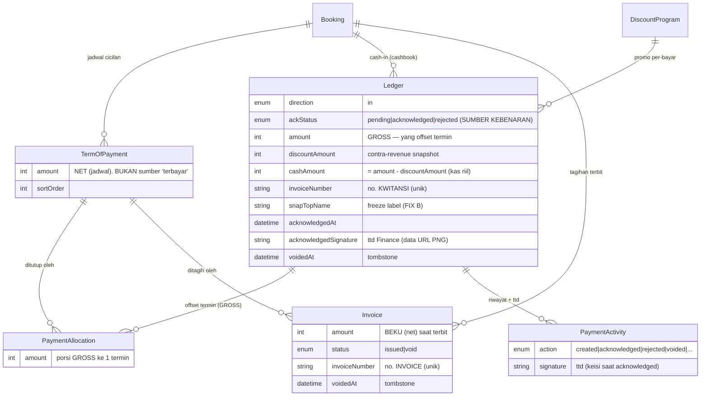
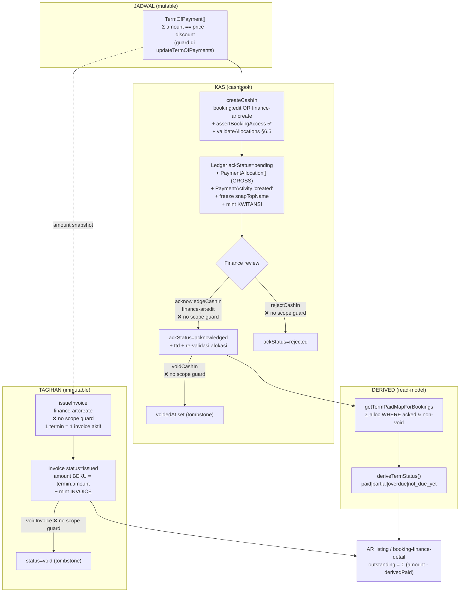
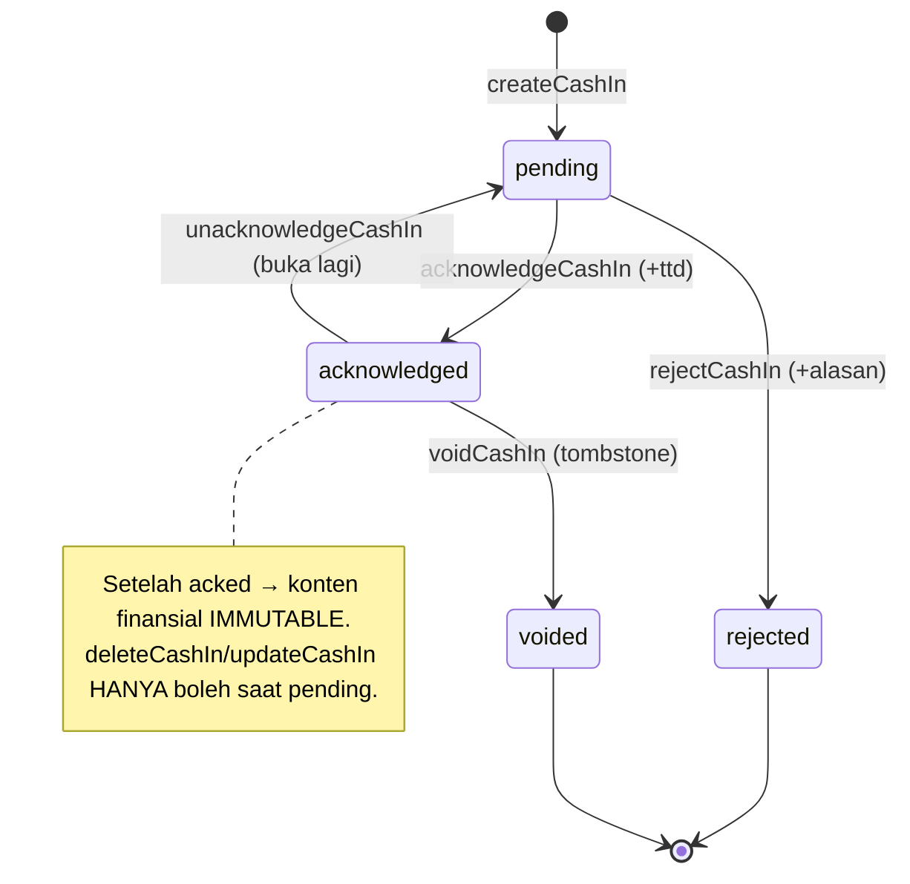
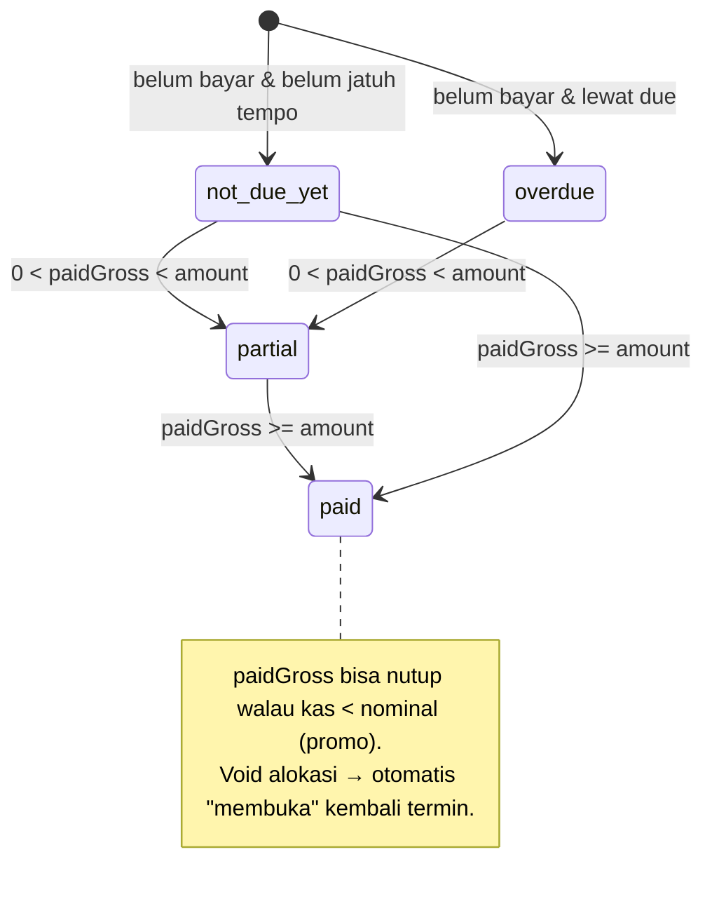
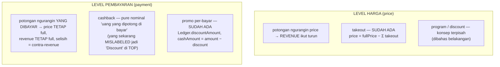
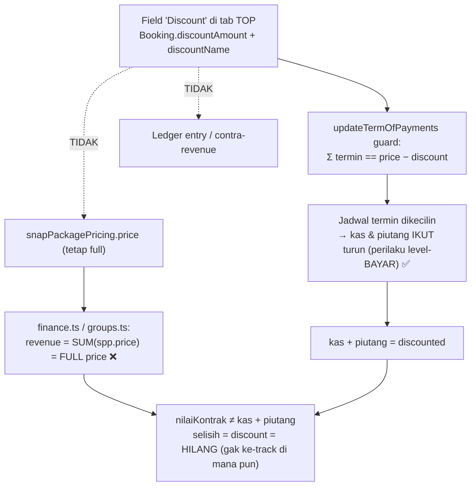

# Pembayaran + TOP — Spec Behavior & Temuan (end-to-end)

> Bukan target-design. Ini **cara kerja fitur pembayaran + Term of Payment apa adanya di kode
> sekarang** (branch `feat/finance-fixes`), di-reverse-engineer dari source biar bisa direview
> sebelum mutusin arah fix.
> Sumber: `prisma/schema.prisma`, `actions/ledger.ts`, `actions/term-of-payment.ts`,
> `actions/invoice.ts`, `lib/queries/ledger.ts`, `lib/queries/ar.ts`,
> `lib/queries/booking-finance-detail.ts`, `lib/queries/invoices.ts`, `lib/access-control.ts`,
> `app/api/ledger/[ledgerId]/activities/route.ts`, `app/api/bookings/[id]/finance-detail/route.ts`.

---

## 0. TL;DR — mental model uang

Ada **3 dunia** yang harus dipisah jelas di kepala:

| Dunia | Tabel | Sifat | Yang disimpan |
|---|---|---|---|
| **Jadwal tagihan** | `TermOfPayment` (TOP) | live / mutable | name, amount (net), dueDate. **TIDAK nyimpen "terbayar".** |
| **Kas riil (cashbook)** | `Ledger` + `PaymentAllocation` | append-only + void tombstone | uang masuk beneran, di-ack Finance, dialokasi ke termin |
| **Tagihan terbit** | `Invoice` | immutable on-demand | snapshot beku 1 termin = 1 invoice |

**Kunci #1 (Fase 5):** "berapa termin sudah terbayar" itu **DERIVED**, bukan disimpan.
Dihitung = Σ `PaymentAllocation.amount` dari `Ledger` yang `direction=in` + `ackStatus=acknowledged`
+ `voidedAt=null`. Kolom `paymentStatus`/`ackStatus`/`invoiceNumber` di TOP **sudah di-drop**.

**Kunci #2 (§6.4):** alokasi pakai **GROSS** (`Ledger.amount`), bukan kas riil (`cashAmount`).
Termin bisa **LUNAS walau kas < nominal** kalau ada promo per-pembayaran — selisihnya kebukti
sebagai contra-revenue di `Ledger.discountAmount`. (Ini benang yang bakal kita tarik di bagian
**§6 program/discount**.)

**Kunci #3:** koreksi itu **non-destruktif**. Cash-in salah → `voidedAt` (tombstone), bukan delete.
Semua query derived WAJIB `exclude voidedAt != null`.

---

## 1. Data model



**Invariant penting yang ke-encode di schema:**
- `PaymentAllocation @@unique([ledgerId, termId])` → 1 cash-in max 1 baris alokasi per termin.
- `Ledger @@unique([invoiceNumber])` & `Invoice @@unique([invoiceNumber])` → nomor gapless & tak dobel.
- `Invoice.termId` **nullable** + `onDelete: SetNull` → termin boleh di-rebuild (switch venue) tanpa
  ngerusak invoice yang udah terbit (invoice jadi "yatim" tapi utuh sebagai dokumen historis).
- `Ledger`/`Invoice` **`onDelete: Cascade`** dari Booking → hapus booking = kwitansi + invoice ikut
  hilang. (Tegangan halus vs klaim "immutable/historis" — lihat Temuan T9.)

---

## 2. Lifecycle — TOP → cash-in → ack → derived-paid → invoice



**Yang perlu digarisbawahi:** cuma cash-in **acknowledged & non-void** yang nutup termin. Row
`pending`/`rejected`/`voided` **tidak** ngurangin piutang. Invoice **tidak** ikut ngitung "terbayar"
— dia cuma dokumen tagihan; pembayaran tetap via Ledger.

---

## 3. State machines

**Ledger.ackStatus** (verifikasi Finance — gate AR & recognition):


**Status termin (DERIVED, `deriveTermStatus`)** — TIDAK disimpan:

> Nilai yang mungkin: `paid | partial | overdue | not_due_yet`. **Tidak ada `unpaid`.** (Relevan ke Temuan T5.)

**Invoice.status:** `issued → void` (tombstone). Void tidak balik ke issued; re-issue = nomor baru.

---

## 4. Aturan penomoran (Kwitansi vs Invoice)

Dua deret nomor **beda total**, dua-duanya gapless via `getNextSequence` (atomic
`INSERT…ON CONFLICT…RETURNING`, no race):

| | Kwitansi (bukti terima) | Invoice (tagihan terbit) |
|---|---|---|
| Field | `Ledger.invoiceNumber` | `Invoice.invoiceNumber` |
| Format | `<seq>/KW/<brand>/<venue>/<bln-ANGKA>/<thn>` | `<seq>/INV/<venue>/<bln-ROMAWI>/<thn>` |
| Counter key | `kwitansi-<year>` | `invoice-<year>` |
| Kapan mint | saat `createCashIn` (uang masuk) | saat `issueInvoice` (tagihan terbit) |
| Bulan | angka | Romawi (I–XII) |
| Di-generate di | **luar** `$transaction` (T7) | **luar** `$transaction` (T7) |

---

## 5. Matriks guard (siapa boleh apa)

Kolom yang jadi sorotan: **data-scope** (apakah caller dicek boleh nyentuh booking ini, bukan cuma
punya permission modul). ✅ = ada, ❌ = tidak ada.

| Aksi | File | permission | rate-limit | data-scope |
|---|---|---|---|---|
| `createCashIn` | ledger.ts:158 | booking:edit OR finance-ar:create | ✅ | ✅ `assertBookingAccess` |
| `acknowledgeCashIn` | ledger.ts:294 | finance-ar:edit | ✅ | ❌ |
| `rejectCashIn` | ledger.ts:392 | finance-ar:edit | ✅ | ❌ |
| `voidCashIn` | ledger.ts:463 | finance-ar:edit | ✅ | ❌ |
| `setLedgerShowInPo` | ledger.ts:534 | booking:edit | ✅ | ✅ |
| `deleteCashIn` | ledger.ts:591 | finance-ar:edit | ✅ | ✅ |
| `updateCashIn` | ledger.ts:660 | finance-ar:edit | ✅ | ✅ |
| `unacknowledgeCashIn` | ledger.ts:765 | finance-ar:edit | ✅ | ❌ |
| `updateTermOfPayments` | term-of-payment.ts:44 | booking:edit | ✅ | ✅ |
| `issueInvoice` | invoice.ts:45 | finance-ar:create | ✅ | ❌ |
| `voidInvoice` | invoice.ts:136 | finance-ar:delete | ✅ | ❌ |
| `GET finance-detail` | api/bookings/[id]/finance-detail | booking:edit OR finance-ar:edit | ✅ | ✅ |
| `GET ledger activities` | api/ledger/[ledgerId]/activities | **cuma `auth()`** | ✅ | ❌ |
| `getARBookings` (read) | ar.ts:19 | page: finance-ar | (cache) | ❌ company-wide |
| `getLedgerEntries` (read) | ledger.ts:351 | page: finance-ar | (cache) | ❌ company-wide |

**Pola yang keliatan:** guard data-scope **nempel di sebagian mutasi tapi bolong di sebagian lain**,
dan **read-nya company-wide**. Ini akar dari mayoritas temuan di bawah.

---

## 6. Potongan — dibedakan by LEVEL, bukan by jenis

> **Reframe (klarifikasi owner):** potongan di swasana dipisah berdasarkan **LEVEL tempat dia nempel**,
> bukan berdasarkan nama. Ini yang bikin field "Discount" di TOP sekarang salah tempat (§6.1).



**Prinsip anchor (auto-calc — dikonfirmasi owner):**

```
SnapPackagePricing.fullPrice = KOTOR / anchor  → BEKU di snapshot (jangan diubah)
SnapPackagePricing.price      = NET = fullPrice − Σ(potongan LEVEL-HARGA)  → TURUNAN, auto-calc
```

`price` **tidak boleh** diketik manual — dia hasil hitung dari anchor dikurangi potongan level-harga
(sekarang: takeout). **Cashback (level-pembayaran) TIDAK PERNAH nyentuh `fullPrice` maupun `price`** —
dia cuma ngurangin kolektabilitas (yang ditagih), jadi revenue tetap full & selisihnya ke-track sebagai
contra-revenue.

### 6.1. Field "Discount" di TOP = cashback yang salah level (T10)

Field "Discount" (`Booking.discountAmount` + `discountName`) di tab TOP **behave setengah-setengah**:
kelakuannya level-pembayaran (ngecilin jadwal termin → yang ditagih turun) TAPI di-guard terhadap price
dan gak nyimpen contra-revenue. Akibatnya nyangkut di tengah:



**Efek angka** (contoh potongan Rp10jt atas paket Rp253,8jt, lunas):

| Metrik | Nilai | Basis |
|---|---|---|
| Nilai Kontrak / Revenue | **253.800.000** | `SUM(spp.price)` — full price |
| Kas Diterima | 243.800.000 | `Σ min(paid, termin.amount)` — schedule dikecilin |
| Piutang | 0 | lunas |
| **Selisih tak-tertrack** | **10.000.000** | potongan yang "hilang" |

→ `nilaiKontrak (253,8) ≠ kas + piutang (243,8)`. Achievement sales over-stated 10jt; potongan
yang dikasih ke klien tidak muncul sebagai angka apa pun di finance. **Root cause:** ini seharusnya
**cashback level-pembayaran** (biar konsisten sama promo per-bayar yang udah ada), tapi malah dipasang
sebagai potongan-schedule tanpa jejak contra-revenue.

### 6.2. Arah fix — jadiin cashback level-pembayaran yang bener

Karena owner udah mastiin ini **cashback** (bukan potongan harga), fix-nya = pindahin ke level-pembayaran
yang konsisten sama mekanisme contra-revenue yang udah ada:

| | Sekarang (bocor) | Target — cashback level-bayar |
|---|---|---|
| Nempel di | `Booking.discountAmount`, ngecilin schedule termin | layer pembayaran (kolektabilitas), schedule termin tetap full |
| `price` / revenue | full price (tak berubah) | full price (tak berubah) — **sama, memang harus full** |
| Kas | turun | turun |
| Contra-revenue | ❌ gak dicatat → selisih hilang | ✅ dicatat sebagai potongan/cashback |
| Rekonsiliasi | `nilaiKontrak ≠ kas + piutang` | `nilaiKontrak = kas + piutang + cashback` (balance) |

**Open question yang MASIH ngeblok desain cashback (perlu jawaban owner):**
1. **Cashback = mekanisme yang sama kayak promo per-bayar (`Ledger.discountAmount`) tapi belum dinamain,
   ATAU concept baru first-class sendiri?**
   - (a) sama → tinggal rapiin + rename + lepasin dari guard price (fix relatif kecil).
   - (b) beda → butuh representasi baru (mis. nominal fix per-booking, bukan per-transaksi-bayar).
2. Kalau cashback nempel per-booking (bukan per-bayar): dia ngurangin termin **mana**? (proporsional?
   termin terakhir? bebas?) — ini nentuin gimana kolektabilitas dihitung.
3. Plafon/validasi: cashback max berapa? boleh bikin total kas < 0? (analog guard `cashAmount >= 0`.)

**Ditunda (sesi berikutnya, sesuai "bahas satu-satu"):**
- **Program / discount** (level-HARGA) — konsep terpisah, belum dibahas.
- Interaksi cashback + program + takeout + "bayar langsung" — spec lama nyinggung unify jadi
  `BookingDeduction` (lihat `docs/takeout-flow-explainer.md §7`). Belum diputusin.

---

## 7. TEMUAN (ranked)

> Severity: **P0** = eksploit langsung / kebocoran data. **P1** = IDOR/otorisasi butuh kondisi ringan.
> **P2** = bug logika/konsistensi. **P3** = gap minor / drift dokumentasi.

### 🔴 P0

**T1 — IDOR + kebocoran tanda tangan Finance di route activities**
`app/api/ledger/[ledgerId]/activities/route.ts:10-16`
Route ini **cuma** `auth()` — tanpa `requirePermission`, tanpa data-scope. `getLedgerActivities`
me-return `signatureDataUrl` (ttd Finance PNG) + nama pelaku + catatan.
**Skenario:** user terautentikasi apa pun (bahkan role tanpa `finance-ar`) nge-loop `ledgerId`
acak → nyedot **seluruh riwayat verifikasi + tanda tangan Finance** semua booking. Ini kebocoran
kredensial visual (ttd) lintas-tenant/scope.
**Fix arah:** tambah `requirePermission({module:"finance-ar",action:"view"})` (atau booking:view)
+ resolve `bookingId` dari `ledgerId` lalu `canAccessBooking`.

### 🟠 P1

**T2 — `issueInvoice` / `voidInvoice` tanpa data-scope guard**
`actions/invoice.ts:45` (issue), `actions/invoice.ts:136` (void)
Beda dari semua aksi cash-in "berat", dua aksi invoice ini **tidak** manggil
`assertBookingAccess`/`canAccessBooking`. `issueInvoice` nerima `termId` mentah → resolve booking
sendiri; `voidInvoice` nerima `invoiceId` mentah.
**Skenario:** user `finance-ar` dengan `dataScope = own/group` nerbitin atau mem-void invoice
untuk booking di luar scope-nya dengan nebak `termId`/`invoiceId`. Terbit invoice = dokumen tagihan
resmi bernomor gapless → efek nyata (mint nomor, muncul di AR booking lain).
**Fix arah:** samain pola dengan ledger — resolve `bookingId` (dari term / invoice) lalu
`canAccessBooking`.

**T3 — `acknowledge`/`reject`/`void`/`unacknowledge` cash-in tanpa data-scope guard**
`actions/ledger.ts:294, 392, 463, 765`
`createCashIn`, `deleteCashIn`, `updateCashIn`, `setLedgerShowInPo` **cek** `assertBookingAccess`;
tapi empat aksi state-transition ini **tidak**. Semua nerima `ledgerId` mentah.
**Skenario:** user `finance-ar:edit` ber-scope `own/group` meng-ack (memicu recognition + nutup
termin), me-reject, atau mem-void cash-in booking di luar scope-nya. Ack itu aksi paling
konsekuensial (uang jadi "diakui") → harusnya minimal se-ketat create.
**Catatan:** kalau keputusan bisnisnya "Finance itu global (scope selalu all)", maka justru guard
di `createCashIn`/`delete`/`update` yang **berlebihan** dan bikin inkonsistensi. **Either way, harus
disamain** — sekarang setengah-setengah.

**T4 — Read AR & Cashbook company-wide (tanpa data-scope filter)**
`lib/queries/ar.ts:19-58` (`getARBookings`, take 500), `lib/queries/ledger.ts:351-386`
(`getLedgerEntries`, take 500)
Dua listing ini nge-fetch **semua** booking/cash-in se-perusahaan; halaman cuma jaga
`requirePagePermission("finance-ar")`. Tidak ada filter `salesId`/group sesuai scope caller.
**Skenario:** user `finance-ar:view` ber-scope `own/group` tetap **lihat piutang & cashbook seluruh
perusahaan** — padahal write-path-nya (createCashIn) di-scope. Inkonsist: bisa lihat semua tapi
cuma boleh nulis sebagian.
**Fix arah:** putuskan finance global atau scoped. Kalau scoped: teruskan `getProfileDataScope` +
filter `salesId ∈ reachable` di `where` (mirror `canViewSalesBookings`).

### 🟡 P2

**T10 — Field "Discount" TOP = cashback yang dipasang di level salah → silent revenue leak**
`actions/term-of-payment.ts:77` (satu-satunya konsumen), `lib/queries/finance.ts:123`,
`lib/queries/groups.ts:278,387`
Klarifikasi owner: field "Discount" ini **maksudnya cashback** (potongan level-PEMBAYARAN, bukan
harga). Tapi implementasinya `Booking.discountAmount` cuma dipakai di **satu** tempat: guard
rekonsiliasi `Σ termin == price − discount`. Efeknya jadwal termin (dan karenanya kas+piutang)
**ikut turun** (perilaku level-bayar ✅) TAPI semua laporan finance ngitung revenue/nilaiKontrak dari
`SUM(spp.price)` = **harga PENUH** (juga benar — price memang harus full). Yang salah: selisihnya
tidak pernah ke-track sebagai contra-revenue → (a) gak ngurangin `price` (memang jangan),
(b) gak bikin baris Ledger, (c) gak ke-tag contra-revenue.
**Skenario:** cashback Rp10jt di booking Rp253,8jt → klien bayar lunas Rp243,8jt.
`nilaiKontrak/revenue` tetap lapor Rp253,8jt, tapi kas riil cuma Rp243,8jt. Selisih Rp10jt
**hilang** — `nilaiKontrak ≠ kas + piutang + cashback`, achievement sales over-stated, dan potongan
yang dikasih tidak ke-track di mana pun.
**Akar:** cashback dipasang sebagai **potongan-schedule tanpa jejak contra-revenue**, alih-alih ikut
mekanisme contra-revenue yang sudah ada (`Ledger.discountAmount`). Fix arah + open question di §6.2.

**T5 — `deriveBookingStatus` punya cabang mati `"unpaid"` (type mismatch)**
`lib/queries/ar.ts:11-17`
`termins[].status` diisi dari `deriveTermStatus()` yang cuma balik
`paid|partial|overdue|not_due_yet`. Baris `if (termins.some((t) => t.status === "unpaid"))`
**tidak pernah true** → dead branch. Sumbernya `ARTerminStatus` (punya `unpaid`) dipakai buat nilai
yang sebenernya `DerivedTermStatus` (tanpa `unpaid`).
**Efek:** booking yang harusnya masuk bucket "unpaid" jatuh ke `not_due_yet` (default akhir). Salah
kategori di ringkasan status AR (bukan crash, tapi salah tampil). Tipe perlu disatukan.

**T6 — Komentar "dual-source max(…legacy)" bertentangan dengan kode (pure-derived `min`)**
`lib/queries/booking-finance-detail.ts`
Komentar bilang `effectivePaid = max(Σ acked Ledger, legacy paid)`, tapi kode aktualnya
`Math.min(paidMap.get(t.id) ?? 0, amount)` — murni derived, di-clamp ke nominal termin, tanpa
sumber legacy sama sekali. Menyesatkan pembaca berikutnya (Fase 5 udah drop legacy).
**Fix arah:** update komentar → "pure-derived, clamped".

### 🟢 P3

**T7 — Nomor Kwitansi & Invoice di-mint di luar `$transaction` → gap saat rollback**
`actions/ledger.ts:212` (kwitansi), `actions/invoice.ts:87` (invoice)
`getNextSequence` di-panggil **sebelum** `db.$transaction`. Kalau transaksi berikutnya gagal
(validasi/DB), nomor udah kepakai → **lompat nomor** (bukan dobel — counter atomic). Untuk dokumen
finansial gapless-sensitive, gap bisa memicu pertanyaan audit.
**Trade-off:** mindahin mint ke dalam tx itu ribet (butuh nilai sebelum insert). Setidaknya
didokumentasikan sebagai "gapless best-effort, boleh lompat".

**T8 — create→ack alokasi bukan transaksional lintas cash-in konkuren (TOCTOU)**
`actions/ledger.ts` `validateAllocations` (create) + re-validasi di `acknowledgeCashIn:331`
Validasi "Σ alokasi ≤ TOP.amount" dievaluasi per-request, bukan di bawah lock. Dua cash-in pending
untuk termin sama, di-ack hampir bersamaan, secara teori bisa lolos dua-duanya (over-alokasi).
**Mitigasi eksisting:** ack me-**re-validasi**, jadi jendela sempit; tapi tanpa serialisasi masih
ada balapan teoretis. Risiko rendah pada volume Finance manual.

**T9 — `Invoice`/`Ledger` cascade-delete dari Booking vs klaim "immutable/historis"**
`prisma/schema.prisma:1215, 1296`
Schema bilang invoice = "dokumen historis utuh" & kwitansi immutable, tapi dua-duanya
`onDelete: Cascade` dari Booking. Hapus booking = semua bukti terima + tagihan **ikut lenyap**,
termasuk deret nomor gapless-nya.
**Pertanyaan:** apakah delete booking memang diblok/soft di layer lain? Kalau booking bisa
hard-delete, klaim immutability bocor. Perlu ditegasin (restrict / soft-delete / arsip).

---

## 8. Ringkasan bersih vs bocor

| Aspek | Status |
|---|---|
| Model 3-dunia (TOP jadwal / Ledger kas / Invoice tagihan) | OK — bersih, well-separated |
| Derived-paid (Fase 5, void-aware) | OK — konsisten, non-destruktif |
| GROSS vs cash + contra-revenue | OK secara konsep (tapi lihat §6 buat sesi discount) |
| Penomoran Kwitansi/Invoice (atomic, distinct) | OK — no race, cuma bisa gap (T7) |
| **Otorisasi data-scope** | **BOCOR** — bolong di ack/reject/void cash-in (T3), invoice (T2), read AR/Cashbook (T4) |
| **Route activities** | **BOCOR P0** — no permission, bocor ttd Finance (T1) |
| **Discount TOP → finance** | **BOCOR** — revenue full pre-discount, selisih tak-tertrack (T10) |
| Konsistensi status AR | Cacat kecil — dead branch `unpaid` (T5) |
| Dokumentasi in-code | Drift — komentar dual-source (T6) |
| Immutability vs cascade delete | Perlu ditegasin (T9) |

**Kesimpulan:** arsitektur uang (pemisahan 3-dunia + derived cash-based + void tombstone) **sehat
dan konsisten**. Yang bocor bukan model-nya, tapi **lapisan otorisasi**: guard data-scope
dipasang setengah-setengah (akar T1–T4), plus satu route yang lolos tanpa permission (T1, P0).
Prioritas fix: **T1 → T2/T3/T4 (samain guard) → T5/T6 (bersihin) → T7–T9 (tegasin)**.
Bagian **program/discount (§6)** sengaja disimpan buat dibahas terakhir.
