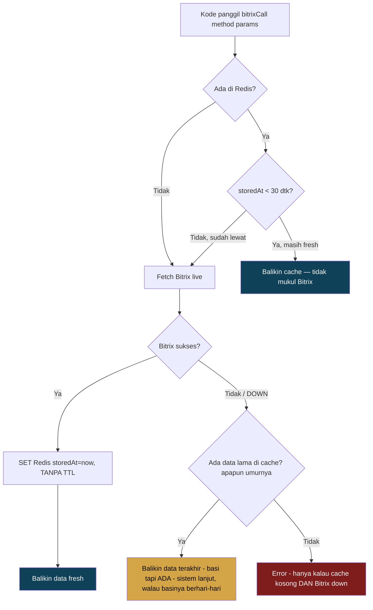
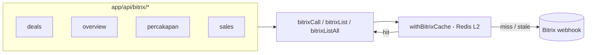

# Rencana: Redis Cache untuk Bitrix (resilience saat Bitrix down)

> Status: **PLAN — belum dieksekusi.** Dokumen ini buat direview dulu.
> Goal utama: **saat Bitrix down, sistem tetap jalan dari cache — tidak error.**
> Goal kedua: data tetap ~fresh (data deal berubah tiap menit).

---

## 1. Prinsip

- Bitrix = sumber data yang **kadang down**. Redis = lapisan yang bikin read Bitrix **selalu punya jawaban**.
- Cache **wajib non-fatal**: kalau Redis sendiri mati/gagal konek, kode **fall-through** ke Bitrix. Redis tidak boleh jadi titik gagal baru.
- Hemat memory = hemat cost: **key TIDAK pakai TTL** (persist selamanya, lihat §2) — kontrol memory murni via `maxmemory` + eviction `allkeys-lru`, bukan waktu.

---

## 2. Ketegangan desain & solusinya (soft window + no-expiry key)

Dua kebutuhan tarik-menarik:

| Kebutuhan | Maunya |
|---|---|
| **Fresh** (data deal berubah tiap menit) | data baru |
| **Tahan banting** (Bitrix suka down) | tetap ada data walau Bitrix mati, **selama mungkin** |

Solusi: **key Redis TIDAK PERNAH expire** (no TTL sama sekali). Freshness ditentukan murni dari field `storedAt` **di dalam value**, bukan dari expiry Redis.

| Ambang | Nilai default | Fungsi |
|---|---|---|
| **Soft / fresh window** | `30 detik` | Dalam window ini → sajikan cache langsung (tidak mukul Bitrix). Lewat window & ada yang baca → refresh dari Bitrix. |
| **Expiry key Redis** | **tidak ada (persist selamanya)** | Data terakhir SELALU tersimpan, seberapa pun basinya — tidak pernah otomatis hilang karena waktu. |
| **Force refresh harian** | `setiap 24 jam` (cron, lihat §7 — sekarang WAJIB) | Job terjadwal yang replace paksa data ke versi terbaru dari Bitrix, terlepas dari apakah ada yang baca atau tidak. Menjaga key yang jarang diakses tetap ≤24 jam basinya. |

**Kenapa bukan hard-TTL 24 jam (desain lama)?** Karena TTL keras berarti kalau Bitrix down LEBIH dari 24 jam, key otomatis kebuang oleh Redis sendiri → sistem balik error padahal itu justru saat resilience paling dibutuhkan. Dengan no-expiry, data terakhir yang berhasil di-fetch tetap tersedia **selama Bitrix downnya**, mau 1 jam atau 3 hari.

**Kalau gitu, gimana kontrol memory (no TTL = key immortal, bukannya dilarang di §6 lama)?** Dijawab dengan **`allkeys-lru`** (lihat §6) — bukan waktu. Redis boleh evict key APAPUN (dengan TTL atau tanpa) saat `maxmemory` tercapai, diprioritaskan yang paling jarang dipakai. Jadi kontrol cost tetap terjaga, cuma mekanismenya LRU bukan TTL.

**Konsekuensi:**
- Operasi normal: data ≤30 detik (auto refresh saat dibaca, read-through).
- Idle/jarang dibaca: tetap di-refresh paksa tiap 24 jam oleh cron (§7), jadi lantai kebasian selalu ≤24 jam meski tidak ada yang buka halamannya.
- Bitrix down (berapa lama pun): sajikan data terakhir yang ada. Sistem lanjut, tidak error — **tidak ada batas waktu kedaluwarsa yang bikin data hilang sendiri.**
- Satu-satunya cara key hilang: LRU eviction saat memory penuh (jarang kejadian untuk dataset sekecil ini, lihat §6) — bukan karena waktu.

---

## 3. Alur (read-through + stale-on-error, key tanpa expiry)



Jalur kuning (`R3`) = inti resilience yang lo mau — dan sekarang **tidak dibatasi 24 jam**, karena key tidak pernah expire sendiri. Jalur merah (`R4`) = satu-satunya kondisi masih bisa error, dan itu makin langka dari desain lama (cache kosong **dan** Bitrix down bersamaan — praktis cuma pas cold-start Redis pertama kali + Bitrix pas mati, atau key kena LRU-evict pas Bitrix down).

Cron harian (§7) berjalan independen dari flow ini — dia bukan bagian dari request path, cuma numpang lewat `F` (fetch Bitrix live) untuk daftar query yang dikenal, lalu `H` (replace paksa), supaya key yang jarang dibaca organik tetap ke-refresh.

---

## 4. Di mana caching dipasang: level `bitrixCall` (cache SEMUA)

Wrapper dipasang di **titik terendah** — `lib/bitrix.ts` `bitrixCall()`. Semua fungsi read (`bitrixList`, `bitrixListAll`, `getBitrixCrmMeta`, `getBitrixDealEnums`, `resolveBitrixContacts`, `bitrixSessionHistory`, dst) lewat sini, jadi **otomatis kebungkus semua** tanpa ubah tiap endpoint.



**Catatan penting — hanya cache method READ.** Semua call Bitrix di project ini saat ini read-only
(`*.list`, `*.get`, `*.fields`, `batch` isi read, `imopenlines.session.history.get`, `user.search`).
Kalau nanti ada method write (mis. `crm.deal.update`), wrapper **skip cache** untuk method itu
(whitelist by suffix `.list`/`.get`/`.fields`/`batch`/history, atau flag `noCache`).

---

## 5. Strategi cache key

```
bitrix:<method>:<hash(params)>
```

- `method` = REST method (`crm.deal.list`, `crm.status.list`, ...).
- `hash(params)` = hash stabil dari body request (filter/select/order/start) — key deterministik per kombinasi query.
- Namespace `bitrix:` → gampang di-flush semua sekaligus kalau perlu (`SCAN` + `DEL` pola `bitrix:*`).
- Karena params di-hash, permutasi filter user tetap ke-cache masing-masing sebagai key terpisah — tanpa TTL, jadi `allkeys-lru` (§6) satu-satunya yang jaga supaya tidak balloon.

---

## 6. Kontrol memory / cost (concern utama lo)

| Rule | Kenapa |
|---|---|
| `maxmemory` di-set + `maxmemory-policy allkeys-lru` | Redis auto-buang key paling jarang dipakai saat penuh — **termasuk key tanpa TTL**. Ini satu-satunya jaring pengaman memory sekarang (bukan waktu), jadi **wajib** di-set, gak boleh diskip. |
| **Tanpa TTL** (§2) | Disengaja — biar data bertahan selama Bitrix down, selama apapun. Kontrol memory dipindah total ke LRU. |
| Cache hanya method **read** | Write (kalau ada) tidak dicache. |
| Payload gede (deal list, session history) → **gzip** sebelum SET (opsional fase 2) | Hemat memory signifikan untuk list besar. |
| Key ter-namespace + di-hash | Tidak ada key liar; gampang di-flush (`SCAN` pola `bitrix:*`). |
| Warmer harian (§7) HANYA target query yang dikenal (well-known), bukan semua key | Query hasil filter user yang random/one-off gak ikut di-refresh paksa tiap hari — biar gak numpuk & gak boros hit Bitrix. Kalau ada yang baca query lama itu lagi, read-through yang urus (fetch live saat itu). |

Estimasi: data Bitrix lo (deal harian puluhan–ratusan row + meta kecil) muat **jauh di bawah** plan Redis terkecil Railway. Karena sekarang gak ada TTL yang otomatis buang key, `allkeys-lru` + `maxmemory` jadi **satu-satunya** penjamin gak OOM — pastikan ini ke-set di Railway (§8) sebelum deploy, ini bukan lagi opsional/tambahan.

---

## 7. Warmer harian (WAJIB — bukan opsional lagi)

Karena key sekarang **tidak pernah expire** (§2), read-through saja tidak cukup untuk dataset yang
**tidak** sedang aktif dibuka siapa pun — key itu bisa diam basi tanpa batas kalau tidak ada yang
baca. Warmer harian jadi jaring pengaman: **paksa replace ke data terbaru tiap 24 jam**, terlepas
ada pembaca aktif atau tidak.

**Keputusan: Opsi A — Railway Cron Job**, jadwal 1×/hari (mis. `0 3 * * *`, jam 3 pagi WIB — dini
hari, trafik sepi), hit `/api/cron/bitrix-refresh` (secret-protected, lihat §9/§10). Container Railway
cuma nyala pas dipanggil cron — tidak nambah cost idle seperti worker always-on (Opsi B, tidak dipilih).

**Apa saja yang di-refresh paksa** — daftar tetap & terbatas (bukan blind refresh semua key `bitrix:*`,
karena filter kombinasi hasil pencarian user itu long-tail dan gak worth di-refresh tiap hari):

| Target | Method Bitrix | Kenapa masuk daftar wajib |
|---|---|---|
| CRM meta (pipelines/stages/sources) | `getBitrixCrmMeta()` (batch) | Dipakai di HAMPIR semua halaman Bitrix untuk label |
| Deal enum fields | `getBitrixDealEnums()` (`crm.deal.fields`) | Sama — label dropdown/enum di banyak tempat |
| Deals list — default/recent view | `crm.deal.list` (filter default, tanpa filter user custom) | View pertama yang dibuka user pas masuk halaman Deals |
| Overview / dashboard aggregate | method yang dipanggil `/api/bitrix/overview` | Dashboard ringkasan harian |
| Percakapan / sessions — recent list | method yang dipanggil `/api/bitrix/percakapan` (list, bukan detail per-session) | List sesi terbaru |

Daftar ini didefinisikan sebagai **satu sumber kebenaran** (mis. `lib/bitrix-cache.ts` export
`WARM_TARGETS: { method, params, label }[]`) yang dipakai **hanya** oleh endpoint cron — bukan
dikonsumsi ulang oleh route handler produksi, supaya tidak ada drift antara apa yang di-warm dan
apa yang dipakai runtime (tapi `params` untuk tiap target harus persis sama dengan yang dipanggil
runtime, biar `bitrixCacheKey(method, params)` hash-nya match dan menimpa key yang sama).

Query dengan filter dinamis milik user (custom search/filter di Deals, per-session history detail,
dsb) **tidak** masuk warm list — itu tetap murni mengandalkan read-through (§3): kalau basi & dibaca,
refresh live saat itu juga; kalau tidak pernah dibaca lagi, dibiarkan basi sampai LRU evict.

---

## 8. Setup Redis di Railway

1. Railway project → **+ New → Database → Add Redis** (template resmi, sudah include volume persistence).
2. Di service Redis, set config: `maxmemory-policy allkeys-lru` (+ `maxmemory` sesuai plan).
3. Di service **app**, tambah env var pakai reference variable:
   ```
   REDIS_URL=${{Redis.REDIS_URL}}
   ```
   (komunikasi lewat private network Railway — tidak lewat internet publik).
4. Docker image project **tidak berubah** — cuma nambah env var.

---

## 9. Rencana file (per layer)

| # | File / langkah | Isi |
|---|---|---|
| 1 | **Railway** (manual, lo yang klik) | Service Redis (`allkeys-lru`) + `REDIS_URL=${{Redis.REDIS_URL}}` + Cron Job (`0 3 * * *`) hit `/api/cron/bitrix-refresh` |
| 2 | `package.json` | `+ ioredis` |
| 3 | `lib/redis.ts` | Singleton `ioredis` (pola `lib/db.ts`). Konek gagal = **non-fatal** (log + return null path). Helper `redisGetJSON` / `redisSetJSON(key, val)` — **tanpa parameter TTL**, key persist selamanya |
| 4 | `lib/bitrix-cache.ts` | `withBitrixCache(key, {freshMs}, fetcher)` (§3, no hard TTL) + `bitrixCacheKey(method, params)` (§5) + `WARM_TARGETS` registry (§7). No dedicated `forceRefresh` — the warmer calls the same read-through `withBitrixCache` path; running once/day (≫ `FRESH_WINDOW_MS`) always finds it stale, so it overwrites the cache without needing a separate force function. |
| 5 | `lib/bitrix.ts` | `bitrixCall` dibungkus `withBitrixCache` untuk method read (whitelist). In-memory `metaCache`/`dealEnumCache` yang ada tetap jadi L1 super cepat; Redis jadi L2 lintas-instance & survive restart |
| 6 | `app/api/cron/bitrix-refresh/route.ts` | Loop `WARM_TARGETS`, force-refresh tiap satu (non-fatal per-target — satu gagal gak gagalin semua). Guard `BITRIX_CRON_SECRET` pakai **`crypto.timingSafeEqual`** (bukan `!==`, dan **tanpa** secret fallback — sesuai AGENTS.md §9) + `apiLimiter` |
| 7 | Tombol "Perbarui data" (opsional) | Di halaman Bitrix — panggil force-refresh utk target itu saja. Guard `bitrix:view` + `mutationLimiter` |
| 8 | `.env.example` | `REDIS_URL`, `BITRIX_CRON_SECRET` (project ini gak punya `types/env.d.ts` — env dibaca langsung via `process.env.X`, gak ada ambient type file) |

> Catatan: endpoint contoh yang ada (`cleanup-logs`) pakai `!==` + secret fallback — itu **melanggar**
> AGENTS.md §9. Endpoint baru kita bikin **lebih benar**: timing-safe compare, tanpa fallback.

---

## 10. Env vars baru

```
REDIS_URL=              # dari Railway: ${{Redis.REDIS_URL}}
BITRIX_CRON_SECRET=     # secret sendiri (openssl rand -base64 32) — JANGAN reuse AUTH_SECRET/CLEANUP_SECRET
```

---

## 11. Default final (dikonfirmasi user)

- Fresh window (soft): **30 detik**
- Expiry key Redis: **tidak ada — persist selamanya** (bukan hard TTL 24 jam lagi)
- Memory control: **`allkeys-lru` + `maxmemory`** (satu-satunya jaring pengaman, wajib di-set)
- Warmer: **WAJIB**, Railway Cron 1×/hari (`0 3 * * *`), target = `WARM_TARGETS` list tetap (§7)
- Cache dipasang di level `bitrixCall` (cache semua read otomatis)
- Redis eviction: `allkeys-lru`

---

## 12. Urutan eksekusi (saat plan di-acc)

1. `lib/redis.ts` + helper (no-TTL `redisSetJSON`) → review.
2. `lib/bitrix-cache.ts` (soft window + `WARM_TARGETS` registry) → review.
3. Wrap `lib/bitrix.ts` `bitrixCall` → test 1 endpoint (mis. deals) hidup dari cache.
4. `/api/cron/bitrix-refresh` (loop `WARM_TARGETS`) + env vars (`REDIS_URL`, `BITRIX_CRON_SECRET`).
5. (Opsional) tombol manual refresh.
6. Setup Railway: Redis service (`allkeys-lru`) + Cron Job (`0 3 * * *`) + env → deploy.

Commit tetap diserahkan ke lo (no auto-commit).
