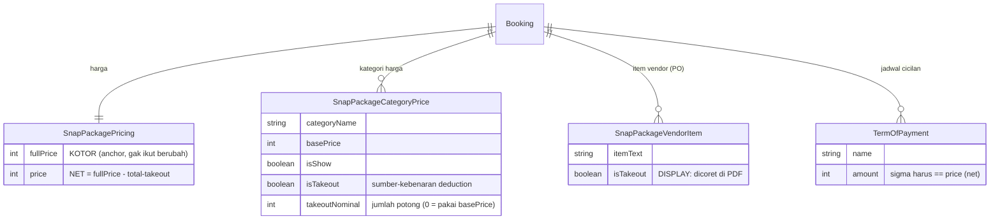
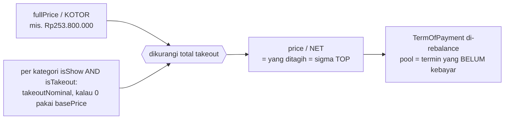
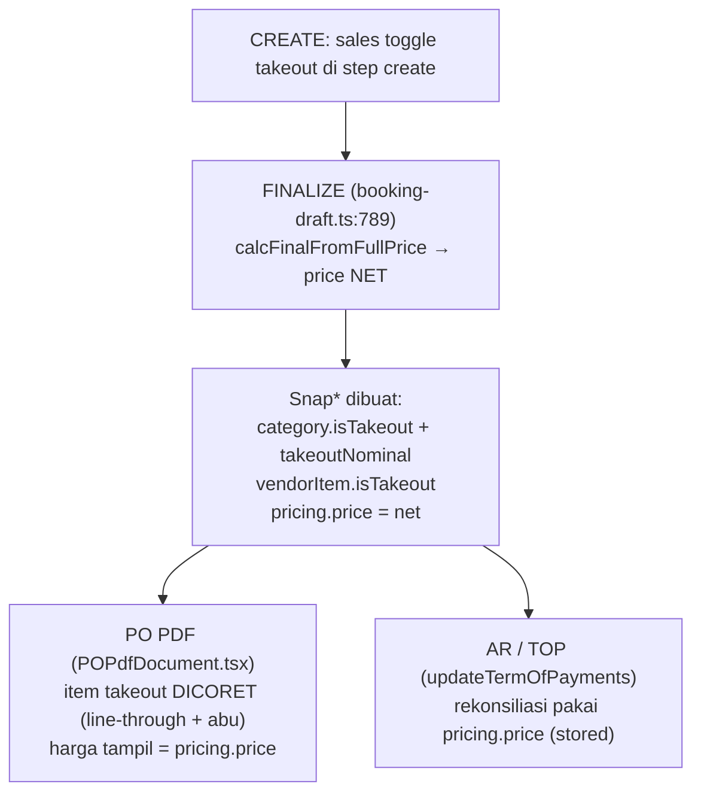
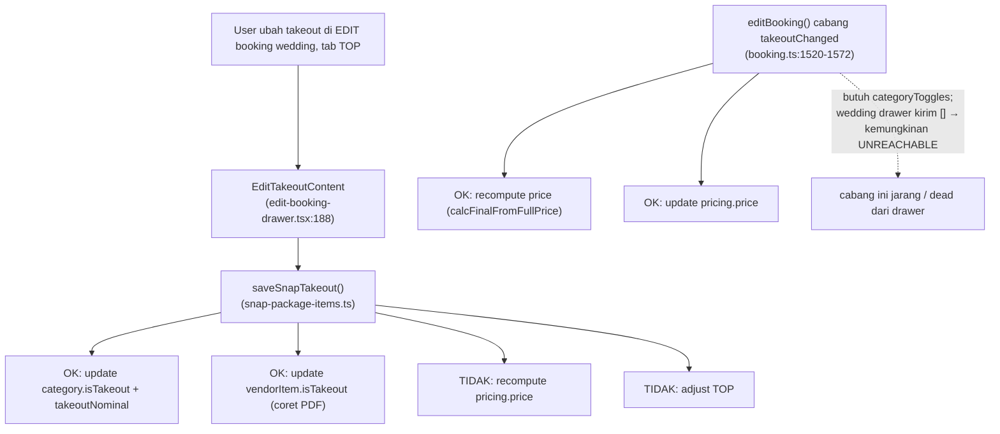
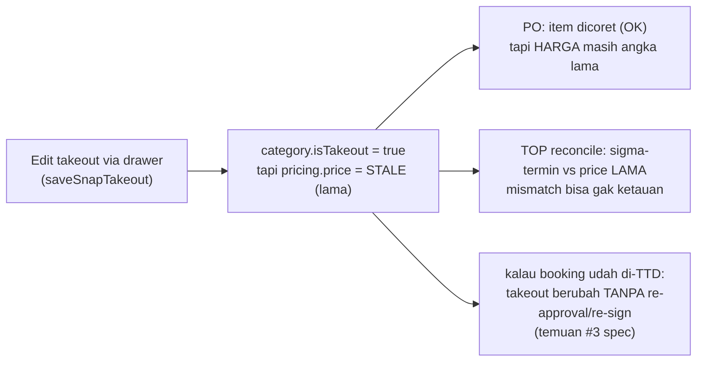

# Takeout — Penjelasan Visual (end-to-end)

> Bukan spec/desain. Ini penjelasan **cara kerja takeout apa adanya di kode sekarang**
> (branch `feat/finance-fixes`), buat mahamin sebelum mutusin arah fix.
> Sumber: `lib/package-prices.ts`, `actions/snap-package-items.ts`, `actions/booking.ts`,
> `actions/booking-draft.ts`, `components/pdf/POPdfDocument.tsx`, `actions/term-of-payment.ts`.

Takeout = klien nyediain **1 kategori** sendiri (mis. catering) → kategori itu **dipotong
dari harga**. Murni **deduction** — gak pernah nyentuh Ledger (cashbook).

---

## 1. Data model — di mana takeout hidup

**Kunci:** `isTakeout` di **kategori** = angka beneran (potong harga). `isTakeout` di
**item vendor** = cuma tampilan (coret di PO). `fullPrice` = anchor kotor yang gak berubah;
`price` = net hasil potong.

---

## 2. Rumus harga

`calcFinalFromFullPrice()` (`lib/package-prices.ts`): `price = max(0, fullPrice − Σ takeout)`.
`adjustTermsForPriceChange()`: rebalance TOP; termin yang udah ada cash-in ter-ack = dikunci.

---

## 3. Lifecycle yang SEHAT — Create sampai PO/AR

Di jalur create→finalize, `price` dihitung dari state takeout → **konsisten**.

---

## 4. INTI MASALAH — 2 jalur edit yang divergen

Drawer edit **pakai jalur kiri** (`saveSnapTakeout`) yang **cuma flip flag**, padahal
drawer-nya nampilin "Harga setelah takeout: Rp X" gede. Jalur kanan yang recompute
(`editBooking`) kemungkinan gak kesentuh dari wedding drawer.

---

## 5. Di mana drift-nya kerasa

---

## 6. Ringkasan: bersih vs bocor

| Aspek | Status |
|---|---|
| Konsep deduction (bukan cashflow) | OK — sesuai money-model |
| Data model (kategori-level) | OK — solid |
| Create → finalize (harga & TOP) | OK — konsisten |
| **Edit takeout via drawer** | BOCOR — flag berubah, `price`/TOP TIDAK |
| Post-signature (booking beku) | BOCOR — ubah takeout tanpa re-approval (temuan #3) |
| Coret item di PO | OK — jalan |

**Kesimpulan:** konsep & create-flow sehat. Yang bocor: **edit takeout gak nyambung ke
harga/TOP** (2 jalur, drawer pakai yang gak recompute) + **gak ada gate re-approval** kalau
booking udah ditandatangani klien.

---

## 7. Keputusan yang nunggu (belum dikerjain)

1. **Takeout itu ubah-harga atau display-only?** Sekarang ambigu (drawer nampilin harga
   turun tapi gak persist).
2. Kalau ubah-harga: satu-in 2 jalur biar `price`+TOP selalu sinkron + putusin re-approval
   saat beku.
3. Long-term (spec): unify takeout + discount + bayar-langsung jadi `BookingDeduction`
   (spec bilang "jangan dulu" — refactor berisiko).
